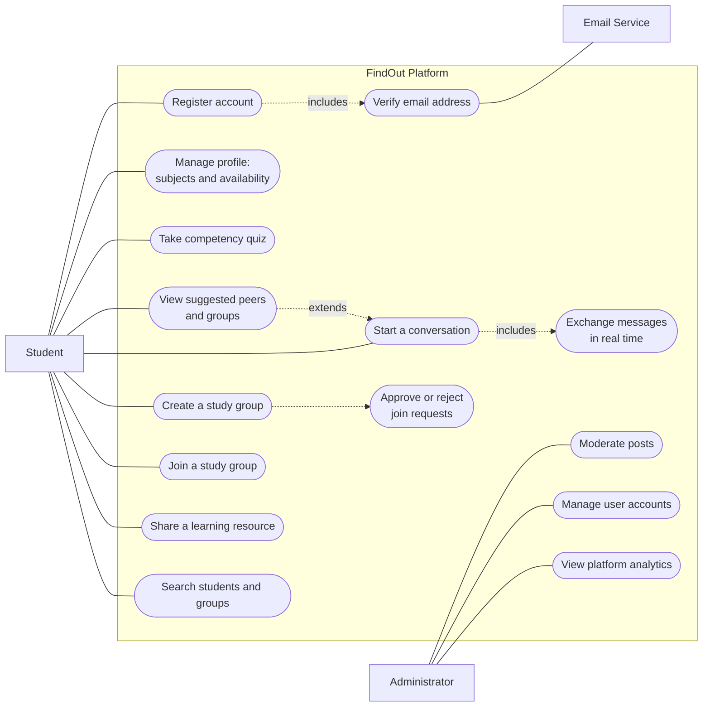
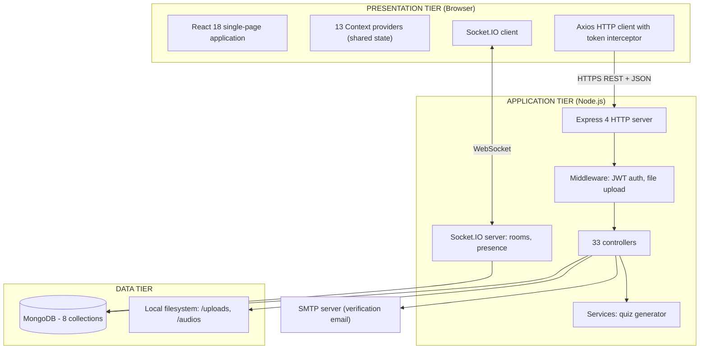
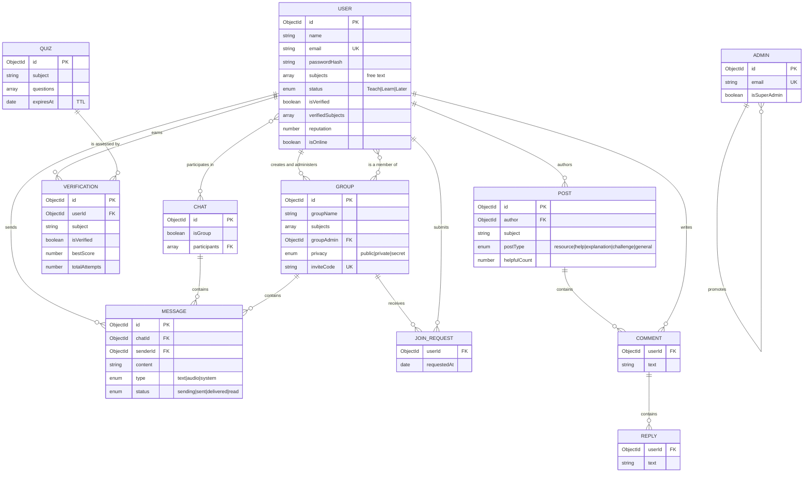
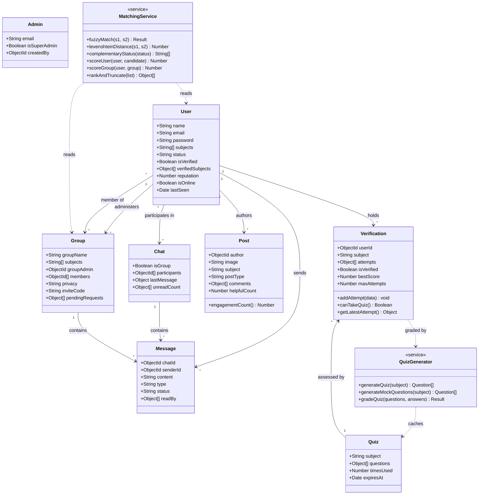
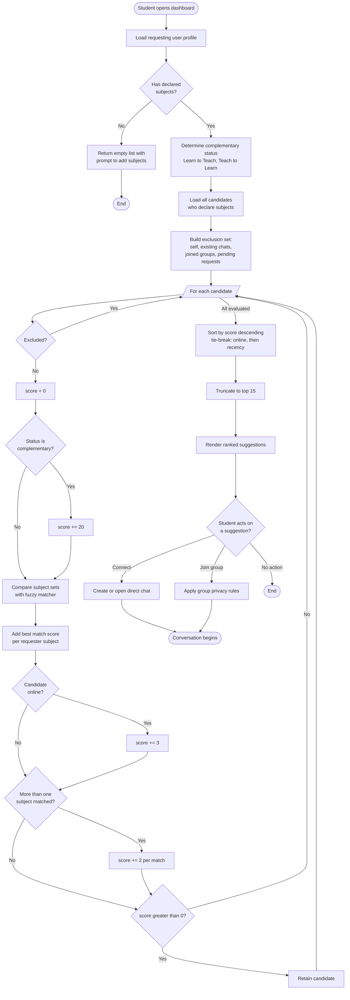
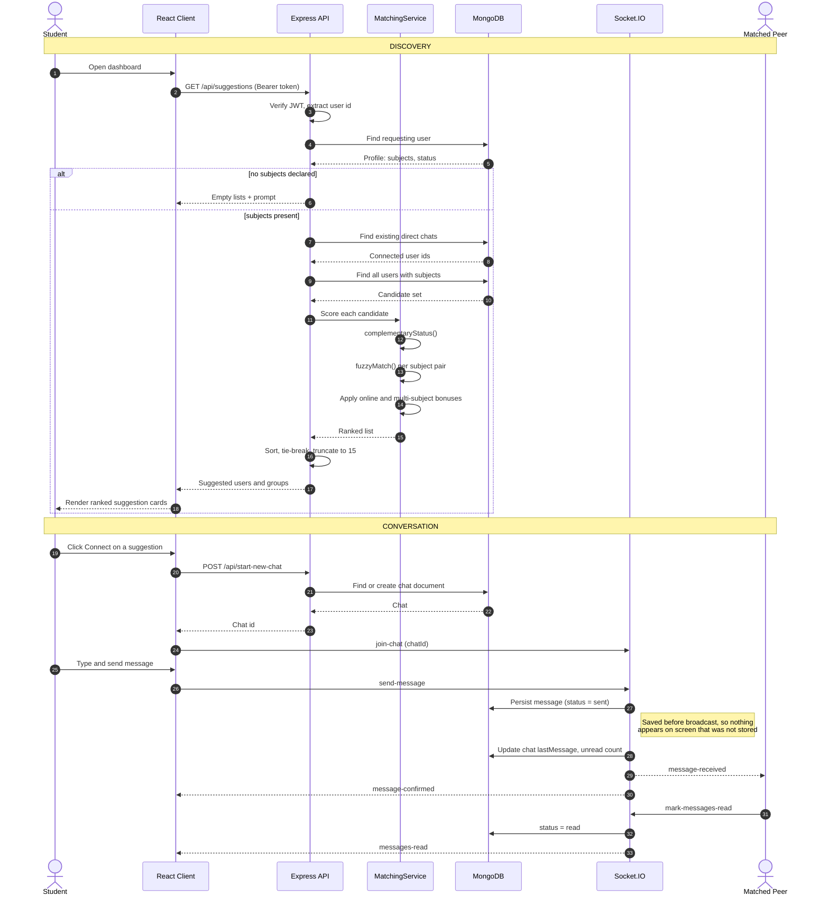
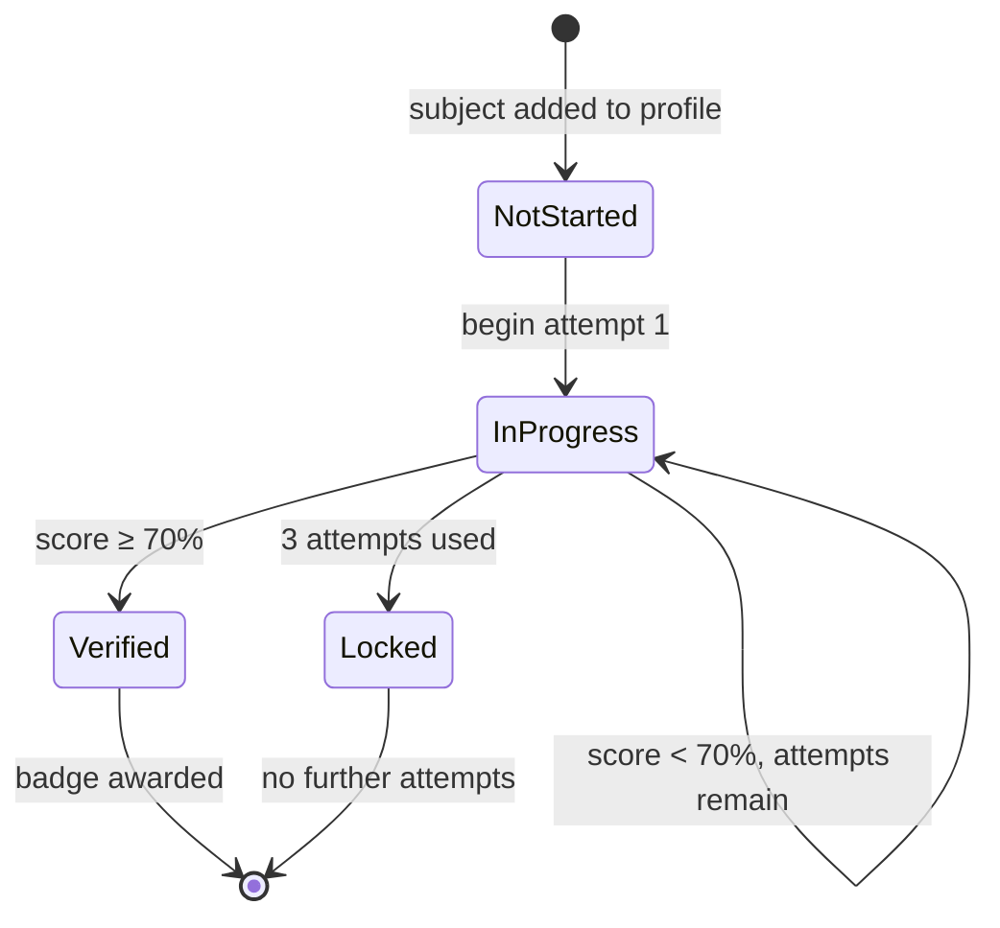

# CHAPTER THREE
# METHODOLOGY

---

> **Note to author.**
>
> This is the chapter your project guide calls "very important." Its test is simple: **could
> another person read this chapter and rebuild your system and get the same results?** Every
> section below is written to meet that test. Exact values, formulas, thresholds and
> configuration are given, not summarised.
>
> The writing stays in plain English where possible. Technical terms are explained when they
> first appear. Where precision matters more than simplicity — the algorithm in §3.8, for
> example — exact detail is given, because a vague description would fail the reproducibility
> test.
>
> Citation style is **APA 7th edition**. Sources marked **[V]** were verified during research.

---

## 3.1 Introduction

Chapter 1 identified the problem: students who need help and students able to give it cannot find
each other. Chapter 2 reviewed what researchers and existing systems have done about it, and
identified four gaps.

This chapter explains how the problem was solved. It covers the research approach, the
development method, the technology choices and why they were made, the design of the system, the
design of the matching algorithm, and the method used to evaluate the finished platform.

The chapter is organised as follows. Section 3.2 states the research approach. Section 3.3
explains the software development method. Section 3.4 describes how requirements were gathered
and presents the use case model. Section 3.5 justifies the technology choices. Sections 3.6 and
3.7 present the system architecture and the database design as an entity relationship model and
a class model. Section 3.8 gives the full specification of the matching algorithm — the central
technical contribution — as a formal definition, an activity model and a sequence model. Sections
3.9 to 3.12 cover the verification, messaging, security and privacy designs. Section 3.13 lists
the tools used. Section 3.14 sets out the evaluation method. Section 3.15 gives the steps needed
to reproduce the system.

**Table 3.0** lists the design models presented in this chapter.

**Table 3.0**

*Design Models Presented in Chapter Three*

| Figure | Model | Section | What it establishes |
|---|---|---|---|
| 3.1 | Use case diagram | §3.4.1 | Actors and the functional scope agreed for the system |
| 3.2 | System architecture | §3.6.1 | Tiers, components and the two communication channels |
| 3.3 | Entity relationship diagram | §3.7.1 | Entities, relationships and cardinality |
| 3.4 | Class diagram | §3.7.2 | Model and service classes with attributes and operations |
| 3.5 | Activity diagram | §3.8.10 | The matching process as a control flow |
| 3.6 | Sequence diagram | §3.8.11 | Component interaction from discovery to a read message |
| 3.7 | State diagram | §3.9.3 | Lifecycle of subject verification |

These are **design** models: they state what was intended before and during construction.
Chapter 4 presents the corresponding **as-built** views, which differ in places — those
differences are exactly what the incremental method in §3.3 was expected to produce, and are
identified where they occur.

---

## 3.2 Research Approach

### 3.2.1 Design Science Research

This project follows **Design Science Research (DSR)**. DSR is a research approach where new
knowledge is produced by building a working thing — called an *artefact* — and then evaluating
it (Hevner et al., 2004). It is the standard approach in information systems research for
projects that create software to solve a real problem.

DSR was chosen because it fits what this project does. The project does not test a hypothesis
about human behaviour using an experiment. It identifies a real problem, designs and builds a
system to solve it, and evaluates whether the system works. Hevner et al. (2004) set out seven
guidelines for DSR. Table 3.1 shows how this project meets each one.

**Table 3.1**

*Compliance with the Design Science Research Guidelines of Hevner et al. (2004)*

| Guideline | How this project satisfies it |
|---|---|
| 1. Design as an artefact | A working web platform (FindOut) was built, not a model or a proposal. |
| 2. Problem relevance | The problem was established in Chapter 1 from the literature and the Ghanaian higher education context. |
| 3. Design evaluation | The artefact was evaluated through functional testing, performance measurement, and a user study (§3.14). |
| 4. Research contributions | A reciprocal recommender for peer learning that uses self-declared intent, stated precisely in §2.8.3. |
| 5. Research rigour | The matching algorithm is formally specified (§3.8); evaluation uses validated instruments (SUS, TAM). |
| 6. Design as a search process | Development was incremental; designs were revised when they proved inadequate (§3.3.2). |
| 7. Communication of research | This report communicates to both technical and management audiences. |

### 3.2.2 The DSR process model followed

Peffers et al. (2007) provide a six-step process model for carrying out DSR. This project followed
that model. Table 3.2 maps the steps to the chapters of this report.

**Table 3.2**

*The Design Science Research Process (Peffers et al., 2007) as Applied in This Project*

| Step | Activity in this project | Reported in |
|---|---|---|
| 1. Problem identification and motivation | Identified the five failures of peer connection (P1–P5) | Chapter 1 |
| 2. Define objectives of a solution | Six objectives (O1–O6) derived from the problems and the literature | Chapter 1, §1.4 |
| 3. Design and development | Designed and built the platform over nine increments | Chapter 3, Chapter 4 |
| 4. Demonstration | Deployed the system and used it to complete real tasks | Chapter 4 |
| 5. Evaluation | Functional testing, performance measurement, user study | Chapter 5 |
| 6. Communication | This report | All chapters |

### 3.2.3 Why other research approaches were not used

**A pure experimental approach** would compare students using the platform against a control
group and measure grade differences. This was rejected for two reasons. It would require a full
semester of use with a large sample to produce meaningful results, which exceeds the project
timeframe. It also assumes a working platform already exists — the building of which is the
actual contribution here.

**A pure survey approach** would ask students about their needs without building anything. This
would document the problem but not solve it, and would produce no artefact.

**A case study approach** would study existing peer-learning practice in depth. This is useful
background work, but again produces no solution.

DSR was selected because it accommodates both building and evaluating, which is what a final year
software project requires.

---

## 3.3 Software Development Methodology

### 3.3.1 Choice of development method

An **incremental and iterative** development method was used, with practices borrowed from agile
development.

Incremental development means the system is built in a series of pieces. Each piece is a complete,
working slice — database, server code and user interface together — that can be demonstrated and
tested before the next piece begins. Iterative means earlier work is revisited and improved when
later work shows it was inadequate.

### 3.3.2 Justification of the choice

**Why not the Waterfall model.** Waterfall requires all requirements to be fully known and fixed
before design starts, and design fixed before coding starts. This project could not meet that
condition. Two examples show why:

- The weights used in the matching algorithm (§3.8.5) could not be decided in advance. They
  needed real profile data to test against.
- The group privacy design began as a simple yes/no setting (`isPrivate`). Only after working
  through real use cases did it become clear that three levels were needed: a group that is
  visible and open, a group that is visible but needs approval, and a group that is hidden
  entirely. This required changing both the database schema and the existing stored data.

Under Waterfall, both of these mistakes would have been discovered at the end, when correcting
them is most expensive. Sommerville (2016) identifies exactly this condition — evolving
requirements and the value of early feedback — as the case where incremental development is
appropriate.

**Why not full Scrum.** Scrum defines roles (Product Owner, Scrum Master, Development Team) and
ceremonies (daily stand-up, sprint review, retrospective). These exist to coordinate a team. This
project had one developer. With one person, the ceremonies produce administrative work without
producing the coordination benefit they exist for.

**What was adopted.** The useful agile practices that work for a single developer were kept:
short cycles, a working system at the end of every cycle, supervisor feedback between cycles, and
willingness to change earlier decisions.

### 3.3.3 Increments delivered

Development proceeded through nine increments. Each delivered a working vertical slice.

**Table 3.3**

*Development Increments*

| # | Increment | What was delivered | Evidence of iteration |
|---|---|---|---|
| I1 | Foundation | Project setup, database connection, User model, registration, password hashing, email verification, login with tokens | — |
| I2 | Profile and intent | Subjects list, teach/learn status, free time, profile picture upload, edit functions | — |
| I3 | Matching | Suggestions endpoint, fuzzy subject matcher, complementary status weighting | Weights tuned against sample profiles |
| I4 | Messaging | Chat and Message models, Socket.IO integration, rooms, presence, delivery and read status | Unread counters changed from per-chat to per-user |
| I5 | Groups | Group model, creation, membership, invite codes | `isPrivate` boolean **replaced** by three-level `privacy` field; migration script written |
| I6 | Feed | Post model with subject and type, comments, threaded replies | "likes" **renamed** to "helpful" to fit the learning context |
| I7 | Verification | Verification model, quiz generation and grading, pass threshold, attempt limits, badges | — |
| I8 | Administration | Separate Admin model and authentication, dashboard statistics, moderation | — |
| I9 | Hardening | Search, voice messages, unread counts, data migration scripts, cross-platform fixes | Import path casing corrected for Linux deployment |

The changes recorded in the final column are evidence that the method was genuinely iterative and
not Waterfall carried out in stages.

---

## 3.4 Requirements Elicitation

Requirements were gathered using four methods.

**1. Derivation from the literature.** Objectives O1 to O3 (Chapter 1, §1.4) were derived from
the gaps identified in Chapter 2. For example, the decision to use self-declared intent rather
than inferred competence follows directly from the cold-start analysis in §2.3.5.

**2. Competitive analysis.** Each system reviewed in §2.5 was examined feature by feature. The
comparison table (Table 2.1) was used to identify which capabilities the new system must have.

**3. Student survey.** A questionnaire was administered to students to establish current
behaviour, the difficulty of finding help, and willingness to teach. The instrument is given in
Appendix D of the SRS.

> **`[YOUR DATA]`** *Report here: how many students responded, how they were selected, and the
> main findings. Present the findings as a table or chart. This is primary evidence and is
> valuable — do not leave it out.*

**4. Iterative supervisor review.** Requirements were reviewed with the project supervisor at
the end of each increment and revised where necessary.

The complete requirements produced by this process are documented in the Software Requirements
Specification, which records 113 numbered requirements across eight modules, each with a
priority and a status.

### 3.4.1 Use case model

The requirements were consolidated into a use case model identifying two human actors — the
Student and the Administrator — and one external system actor, the email service used to confirm
account ownership.



**Figure 3.1.** *Use case diagram. Solid lines are actor associations; dashed lines are
`include` and `extend` relationships between use cases. Group administration (UC10) is performed
by the Student who created the group, not by a platform Administrator — group ownership and
platform administration are separate privileges.*

Three relationships in the model are worth noting because they shaped the design:

- **Register account *includes* Verify email address.** Registration is not complete until
  ownership of the address is proven, which is why login is gated on the verified flag.
- **View suggestions *extends* Start a conversation.** Discovery is the entry point to
  communication, so both must live in the same artefact — the argument made in §2.8, Gap 3.
- **Take competency quiz** is available to any student but is only meaningful for those offering
  to teach, which is why it is optional rather than a precondition of any other case.

---

## 3.5 Technology Selection

Technology choices were made against four criteria: suitability for the problem, cost (the
project had no budget), availability of documentation and community support, and the
developer's ability to become productive within the project timeframe.

**Table 3.4**

*Technology Choices and Justifications*

| Layer | Selected | Alternatives considered | Justification |
|---|---|---|---|
| Frontend framework | React 18 with Vite | Angular, Vue, Next.js | React's component model suits an interface with a lot of changing state, such as a chat window. It has the largest ecosystem of the options. Vite rebuilds the page in under a second during development, compared with much slower rebuilds under Webpack. Next.js offers server-side rendering, but the benefit is small for an application that sits behind a login. |
| Styling | Tailwind CSS 3 | Bootstrap, Material UI, plain CSS | Tailwind applies styles directly in the markup, which avoids inventing and maintaining class names. Unused styles are removed at build time, producing a smaller file. Unlike Bootstrap or Material UI it does not impose a recognisable visual identity. |
| Backend runtime | Node.js with Express 4 | Django (Python), Spring Boot (Java), Laravel (PHP) | Using JavaScript on both sides means one language for the whole project, which matters for a single developer with limited time. Node handles many idle open connections efficiently, which is exactly the chat workload. |
| Database | MongoDB with Mongoose | PostgreSQL, MySQL | The data is document-shaped: a post owns its comments, which own their replies. Fetching a post with its full comment thread is one read, not a three-table join. The flexible schema also suited the iterative method, since fields were added as increments progressed. |
| Real-time channel | Socket.IO 4 | Plain WebSocket, Server-Sent Events, polling | Socket.IO adds automatic reconnection, a "room" abstraction that maps directly onto chats and groups, and a fallback to long-polling when WebSocket is blocked. The fallback matters on unreliable mobile networks. |
| Authentication | JWT with bcrypt | Server sessions, OAuth, Passport.js | Tokens hold their own validity, so the server stores no session data and can be scaled to multiple machines. bcrypt is deliberately slow to compute, which makes password guessing expensive (Provos & Mazières, 1999). |
| Email | Nodemailer with SMTP | SendGrid, Amazon SES | Free, and adequate for the volume this project generates. |
| File uploads | Multer to local disk | Cloudinary, Amazon S3 | Free and simple to implement. |

### 3.5.1 Acknowledged trade-offs

Every choice above has a cost. Stating them shows the decisions were made deliberately.

- **MongoDB** does not enforce relationships between records the way a relational database does.
  If a user is deleted, references to that user elsewhere are not automatically cleaned up. This
  became a real limitation and is reported in Chapter 4.
- **JWT** tokens cannot be cancelled before they expire. If a token is stolen, it stays valid
  until expiry. This is reduced by making the access token short-lived (15 minutes).
- **Local file storage** is destroyed when a hosting platform redeploys the application. This
  makes the current upload approach unsuitable for production hosting without change.

---

## 3.6 System Architecture

### 3.6.1 Overall structure

The system uses a **three-tier architecture** with an additional persistent channel for real-time
features.



**Figure 3.2.** *System architecture. Three tiers with two distinct communication channels
between the client and the application tier: request-response over HTTPS for user-initiated
operations, and a persistent WebSocket for server-initiated events.*

### 3.6.2 Why two communication channels

The system uses REST over HTTP for most operations and WebSocket for messaging. This is a
deliberate design decision and the reason should be understood.

HTTP works on a request-and-response model. The client asks, the server answers. This suits
operations the user initiates: load my profile, create a group, submit a quiz.

Chat does not fit this model. A message must reach a recipient **who did not ask for it**. Under
HTTP alone the only way to achieve this is polling — the client repeatedly asking "is there
anything new?" Polling every few seconds wastes bandwidth and battery, and still delivers
messages late.

WebSocket (Fette & Melnikov, 2011) keeps a connection open in both directions, so the server can
send without being asked. Socket.IO adds reconnection and grouping on top of it.

The system therefore uses each protocol for what it does well, rather than forcing one to do both
jobs.

### 3.6.3 Backend structure

The backend is organised in layers, each with one responsibility.

| Layer | Location | Responsibility |
|---|---|---|
| Entry point | `server.js` | Creates the HTTP server, attaches Socket.IO, connects the database, mounts routers |
| Routes | `routes/` (4 files) | Declares which URL maps to which handler. Contains no logic. |
| Middleware | `middleware/` | Runs before handlers: checks the token, processes file uploads |
| Controllers | `controllers/` (33 files) | Contains the business logic for one operation each |
| Services | `services/` | Logic reused by more than one controller (quiz generation) |
| Models | `models/` (7 files) | Defines the shape of the data and its validation rules |
| Socket handlers | `socket/Socket.js` | Handles all real-time events |

This separation means a change to a URL affects only the route file, and a change to a validation
rule affects only the model. It follows the layered pattern described by Fowler (2002), without
the server-side view layer, since the React application handles all presentation.

### 3.6.4 Frontend structure

The frontend is a single-page application. The browser loads the application once, and
navigation between screens happens without further page loads.

State that is needed by many components — the logged-in user, the chat list, the suggestions — is
held in **React Context providers**. A Context provider makes a value available to every
component beneath it without passing it manually through each level. The application composes 13
such providers in `Providers/Provider.jsx`.

Two utilities are important to the design:

- **`utils/tokenService.js`** stores and retrieves the authentication tokens.
- **`utils/axiosInstance.js`** wraps the HTTP client. It automatically attaches the access token
  to every request. It also watches for a 401 (unauthorised) response, and when one occurs it
  requests a new access token using the refresh token, then retries the original request. If the
  refresh also fails, it clears the tokens and redirects to the login page.

This means token renewal is invisible to the rest of the application. No component needs to know
that tokens expire.

---

## 3.7 Database Design

### 3.7.1 Collections

The database holds eight collections: `users`, `groups`, `chats`, `messages`, `posts`,
`verifications`, `quizzes` and `admins`.

Figure 3.3 shows the conceptual data model. It is the **design-level** view: entities, their
relationships and cardinality. The as-built physical schema, with every field and validation
rule, is given in Chapter 4, Figure 4.3, and in the SRS §9.



**Figure 3.3.** *Entity relationship diagram (conceptual). `||--o{` denotes one-to-many and
`}o--o{` many-to-many. COMMENT, REPLY and JOIN_REQUEST are modelled as separate entities here for
clarity, but are physically embedded within their parent documents — the reasoning is given in
§3.7.2.*

Two relationships deserve comment. A USER has **two distinct associations with GROUP**: one as
creator and administrator, and one as an ordinary member. Separating them is what allows group
administration to be a per-group privilege rather than a platform-wide role. Second, both CHAT and
GROUP own MESSAGE records, because a group conversation and a direct conversation carry the same
message structure and are addressed by the same identifier at the socket layer.

### 3.7.2 The design as classes

The system uses Mongoose, which represents each collection as a model class carrying both schema
and behaviour. Figure 3.4 shows those classes together with the two service classes that hold
logic used by more than one controller.



**Figure 3.4.** *Class diagram. Solid arrows are associations with cardinality; dashed arrows are
dependencies. `MatchingService` and `QuizGenerator` are stereotyped as services: they hold
behaviour rather than state, and are the only classes containing algorithmic logic.*

Note that `MatchingService` **reads** User and Group but owns no data of its own. This is
deliberate: the matching algorithm is a pure function of the profile data, which is what makes it
independently testable — the property exploited by the unit tests in Chapter 5, §5.3, where the
functions were extracted and run in isolation without a database.

### 3.7.3 Embedding versus referencing

MongoDB allows related data either to be stored inside a parent document (*embedding*) or stored
separately and linked by an identifier (*referencing*). The choice affects performance. The
decisions made here were:

| Data | Decision | Reason |
|---|---|---|
| Comments and replies inside posts | **Embedded** | A post and its discussion are always displayed together. Embedding makes this one database read instead of three. The cost is that a document has a 16 MB size limit, which caps how many comments a single post can hold. |
| Messages separate from chats | **Referenced** | A conversation grows without limit. Embedding messages would eventually exceed the document size limit. |
| Quiz attempt history separate from users | **Referenced** | Attempt history grows and is rarely read. Keeping it out of the user document keeps that frequently-read document small. |
| Unread counts inside chats | **Embedded as an array of `{userId, count}`** | Each participant needs their own counter. Storing them with the chat avoids a separate lookup when listing chats. |
| Last message copied onto the chat | **Denormalised (duplicated)** | The chat list shows the last message for every chat. Without this copy, displaying a list of 20 chats would need 20 extra queries. The cost is that the copy must be kept in step with the messages collection. |

The last decision is a deliberate trade of write complexity for read speed, which is appropriate
because a chat list is read far more often than a message is sent.

### 3.7.4 Indexes

An index is a data structure that lets the database find records without scanning every one.
Indexes were added where queries are frequent.

| Collection | Index | Purpose |
|---|---|---|
| `users` | `email` (unique) | Login lookup; also enforces that no email is registered twice |
| `verifications` | `{userId, subject}` (unique) | Ensures one verification record per user per subject |
| `verifications` | `{userId, isVerified}` | Fast badge lookup |
| `quizzes` | `{subject, expiresAt}` | Finding a valid cached quiz |
| `quizzes` | `{expiresAt}` with TTL 0 | Deletes expired quizzes automatically |
| `posts` | `{author, createdAt}` descending | Author timeline |
| `posts` | `{subject}`, `{postType}` | Filtering the feed |
| `groups` | `inviteCode` (unique, sparse) | Resolving invite links |

The TTL (time-to-live) index on `quizzes` is worth noting: MongoDB deletes those documents by
itself once the expiry date passes, so no scheduled cleanup job is needed.

---

## 3.8 Design of the Matching Algorithm

This section specifies the central technical contribution of the project. It is written so that
another developer could implement the same algorithm from this description alone.

**Reference implementation:** `backend/controllers/Suggestions.js`

### 3.8.1 The problem to solve

Given a student who has declared some subjects and a role, produce a ranked list of other
students and groups that are worth connecting with. The list must be produced without the student
performing a search, and must place the most suitable candidates first.

### 3.8.2 Notation

Let:

- $u$ be the requesting student, with subject set $S_u$ and status $\sigma_u$
- $c$ be a candidate student, with subject set $S_c$ and status $\sigma_c$
- $g$ be a candidate group, with subject set $S_g$ and member set $M_g$

Status takes one of three values: `Ready To Teach`, `Ready To Learn`, or `Later`.

### 3.8.3 The complementary status function

The core idea of the algorithm is that a learner should be matched to a teacher, not to another
learner. This is expressed as a function returning the status that *complements* the requester's:

$$
\text{comp}(\sigma_u) =
\begin{cases}
\{\texttt{Ready To Teach}\} & \text{if } \sigma_u = \texttt{Ready To Learn} \\
\{\texttt{Ready To Learn}\} & \text{if } \sigma_u = \texttt{Ready To Teach} \\
\varnothing & \text{if } \sigma_u = \texttt{Later}
\end{cases}
$$

A student whose status is `Later` has no complement, and therefore receives no status bonus. This
is what makes the system a *reciprocal* recommender in the sense defined by Palomares et al.
(2021): the match must serve both parties, and it does so because the two roles need each other.

### 3.8.4 The fuzzy subject matcher

Subjects are typed in as free text. Two students may write the same subject differently. The
matcher must therefore tolerate differences in case, punctuation, spacing and spelling.

The matcher works in four tiers, from most confident to least. It stops at the first tier that
matches, so the expensive calculation only runs when the cheap tests fail.

```
FUNCTION fuzzyMatch(s1, s2):

    // Normalisation: lowercase, then remove + # . - _ and all spaces
    n1 ← normalise(s1)
    n2 ← normalise(s2)

    // Tier 1 — exact match after normalisation
    IF n1 = n2 THEN
        RETURN (matched, score = 10)

    // Tier 2 — one contains the other
    IF n1 contains n2 OR n2 contains n1 THEN
        RETURN (matched, score = 7)

    // Tier 3 — first three characters agree
    IF length(n1) ≥ 3 AND length(n2) ≥ 3 AND n1[0..2] = n2[0..2] THEN
        RETURN (matched, score = 5)

    // Tier 4 — edit distance similarity
    d   ← levenshteinDistance(n1, n2)
    sim ← 1 − d / max(length(n1), length(n2))
    IF sim ≥ 0.7 THEN
        RETURN (matched, score = floor(5 × sim))

    RETURN (not matched, score = 0)
```

The normalisation step is what allows `C++`, `cpp` and `c-plus-plus` to be treated as identical,
and `Data Structures` to match `data-structures`.

Tier 4 uses **Levenshtein distance** (Levenshtein, 1966), which counts the minimum number of
single-character insertions, deletions or substitutions needed to turn one string into the other.
It is computed with the standard dynamic-programming matrix. Dividing by the length of the longer
string converts the distance into a similarity value between 0 and 1.

**The threshold of 0.7 was chosen deliberately, and the reasoning should be stated in your
defence.** The two possible errors have unequal costs. A missed match means a student never
learns that a suitable partner existed. A wrong match means one suggestion card is ignored. Since
the first error is much more costly than the second, the threshold favours finding more matches
(recall) over being strictly correct (precision). Chapter 5 reports a case where this produces a
wrong match, which is the expected consequence of the choice.

### 3.8.5 The scoring function for candidate students

For each candidate $c$, a score is computed:

$$
\text{Score}(u,c) =
\underbrace{20 \cdot [\sigma_c \in \text{comp}(\sigma_u)]}_{\text{complementary role}}
+ \underbrace{\sum_{s \in S_u} \max_{t \in S_c} \text{fuzz}(s,t)}_{\text{subject overlap}}
+ \underbrace{3 \cdot [\text{online}(c)]}_{\text{currently online}}
+ \underbrace{2 \cdot |M|}_{\text{multiple subjects}}
$$

where $M$ is the set of matched subject pairs, the final term applies only when $|M| > 1$, and
$[\,\cdot\,]$ equals 1 when the condition is true and 0 otherwise.

For each of the requester's subjects, the matcher finds the best-matching subject on the
candidate's profile and adds that score once. It does not add a score for every pair, which would
over-reward candidates who list many subjects.

### 3.8.6 Justification of the weights

**Table 3.5**

*Scoring Weights and Their Justification*

| Component | Weight | Justification |
|---|---|---|
| Complementary role | **20** | This is the largest weight, and deliberately so. It ensures that one correct role match outranks any accumulation of subject similarity alone. A perfect subject match between two learners does not serve the platform's purpose, because neither can help the other. This weight is the point where the reciprocal principle from §2.3.2 becomes code. |
| Exact subject match | 10 | The strongest available evidence of a genuinely shared subject. |
| One subject contains the other | 7 | For example `Maths` inside `Advanced Maths`. High confidence, but slightly lower than exact. |
| First three characters match | 5 | For example `Programming` and `Program`. Moderate confidence. |
| Edit-distance similarity ≥ 0.7 | ⌊5 × sim⌋ | Catches spelling errors. Capped at a low value because this tier produces the most false matches. |
| Currently online | 3 | Being available right now has real value, but must not outweigh subject fit. Deliberately small. |
| More than one shared subject | 2 per match | Two students sharing several subjects are more likely to form a lasting partnership than a one-off exchange. |

**These weights were set by hand and tuned against sample profiles.** This must be stated openly.
There was no labelled dataset of "correct" matches to optimise against, because no such dataset
exists for this problem. This is a genuine limitation of the method, not an oversight, and
Chapter 5 discusses it. The Future Work section proposes learning the weights from observed
outcomes once the platform has usage data.

### 3.8.7 The scoring function for candidate groups

Groups are scored with the same subject term plus two group-specific terms:

$$
\text{Score}(u,g) = \sum_{s \in S_u} \max_{t \in S_g} \text{fuzz}(s,t) + \min(|M_g|, 15) + 3|M|
$$

The middle term rewards groups that already have members, since an empty group offers little.
It is capped at 15 so that very large groups do not permanently outrank new small ones, which
would prevent new groups from ever being discovered.

Groups do not receive a status term, because a group has no single teach or learn role.

### 3.8.8 Exclusion rules

Before scoring, candidates are removed if any of the following apply:

| Candidate type | Excluded when |
|---|---|
| Student | It is the requester themselves |
| Student | The requester already has a direct chat with them |
| Student | They have declared no subjects |
| Group | The requester is already a member |
| Group | The requester has a join request pending |

Excluding existing chat partners is important. Without it, the suggestion list would fill up with
people the student already talks to, and would stop being a discovery tool.

After scoring, any candidate scoring zero is discarded.

### 3.8.9 Ranking and truncation

Results are sorted by score, highest first. Ties among students are broken first by online status,
then by most recent activity. Ties among groups are broken by newest first.

Both lists are cut to the **top 15**. This limit exists for interface reasons: a student
presented with 200 suggestions will act on none of them.

### 3.8.10 Activity model of the matching process

Figure 3.5 shows the process as an activity diagram, from the point a student completes their
profile to the point a suggestion becomes a conversation. The two swim lanes separate what the
student does from what the system does.



**Figure 3.5.** *Activity diagram of the matching process. Diamonds are decision points;
the loop node iterates over every candidate. The exclusion step precedes scoring so that
computation is not spent on candidates that will be discarded.*

### 3.8.11 Sequence model of discovery to conversation

Figure 3.6 shows the same process as an interaction between components, which makes the division
of responsibility explicit — in particular that scoring happens in the application tier, not in
the database.



**Figure 3.6.** *Sequence diagram from discovery through to a delivered and read message. The
`alt` fragment shows the cold-start branch for a student who has declared no subjects. Steps 12
to 15 occur entirely in the application tier — the scalability consequence is analysed in
§3.8.13.*

### 3.8.12 Worked example

To make the algorithm concrete, consider:

- **Requester:** Ama. Subjects: `Calculus`, `Data Structures`. Status: `Ready To Learn`.
- **Candidate 1:** Kwame. Subjects: `calculus`, `data-structures`. Status: `Ready To Teach`. Online.
- **Candidate 2:** Efua. Subjects: `Calculus`. Status: `Ready To Learn`. Offline.

**Kwame's score:**
- Complementary role (`Ready To Teach` complements `Ready To Learn`): +20
- `Calculus` ↔ `calculus`: exact after normalisation: +10
- `Data Structures` ↔ `data-structures`: exact after normalisation: +10
- Online: +3
- Two subjects matched, so multiple-subject bonus 2 × 2: +4
- **Total: 47**

**Efua's score:**
- Complementary role: `Ready To Learn` does not complement `Ready To Learn`: +0
- `Calculus` ↔ `Calculus`: exact: +10
- Not online: +0
- Only one subject matched, so no bonus: +0
- **Total: 10**

Kwame is ranked first. This is the correct outcome: Ama needs someone who can teach, and Efua
needs the same help Ama does.

### 3.8.13 Complexity analysis

Let $n$ be the number of candidate students, $|S|$ the average number of subjects per student, and
$\ell$ the average length of a subject name.

The algorithm compares every one of the requester's subjects against every one of each
candidate's subjects. Each comparison may run Levenshtein, which costs $O(\ell^2)$. The total is:

$$
O(n \cdot |S_u| \cdot |S_c| \cdot \ell^2)
$$

The candidate list is loaded into the application's memory and scored there, rather than in the
database.

**This is acceptable at the scale of a pilot and unacceptable at institutional scale.** With a few
thousand users and short subject names the endpoint responds within the target time. But the cost
grows linearly with the number of users, so the approach has a ceiling. This is the system's main
scalability limit. It is stated here rather than hidden, and Chapter 5 reports the measured
behaviour. The Future Work section proposes moving the scoring into a database aggregation
pipeline and adding an index from subjects to users.

---

## 3.9 Design of the Verification Mechanism

### 3.9.1 Purpose

Chapter 1, Problem 4 established that learners cannot tell genuine competence from confidence.
Chapter 2, §2.4.2 established that conventional reputation systems cannot solve this at launch
because they need accumulated ratings first.

The verification mechanism addresses this with an assessment that can be taken immediately.

### 3.9.2 Design decisions

**Table 3.6**

*Verification Design Decisions*

| Decision | Value | Justification |
|---|---|---|
| Pass threshold | 70% | High enough that the badge means something; low enough not to discourage participation. Since willing teachers are the scarce resource (§2.2.3), an excessively hard test would starve the platform of supply. |
| Attempts allowed | 3 per subject | Prevents someone repeatedly guessing their way through a fixed question bank. |
| Questions per quiz | 10 | Enough to make guessing unreliable; short enough that students complete it. |
| Options per question | 4 | Reduces the chance of a correct guess to 25%. |
| Correct answers sent to browser | **Never** | Answers are removed from the response before it is sent. Marking happens only on the server. This prevents a student reading the answers from the page source. |
| Session ownership check | Enforced | The submitted session is checked against the submitting user, preventing one student submitting another's quiz. |
| Scope | Per subject | Competence is subject-specific. A badge in Java says nothing about Statistics. |

### 3.9.3 State model



**Figure 3.7.** *State diagram for competency verification of a single subject. Verification is
per subject, so a student holds one independent instance of this machine for each subject they
declare.*

### 3.9.4 Question generation — accurate statement of the approach

**This subsection must be reported accurately, and the accurate statement is as follows.**

The design intention was to generate questions specific to each subject using a large language
model, drawing on the research reviewed in §2.4.4. Provision for this was made: the environment
holds an API key and the client library is installed.

**However, the implemented build does not use it.** Question generation currently uses a
**deterministic template bank**: ten fixed question templates into which the subject name is
inserted. The templates assess *pedagogical approach* — how a person would go about teaching —
rather than knowledge of the subject itself.

The consequences must be stated:

1. The badge is a weaker signal of subject competence than the design intended. It indicates that
   the holder has sensible views about teaching, not that they know the subject.
2. Every subject produces structurally identical questions.

This is reported here, in Chapter 4, and in Chapter 5 rather than being concealed. **Do not
describe this system as using AI-generated assessment.** An examiner who asks for a demonstration
across two different subjects will see identical questions immediately, and a claim that
collapses under demonstration is far more damaging than a limitation stated openly.

Generated quizzes are cached per subject for 7 days, so the caching and marking infrastructure is
already in place to receive model-generated questions when that component is completed.

---

## 3.10 Design of the Real-Time Subsystem

### 3.10.1 Rooms

Socket.IO provides *rooms* — named groups of connections. A message sent to a room reaches only
the connections in it.

The design uses one room per chat and one per group, named by the identifier of that chat or
group. When a user opens a conversation the client joins the corresponding room. Sending a
message to that room therefore reaches exactly the participants and nobody else. This gives
message isolation without any manual recipient list.

### 3.10.2 Presence

When a user connects, the client emits `user-online`. The server records the connection
identifier on the user record, sets the online flag, and broadcasts the change so other users see
the status update. On disconnect the server clears the flag and records the time as `lastSeen`.

### 3.10.3 Message state

Each message carries a status that moves through four values:

`sending` → `sent` → `delivered` → `read`

The transitions are:

| Transition | Trigger |
|---|---|
| `sending` → `sent` | Server has saved the message to the database |
| `sent` → `delivered` | Recipient's client is connected and receives it |
| `delivered` → `read` | Recipient opens the conversation and the client emits `mark-messages-read` |

For group chats the server additionally records **which** users have read the message, since
"read" is not a single event when there are many recipients.

### 3.10.4 Ordering of persistence and emission

An important design rule: the server **saves the message to the database before broadcasting it**.
The alternative — broadcast first for lower latency — risks a message appearing on screen and
then vanishing if the save fails. Saving first means anything a user sees has been stored.

---

## 3.11 Security Design

**Table 3.7**

*Security Controls and Their Placement*

| Concern | Control | Where implemented |
|---|---|---|
| Password storage | bcrypt hashing, cost factor 10 | `controllers/RegisterUser.js` |
| Session management | JWT access token, 15-minute lifetime | `controllers/LoginUser.js` |
| Session continuity | Refresh token, 7-day lifetime | `controllers/RefreshToken.js` |
| Route protection | Bearer token verified before the handler runs | `middleware/authMiddleware.js` |
| Administrator separation | Separate collection, separate login, separate middleware | `middleware/adminAuth.js` |
| Privilege escalation | Only a super-administrator may promote another admin | `routes/adminRoutes.js` |
| Duplicate accounts | Unique index on email | `models/UserModel.js` |
| Upload abuse | File type and size restricted (JPEG/PNG, 2 MB) | `middleware/upload.js` |
| Cross-origin requests | Only the configured frontend origin permitted | `server.js` |
| Assessment integrity | Answers withheld; marking server-side only | `controllers/verificationController.js` |
| Secret management | Values supplied by environment variables, excluded from version control | `.env`, `.gitignore` |

**Why bcrypt rather than a plain hash.** A fast hash such as SHA-256 can be computed billions of
times per second on modern hardware, so a stolen password database can be attacked by brute
force. bcrypt is deliberately slow and its cost is adjustable, which makes such an attack
impractical (Provos & Mazières, 1999).

**Why two tokens.** A single long-lived token is convenient but dangerous, since a stolen token
remains valid for a long time. A single short-lived token is safe but forces the user to log in
repeatedly. The two-token design gives both: the access token expires in 15 minutes, limiting the
damage from theft, while the refresh token renews it silently for up to 7 days.

Weaknesses found in the implementation of these controls are reported in Chapter 4 and discussed
in Chapter 5. They are not concealed.

---

## 3.12 Group Privacy Model

Three privacy levels were designed after the original two-state model proved inadequate.

**Table 3.8**

*Group Privacy Levels*

| Level | Appears in search and explore | How a user joins | Intended use |
|---|---|---|---|
| `public` | Yes | Joins immediately | An open study group anyone may enter |
| `private` | Yes | Sends a request; group admin approves or rejects | A group that wants to be found but control who enters |
| `secret` | **No** | Invite link only | A closed group that should not be discoverable at all |

The distinction between `private` and `secret` is the one the original boolean design could not
express. A boolean forces a group to choose between being fully open and being invisible. In
practice a group often wants to be *findable* but not *automatically joinable* — a student should
be able to discover that a Statistics group exists and ask to join, while the existing members
retain control over membership. This is the `private` level, and adding it required a schema
change and a migration script for existing data.

---

## 3.13 Development Environment and Tools

**Table 3.9**

*Tools Used*

| Purpose | Tool |
|---|---|
| Code editor | Visual Studio Code |
| Version control | Git |
| Runtime | Node.js v24.15.0 (minimum v18) |
| Package manager | npm v11 |
| Database | MongoDB 6.0+ |
| Database inspection | MongoDB Compass |
| API testing | Postman / Thunder Client |
| Automatic server restart | nodemon |
| Frontend dev server | Vite |
| Code quality | ESLint 9 with React plugins |
| Operating system | Linux |

---

## 3.14 Evaluation Methodology

Evaluation is step 5 of the DSR process (Peffers et al., 2007). Three forms of evaluation were
used: functional testing, performance measurement, and a user study.

### 3.14.1 Functional testing

Testing was carried out at four levels.

| Level | What is tested | Method |
|---|---|---|
| Unit | Individual functions in isolation — the fuzzy matcher, the Levenshtein function, the quiz marker | Test inputs with known expected outputs |
| Integration | Each API endpoint against a test database | Postman request collection |
| System | Complete user journeys through the interface | Scripted manual walkthrough |
| Real-time | Behaviour with multiple simultaneous clients | Two browsers, two accounts, side by side |

The fuzzy matcher receives particular attention because it is the most testable component and the
one most central to the contribution. A table of specific test inputs and expected scores is given
in the SRS, §11.2.

### 3.14.2 Performance measurement

Measurable targets were set in advance, so that the evaluation has pass or fail criteria rather
than opinions. The main ones:

| Measure | Target |
|---|---|
| Authentication response time | ≤ 2 seconds |
| Suggestions response time (≤ 1,000 users) | ≤ 3 seconds |
| Message delivery latency between clients | ≤ 500 milliseconds |
| Initial application load | ≤ 5 seconds |
| Concurrent users supported | ≥ 100 |

### 3.14.3 User study design

**Design.** A post-test evaluation in which participants use the system to complete defined tasks
and then complete questionnaires.

**Participants.** A convenience sample of tertiary students, target N ≥ 20, including students
with both intents and from different subject areas.

> **`[YOUR DATA]`** *Report the actual number, how you recruited them, their programmes and
> levels.*

**Procedure.**

1. Brief the participant and obtain written consent.
2. Administer the pre-test questionnaire: how they currently find study partners, how difficult
   they find it, how long it takes.
3. The participant completes five tasks unaided while the researcher records success and time:
   - T1: Register and verify an account
   - T2: Add three subjects and set a status
   - T3: Find a suggested peer and open a chat with them
   - T4: Create or join a study group
   - T5: Take a verification quiz for one subject
4. Administer the post-test questionnaires (below).
5. Conduct a short interview: what worked, what did not, what is missing.

### 3.14.4 Instruments

Two validated instruments were used rather than questions invented for this project. Using
established instruments means the results can be compared against published benchmarks.

**System Usability Scale (SUS).** Ten statements answered on a five-point scale, producing a
score from 0 to 100 (Brooke, 1996). SUS is widely used and its benchmark is well established: a
score of 68 is average. This gives a defensible pass mark rather than an arbitrary one.

**Technology Acceptance Model (TAM).** Measures *perceived usefulness* and *perceived ease of
use*, the two factors Davis (1989) identified as predicting whether people will actually adopt a
system. This matters here because a matching platform that people do not adopt cannot work,
regardless of its technical quality.

**Project-specific measures.** Three additional measures answer the research questions directly:

| Research question | Measure |
|---|---|
| RQ1 (are suggestions relevant?) | For each of the top five suggestions: "How relevant is this person to your learning needs?" rated 1–5 |
| RQ2 (does the badge build trust?) | "How willing would you be to contact this person for help?" asked with and without a verification badge visible |
| RQ3 (does it reduce effort?) | Difficulty rating before and after using the system |
| RQ4 (how does it scale?) | Suggestions response time measured against increasing numbers of users |

### 3.14.5 Data analysis

Descriptive statistics (mean, standard deviation) are reported for SUS scores, task success rates
and completion times. The RQ2 trust measure is a paired comparison, since the same participant
answers both conditions. Interview responses are analysed by grouping similar comments into
themes.

### 3.14.6 Ethical considerations

- Participation is voluntary, and participants may withdraw at any point without giving a reason.
- Written informed consent is obtained before any activity. The consent form is in the SRS,
  Appendix E.
- Responses are anonymised and reported only in aggregate.
- Test accounts and any data entered during testing are deleted after analysis.
- No sensitive personal data is collected.

> **Note to author:** confirm your department's ethics approval requirements with your supervisor
> before running the study. Some departments require formal approval before any data collection.

---

## 3.15 Reproducibility

This section provides what another researcher needs to rebuild and run the system. It exists
because the project guide requires that someone else could reproduce the results.

### 3.15.1 Requirements

- Node.js version 18 or later
- MongoDB version 6.0 or later
- An SMTP account for sending verification email

### 3.15.2 Configuration

The backend requires these environment variables in `backend/.env`:

| Variable | Purpose |
|---|---|
| `MONGODB_URI` | Database connection string |
| `PORT` | Port the API listens on (default 5000) |
| `FRONTEND_URL` | Address of the frontend; used for CORS and verification links |
| `JWT_SECRET` | Signing key for access tokens |
| `REFRESH_TOKEN_SECRET` | Signing key for refresh tokens |
| `EMAIL_USER` | SMTP account name |
| `EMAIL_PASS` | SMTP password |
| `ANTHROPIC_API_KEY` | Reserved for question generation (not currently used — see §3.9.4) |

The frontend requires `VITE_BACKEND_URL` in `frontend/.env`.

### 3.15.3 Installation and running

```bash
# from the project root
npm install          # installs both backend and frontend dependencies

npm run backend      # starts the API server
npm run frontend     # starts the frontend development server
```

The two servers run in separate terminals. MongoDB must be reachable before the backend starts.

The first administrator account is created by running:

```bash
node backend/migration/createSuperAdmin.js
```

### 3.15.4 Reproducing the algorithm results

The matching algorithm is fully specified in §3.8, including all weights, thresholds, exclusion
rules and the tie-breaking order. The worked example in §3.8.12 provides a test case with a known
correct answer, which an implementer can use to check their reimplementation.

---

## 3.16 Chapter Summary

This chapter set out how the problem identified in Chapter 1 was solved.

The project follows Design Science Research (Hevner et al., 2004), using the six-step process of
Peffers et al. (2007), because the contribution is a built artefact that is then evaluated.
Development used an incremental and iterative method, justified by the fact that key design
decisions — the algorithm weights and the group privacy model — could not be known in advance and
had in fact to be revised during development.

Technology choices were justified against stated criteria, and the cost of each choice was
acknowledged rather than ignored. The system uses a three-tier architecture with two
communication channels, because request-response and push messaging have genuinely different
requirements.

Section 3.8 gave the complete specification of the matching algorithm: the complementary status
function, the four-tier fuzzy subject matcher, the scoring functions for students and groups, all
weights with their justifications, the exclusion rules, an activity model (Figure 3.5), a
sequence model (Figure 3.6), a worked example, and an honest complexity analysis identifying the
point at which the approach would need redesigning.

Seven design models were presented in total — use case, architecture, entity relationship, class,
activity, sequence and state — listed in Table 3.0. Together they satisfy the reproducibility
requirement from two directions: the diagrams fix the structure and the interactions, while the
formal specification in §3.8 fixes the behaviour.

Sections 3.9 to 3.12 covered the verification, real-time, security and privacy designs, including
an accurate statement that question generation currently uses templates rather than a language
model.

Section 3.14 set out the evaluation method, using two validated instruments so that results can be
compared against published benchmarks rather than judged subjectively.

Chapter 4 describes what was actually built.

---

## References

Brooke, J. (1996). SUS: A "quick and dirty" usability scale. In P. W. Jordan, B. Thomas, B. A. Weerdmeester, & I. L. McClelland (Eds.), *Usability evaluation in industry* (pp. 189–194). Taylor & Francis.

Davis, F. D. (1989). Perceived usefulness, perceived ease of use, and user acceptance of information technology. *MIS Quarterly, 13*(3), 319–340.

Fette, I., & Melnikov, A. (2011). *The WebSocket protocol* (RFC 6455). Internet Engineering Task Force. https://doi.org/10.17487/RFC6455

Fowler, M. (2002). *Patterns of enterprise application architecture*. Addison-Wesley.

Hevner, A. R., March, S. T., Park, J., & Ram, S. (2004). Design science in information systems research. *MIS Quarterly, 28*(1), 75–105. **[V]**

Levenshtein, V. I. (1966). Binary codes capable of correcting deletions, insertions, and reversals. *Soviet Physics Doklady, 10*(8), 707–710.

Palomares, I., Porcel, C., Pizzato, L., Guy, I., & Herrera-Viedma, E. (2021). Reciprocal recommender systems: Analysis of state-of-art literature, challenges and opportunities towards social recommendation. *Information Fusion, 69*, 103–127. https://doi.org/10.1016/j.inffus.2020.12.001 **[V]**

Peffers, K., Tuunanen, T., Rothenberger, M. A., & Chatterjee, S. (2007). A design science research methodology for information systems research. *Journal of Management Information Systems, 24*(3), 45–77. https://doi.org/10.2753/MIS0742-1222240302 **[V]**

Provos, N., & Mazières, D. (1999). A future-adaptable password scheme. In *Proceedings of the USENIX Annual Technical Conference* (pp. 81–91). USENIX Association.

Sommerville, I. (2016). *Software engineering* (10th ed.). Pearson.

---

## 3.17 Note on Diagram Formats

All seven diagrams are written in **Mermaid**, a text-based diagram format. They render
automatically on GitHub, GitLab, Notion, Obsidian, and in VS Code with the Markdown Preview
Mermaid Support extension.

**To export as images for Microsoft Word:**

1. Open <https://mermaid.live>.
2. Paste the diagram source (everything between the ` ```mermaid ` markers).
3. Choose **Actions → SVG** if your department accepts vector images, since these stay sharp
   when printed, or **PNG** otherwise.
4. Insert the image and place the caption beneath it, keeping the figure numbers exactly as
   given here so the cross-references in the text remain correct.

---

## Appendix 3A — Author's checklist for this chapter

- [ ] `[YOUR DATA]` in §3.4 replaced with your survey results
- [ ] `[YOUR DATA]` in §3.14.3 replaced with your actual participant details
- [ ] Worked example in §3.8.12 verified by running it against your own system
- [ ] Ethics approval confirmed with supervisor before data collection
- [ ] Weights in Table 3.5 checked against the current code
- [ ] Tools table (3.9) updated if you used anything else
- [ ] All seven diagrams exported as images if your department requires Word format
- [ ] Figure numbers in Table 3.0 match your final List of Figures
- [ ] Use case diagram checked against the final feature set
