# CHAPTER FOUR
# IMPLEMENTATION

---

> **Note to author.**
>
> Chapter 3 presented the **design** as models. This chapter presents the **build** as evidence:
> screenshots of the running system, the real database, live API documentation, and short
> extracts of the code that implements each feature.
>
> All 29 figures are captured and embedded. Twenty-two are screenshots of the
> running application; the remainder render live database queries, real API
> request and response pairs, and the verification email template. None is a
> mock-up, and every caption states what its figure actually is.
>
> Two figures show real email addresses and must be redacted before submission:
> Figures 4.26 and 4.27.
>
> Code extracts are short and are quoted verbatim from the repository, with the source file named
> above each. If your department discourages code in the report body, move §4.6 extracts to an
> appendix and keep the prose.
>
> §4.10 lists 27 known defects. Read it before your demonstration.

---

## 4.1 Introduction

Chapter 3 explained how the system was designed. This chapter shows what was actually built.

It documents the development environment, the structure of the code, how the database was
created, how the API was implemented and documented, how each functional module works, and what
the finished interface looks like. It closes with the statistics of the build, the problems
encountered during development, and an honest account of the defects that remain.

The evidence in this chapter takes four forms: screenshots of the running system, screenshots of
the database and API tooling, short verbatim code extracts, and quantitative measures of what was
produced.

---

## 4.2 Development Environment

**Table 4.1**

*Development Environment*

| Component | Version / Tool | Purpose |
|---|---|---|
| Operating system | Linux (kernel 6.19) | Development host |
| Runtime | Node.js v24.15.0 (minimum v18) | Server execution |
| Package manager | npm v11 | Dependency management |
| Database | MongoDB 6.0+ (Atlas, cloud-hosted) | Persistence |
| Database client | MongoDB Compass, `mongosh` | Inspecting collections and documents |
| Editor | Visual Studio Code | Development |
| Version control | Git, hosted on GitHub | History and backup |
| API documentation | swagger-ui-express 5.0.1 | Interactive API reference |
| API testing | Postman | Manual endpoint verification |
| Server reloading | nodemon 3.1.9 | Restart on file change |
| Frontend tooling | Vite 6.0.3 | Development server and production build |
| Linting | ESLint 9 | Static analysis |

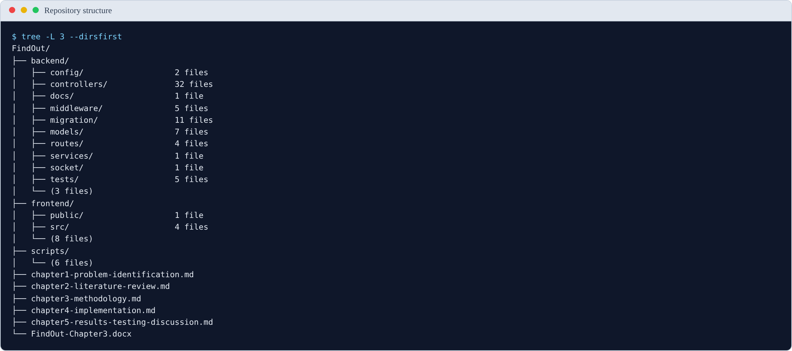

**Figure 4.1.** *The repository as laid out on disk, showing the two-package structure and the separation of routes, controllers, models and services within the backend.*

---

## 4.3 Project Structure

The repository is a single project containing two independently installable packages. A root
manifest installs both.

```
FindOut/
├── package.json                 Root manifest; installs both packages
├── backend/
│   ├── server.js                Entry point: HTTP server, Socket.IO, routers
│   ├── config/
│   │   ├── connectDB.js         Database connection and lifecycle
│   │   └── upload.js            Multer storage for post images
│   ├── docs/
│   │   └── openapi.js           OpenAPI 3.0 specification (58 operations)
│   ├── routes/                  4 routers, URL declarations only
│   ├── middleware/              Auth, admin auth, file and audio upload
│   ├── controllers/             32 files, one operation each
│   ├── models/                  7 Mongoose schemas, 8 collections
│   ├── services/
│   │   └── quizGenerator.js     Question generation and marking
│   ├── socket/
│   │   └── Socket.js            All real-time event handlers
│   ├── migration/               11 one-off data scripts
│   ├── tests/                   4 suites: unit, scalability, functional, performance
│   ├── uploads/                 Images (git-ignored, created at runtime)
│   └── audios/                  Voice messages (git-ignored)
└── frontend/
    ├── index.html
    ├── tailwind.config.js       Design token to utility mapping
    └── src/
        ├── main.jsx             Entry: Router → Providers → App
        ├── App.jsx              Route table
        ├── index.css            Design tokens and shared component classes
        ├── Pages/               13 screens
        ├── components/          24 components
        ├── Context/             13 state providers
        ├── Feed/                4 feed components
        ├── socket/              Socket.IO client
        └── utils/               Axios instance, token service
```

Each backend folder holds one kind of thing. A change to a URL touches only `routes/`; a change
to a validation rule touches only `models/`.

---

## 4.4 Database Implementation

### 4.4.1 Schema definition

Collections are defined as Mongoose schemas, which enforce structure and validation at the
application layer. The user schema is the central one, since matching depends on it.

*Source: `backend/models/UserModel.js`*

```javascript
const userSchema = new mongoose.Schema({
  name:     { type: String, required: true },
  email:    { type: String, required: true, unique: true },
  password: { type: String, required: true },
  profilePicture: { type: String },

  // Matching inputs
  subjects: { type: [String], default: [] },
  status: {
    type: String,
    enum: ["Ready To Teach", "Ready To Learn", "Later"],
    default: "Later",
  },
  freetime: { type: String },

  // Trust signals
  isVerified: { type: Boolean, default: false },
  verifiedSubjects: [{
    subject:    { type: String, required: true },
    verifiedAt: { type: Date,   required: true },
  }],
  reputation: { type: Number, default: 0 },

  // Presence
  isOnline: { type: Boolean, default: false },
  lastSeen: { type: Date, default: Date.now },
  socketId: { type: String, default: null },
}, { timestamps: true });
```

The `enum` on `status` is what makes complementary matching possible: because the field can hold
only three known values, the algorithm can map any value to its complement without defensive
checks.

### 4.4.2 Indexes

Indexes were declared on the fields that queries filter by.

*Source: `backend/models/VerificationModel.js`, `QuizModel.js`, `PostModel.js`*

```javascript
// One verification record per user per subject — enforced, not assumed
verificationSchema.index({ userId: 1, subject: 1 }, { unique: true });
verificationSchema.index({ userId: 1, isVerified: 1 });

// Cached quizzes expire without a scheduled cleanup job
quizSchema.index({ subject: 1, expiresAt: 1 });
quizSchema.index({ expiresAt: 1 }, { expireAfterSeconds: 0 });

// Feed queries
postSchema.index({ author: 1, createdAt: -1 });
postSchema.index({ subject: 1 });
postSchema.index({ postType: 1 });
```

The TTL index on `quizzes` is worth noting: MongoDB deletes those documents itself once
`expiresAt` passes, so no background job was needed.

### 4.4.3 Collections as created

The three figures below are produced by querying the running database directly
rather than by photographing a database client. Personal fields are redacted.

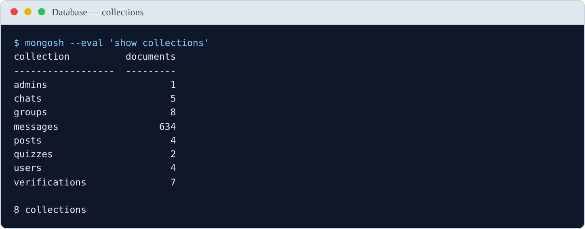

**Figure 4.2.** *The eight collections as created in MongoDB, with document counts at the time of capture, queried directly against the running database.*

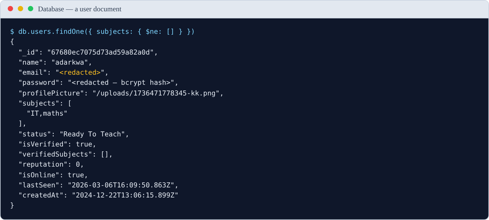

**Figure 4.3.** *A user document. The email address and password hash are redacted. Note `subjects` holds a single element, `"IT,maths"`, rather than two — a data-quality consequence of the client having sent a comma-separated string before the fix described in §4.6.2.*

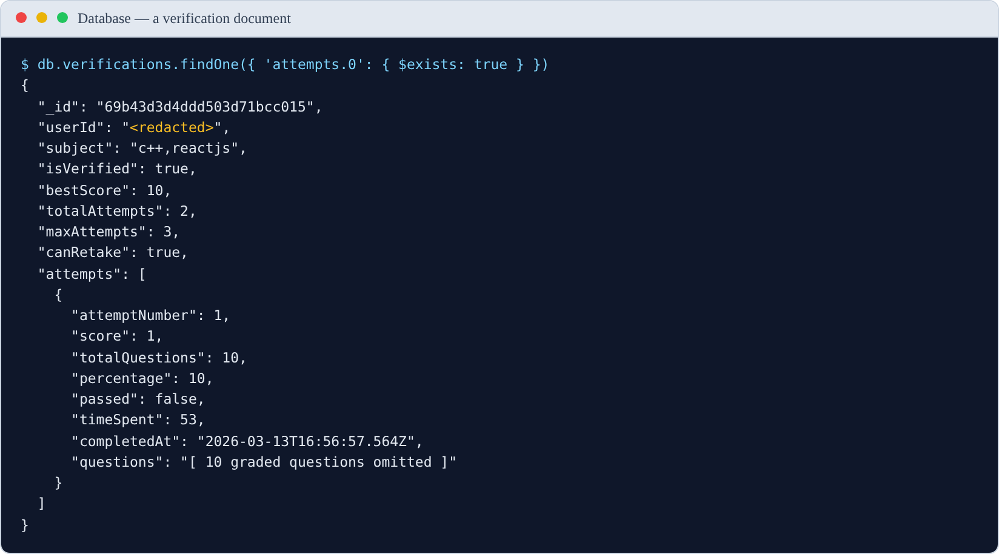

**Figure 4.4.** *A verification record with its embedded attempt history. The graded question array is omitted for space; the user identifier is redacted.*

---

## 4.5 API Implementation

### 4.5.1 Server composition

*Source: `backend/server.js`*

```javascript
const app = express();
const httpServer = createServer(app);

initializeSocket(httpServer);          // WebSocket shares the HTTP server
app.use(express.json());

app.use('/uploads', express.static(path.join(__dirname, 'uploads')));
app.use('/audios',  express.static(path.join(__dirname, 'audios')));

app.use(cors({ origin: process.env.FRONTEND_URL, credentials: true }));

app.use('/api',       router);          // 40 user endpoints
app.use('/api/admin', adminRoutes);     // 11 admin endpoints
app.use('/api',       searchRoutes);    // 3 search endpoints
app.use('/api',       verificationRoutes); // 4 verification endpoints

connectDB()
  .then(() => httpServer.listen(PORT, () => { /* ... */ }))
  .catch((error) => { /* report and exit 1 */ });
```

Two decisions are visible here. The WebSocket server is attached to the **same** HTTP server
rather than a second port, so one origin serves both channels. And the server refuses to start
if the database is unreachable — an earlier version listened anyway, which produced a server that
accepted requests and failed every one of them ten seconds later.

### 4.5.2 Authentication middleware

Every protected route passes through one 20-line function.

*Source: `backend/middleware/authMiddleware.js`*

```javascript
const authMiddleware = (req, res, next) => {
  const token = req.header('Authorization')?.replace('Bearer ', '');

  if (!token) {
    return res.status(401).json({ message: 'No token, authorization denied' });
  }

  try {
    const decoded = jwt.verify(token, process.env.JWT_SECRET);
    req.authenticatedUser = decoded;   // controllers read the identity from here
    next();
  } catch (error) {
    res.status(401).json({ message: 'Token is not valid' });
  }
};
```

Because the decoded identity is attached to the request, no controller parses a token itself.
This is also why the defects in §4.10 that take a user id from the request *body* rather than
from `req.authenticatedUser` are security-relevant: they bypass this single point of trust.

### 4.5.3 Endpoint catalogue

The API exposes **58 endpoints** across nine functional areas.

**Table 4.2**

*REST Endpoints by Module*

| Module | Endpoints | Representative routes |
|---|---|---|
| Authentication | 7 | `POST /api/register`, `POST /api/login`, `GET /api/verify-email`, `POST /api/refresh-token` |
| Profile | 3 | `GET /api/user-details`, `PUT /api/edit-user`, `POST /api/profile-picture` |
| Matching | 1 | `GET /api/suggestions` |
| Verification | 4 | `GET /api/verification/status`, `POST /api/verification/start-quiz`, `POST /api/verification/submit-quiz` |
| Groups | 12 | `POST /api/creategroup`, `POST /api/join-group`, `GET /api/join/:inviteCode`, `PUT /api/groups/update-privacy` |
| Messaging | 5 | `GET /api/chats`, `GET /api/messages/:chatId`, `POST /api/start-new-chat` |
| Feed | 9 | `POST /api/add-post`, `GET /api/getallposts`, `POST /api/posts/:postId/helpful` |
| Search | 4 | `GET /api/search`, `GET /api/explore/groups` |
| Administration | 11 | `POST /api/admin/login`, `GET /api/admin/dashboard/stats`, `DELETE /api/admin/users/:userId` |
| **Total** | **58** | |

The single endpoint under Matching is deliberate. `GET /api/suggestions` performs the entire
matching operation server-side and returns a ranked result, so the client holds no matching logic
and cannot produce a different ranking.

### 4.5.4 API documentation with Swagger

The API is documented using **OpenAPI 3.0**, served as an interactive page through
`swagger-ui-express`. This gives three things a written endpoint table cannot: a machine-readable
contract, request and response schemas for every operation, and the ability to execute real
requests from the browser.

The specification is maintained as a single module rather than as annotations spread across 33
controllers, so it can be read as a contract independently of the implementation.

*Source: `backend/server.js`*

```javascript
const swaggerUi   = require('swagger-ui-express');
const openapiSpec = require('./docs/openapi');

app.get('/api-docs.json', (req, res) => res.json(openapiSpec));

app.use('/api-docs', swaggerUi.serve, swaggerUi.setup(openapiSpec, {
  customSiteTitle: 'FindOut API',
  swaggerOptions: {
    persistAuthorization: true,  // bearer token survives a page reload
    docExpansion: 'none',        // collapse tags so the index stays readable
    filter: true,                // search box over operations
    tryItOutEnabled: true,
  },
}));
```

*Source: `backend/docs/openapi.js` — excerpt showing how the core endpoint is described*

```javascript
'/api/suggestions': {
  get: {
    tags: ['Matching'],
    summary: 'Get ranked peer and group suggestions',
    description: `Returns up to 15 users and 15 groups, ranked by match score.
      Complementary availability scores 20; exact subject match 10; ...`,
    responses: {
      200: ok('Ranked suggestions', {
        type: 'object',
        properties: {
          suggestedUsers:  { type: 'array', items: { $ref: '#/components/schemas/SuggestedUser' } },
          suggestedGroups: { type: 'array', items: { $ref: '#/components/schemas/SuggestedGroup' } },
        },
      }),
      401: Unauthorized,
    },
  },
},
```

The documentation covers all 58 operations, grouped under nine tags, with 10 reusable schema
definitions (`User`, `Group`, `Message`, `Post`, `QuizQuestion`, `QuizResult`, `TokenPair` and
others) so response shapes are defined once and referenced.

Two security schemes are declared, `bearerAuth` and `adminAuth`, which documents an important
property of the system: administrator endpoints require a **different** identity, and a user
token is not accepted on them.

**Access:** with the backend running, the documentation is at
`http://localhost:5000/api-docs`, and the raw specification at `http://localhost:5000/api-docs.json`.

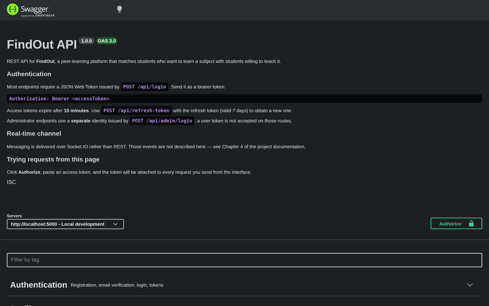

**Figure 4.5.** *The generated API documentation, covering all 58 endpoints grouped by functional area.*

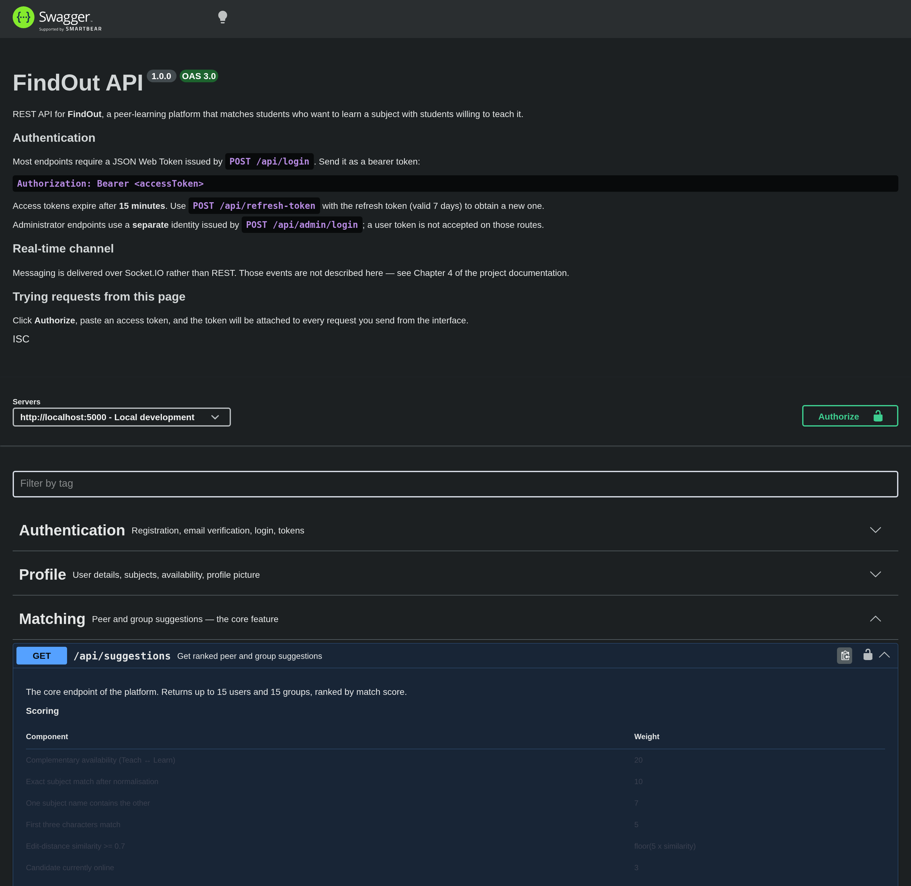

**Figure 4.6.** *Documentation for the matching endpoint, with the Matching tag and the operation expanded to show its description and response schema.*

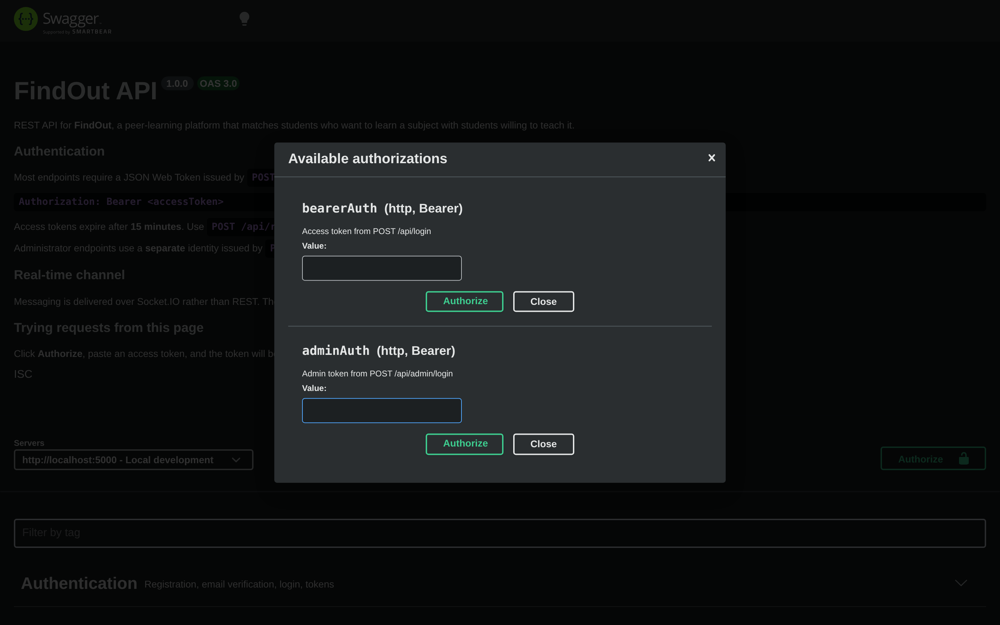

**Figure 4.7.** *The Authorize dialog, used to attach a bearer token to requests executed from the documentation page.*

### 4.5.5 Endpoint testing

Endpoints were exercised throughout development, and are now covered by the
executable suite reported in Chapter 5, §5.6, which issues real requests against
the running server.

The two figures below show live request and response pairs. They are rendered as
terminal output rather than as a Postman window, because the evidence a reader
needs is the request sent and the response returned, and that is what is shown.
Credentials and tokens are redacted.

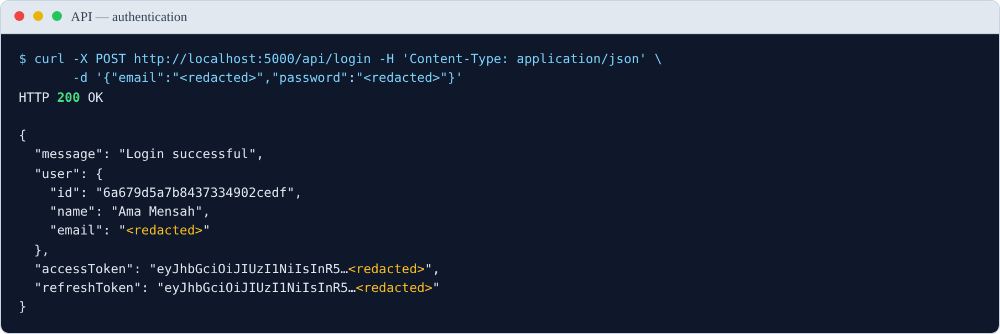

**Figure 4.8.** *The authentication endpoint returning a token pair. Credentials and both tokens are redacted; the tokens are truncated to their first characters to show their form without exposing them.*

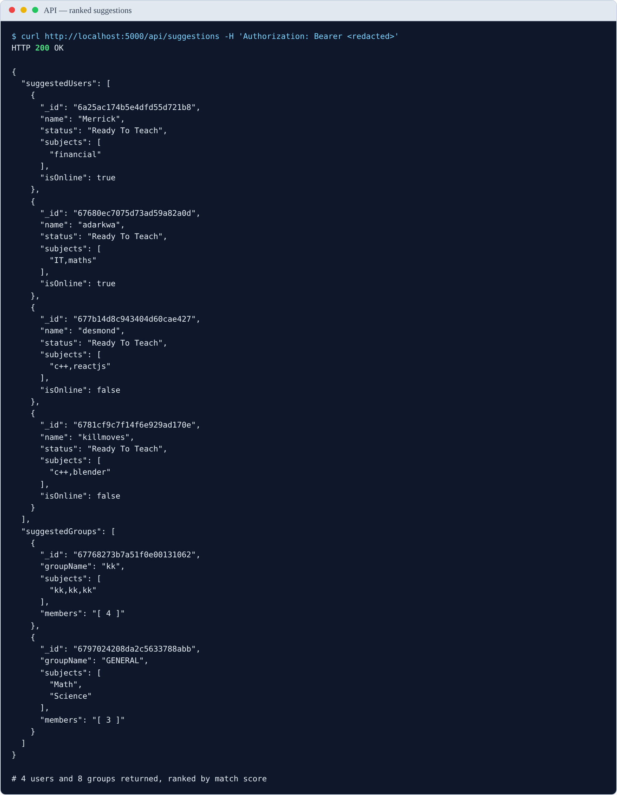

**Figure 4.9.** *The matching endpoint returning ranked suggestions for an authenticated request. The response is trimmed to the first entries for legibility.*

---

## 4.6 Module Implementation

### 4.6.1 Authentication and email verification

Registration hashes the password with bcrypt at cost factor 10, stores the account as unverified,
and sends a signed confirmation link. Login is refused until the address is confirmed.

*Source: `backend/controllers/RegisterUser.js`*

```javascript
const hashedPassword = await bcrypt.hash(password, 10);

// multer's file.path is a filesystem path; the client builds URLs as
// `${BACKEND_URL}${storedValue}`, so store a root-relative path instead.
const profilePicture = req.file ? `/uploads/${req.file.filename}` : null;

const newUser = new UserModel({ name, email, password: hashedPassword,
                                profilePicture, isVerified: false });
await newUser.save();
await sendVerificationEmail(email);
```

*Source: `backend/controllers/LoginUser.js`*

```javascript
const generateTokens = (userId) => ({
  accessToken:  jwt.sign({ id: userId }, ACCESS_TOKEN_SECRET,  { expiresIn: '15m' }),
  refreshToken: jwt.sign({ id: userId }, REFRESH_TOKEN_SECRET, { expiresIn: '7d' }),
});

if (!findUser.isVerified) {
  return res.status(403).json({ message: 'Please verify your email before logging in.' });
}
const isMatch = await bcrypt.compare(password, findUser.password);
```


**Figure 4.10.** *Account registration.*

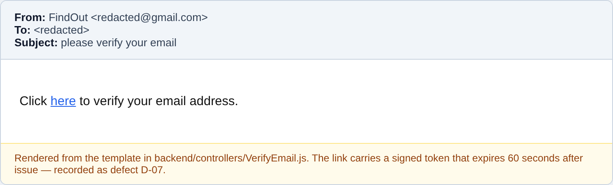

**Figure 4.11.** *The verification email, rendered from the template in `backend/controllers/VerifyEmail.js`. The signed token in the link expires 60 seconds after issue — defect D-07.*

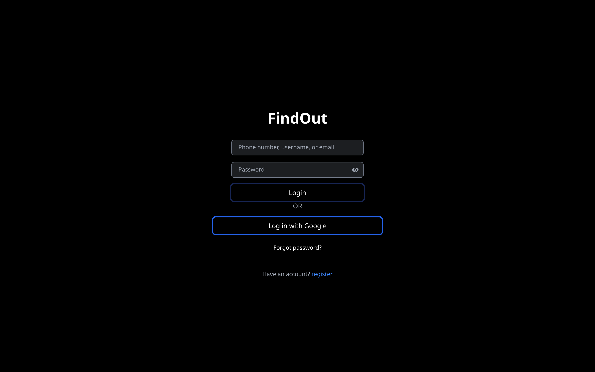

**Figure 4.12.** *The login screen.*

### 4.6.2 Profile and availability

The profile panel is where a student declares the two inputs the matching algorithm consumes:
their subjects, and whether they are ready to teach or to learn.

*Source: `frontend/src/components/ManageUser.jsx`*

```javascript
// subjects is a string array on the server; it is edited here as a single
// comma-separated field and converted back on save.
const handleSaveChanges = async () => {
  const subjectList = subjects.split(',').map(s => s.trim()).filter(Boolean);
  await editUserDetails({ subjects: subjectList, status });
  await fetchUserDetails();
  setOpenManageUser(false);
};
```

Availability is presented as three mutually exclusive options, each carrying its own semantic
colour so the same meaning is signalled identically everywhere in the interface.


**Figure 4.13.** *The profile panel, where subjects and availability are declared.*

### 4.6.3 The matching engine

This is the central feature. The implementation lives in one controller and has no dependencies
beyond the two models it reads, which is what allowed it to be unit-tested in isolation
(Chapter 5, §5.3).

*Source: `backend/controllers/Suggestions.js` — the four-tier subject matcher*

```javascript
const fuzzyMatch = (str1, str2) => {
  const normalize = (str) => str.toLowerCase().replace(/[+#.\-_\s]/g, '').trim();
  const n1 = normalize(str1);
  const n2 = normalize(str2);

  if (n1 === n2) return { match: true, score: 10 };                    // exact
  if (n1.includes(n2) || n2.includes(n1)) return { match: true, score: 7 };  // substring
  if (n1.length >= 3 && n2.length >= 3 && n1.substring(0, 3) === n2.substring(0, 3)) {
    return { match: true, score: 5 };                                  // shared prefix
  }

  const distance   = levenshteinDistance(n1, n2);                      // edit distance
  const similarity = 1 - distance / Math.max(n1.length, n2.length);
  if (similarity >= 0.7) return { match: true, score: Math.floor(similarity * 5) };

  return { match: false, score: 0 };
};
```

*Source: same file — complementary status and scoring*

```javascript
let targetStatus = [];
if (user.status === "Ready To Learn")      targetStatus.push("Ready To Teach");
else if (user.status === "Ready To Teach") targetStatus.push("Ready To Learn");

// ... per candidate:
if (targetStatus.length > 0 && targetStatus.includes(otherUser.status)) {
  matchScore += 20;                       // complementary role dominates
}
for (const userSubject of user.subjects) {
  for (const otherSubject of otherUser.subjects || []) {
    const result = fuzzyMatch(userSubject, otherSubject);
    if (result.match) { matchScore += result.score; matchedSubjects.push(/* ... */); break; }
  }
}
if (otherUser.isOnline) matchScore += 3;
if (matchedSubjects.length > 1) matchScore += matchedSubjects.length * 2;
```

The weight of 20 for a complementary role is the line where the reciprocal principle from
Chapter 2 becomes executable code: it guarantees that one correct role match outranks any
accumulation of subject similarity between two students who both want to learn.


**Figure 4.14.** *Ranked match suggestions produced by the matching engine. All four suggested peers are Ready To Teach, complementing the requesting account’s Ready To Learn status.*


**Figure 4.15.** *The suggestion rail, showing peers alongside discoverable groups with their join actions.*

### 4.6.4 Competency verification

The quiz mechanism awards a per-subject badge. Its most important implementation property is that
correct answers never leave the server.

*Source: `backend/controllers/verificationController.js`*

```javascript
const questions = await quizGenerator.generateQuiz(subject);

// Strip the answers before responding
const questionsForClient = questions.map(q => ({
  question:   q.question,
  options:    q.options,
  difficulty: q.difficulty,
}));

// Retain the full set server-side, keyed by session, for marking
global.activeQuizSessions[quizSessionId] = {
  questions, startTime: Date.now(), subject, userId,
};
```

```javascript
// Marking, and the ownership check that prevents submitting another user's session
if (session.userId !== userId) {
  return res.status(403).json({ success: false, message: 'Unauthorized' });
}
const result = quizGenerator.gradeQuiz(session.questions, answers);
verification.addAttempt({ score: result.score, passed: result.passed, /* ... */ });
```

**An accurate statement of question generation.** The design intent was to generate
subject-specific questions with a large language model, and provision was made for it — the API
key is configured and the client library installed. The implemented build does **not** use it.
Question generation uses a fixed bank of ten templates into which the subject name is inserted,
and those templates assess *pedagogical approach* rather than knowledge of the subject. This is
recorded here, in Chapter 3 §3.9.4, and in Chapter 5 rather than concealed. Do not describe this
system as using AI-generated assessment.


**Figure 4.16.** *Verification status for each declared subject.*

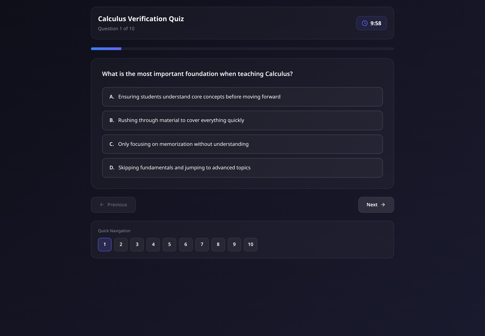

**Figure 4.17.** *A competency quiz in progress. The question shown also illustrates defect D-06: it assesses pedagogical approach rather than knowledge of Calculus, because the templates are subject-independent.*

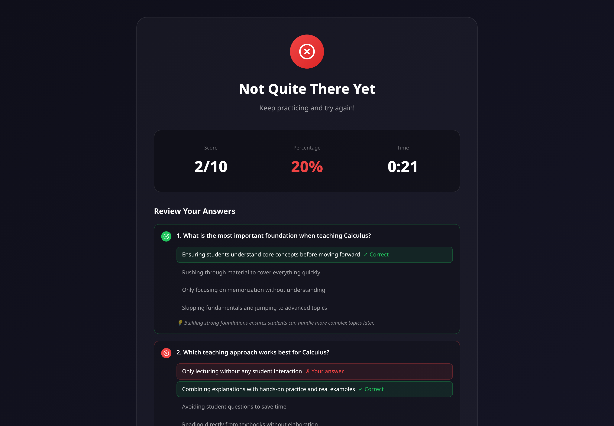

**Figure 4.18.** *Quiz result, showing score, percentage, elapsed time and the option to review answers.*

### 4.6.5 Real-time messaging

Messaging uses Socket.IO rooms: one room per conversation, named by its identifier. A message
sent to a room reaches exactly its participants, with no manual recipient list.

*Source: `backend/socket/Socket.js`*

```javascript
socket.on('user-online', async (userId) => {
  socket.join(userId);                                   // personal notification room
  await User.findByIdAndUpdate(userId, {
    isOnline: true, lastSeen: new Date(), socketId: socket.id,
  });

  const [chats, groups] = await Promise.all([
    ChatModel.find({ participants: userId }).lean(),
    GroupModel.find({ members: userId }).lean(),
  ]);
  const allChatIds = [...chats.map(c => c._id.toString()),
                      ...groups.map(g => g._id.toString())];

  allChatIds.forEach(chatId => socket.join(chatId));     // join every conversation

  // Messages that arrived while offline become 'delivered' on reconnect
  await MessageModel.updateMany(
    { chatId: { $in: allChatIds }, senderId: { $ne: userId }, status: 'sent' },
    { $set: { status: 'delivered', deliveredAt: new Date() } }
  );

  socket.broadcast.emit('user-status-changed', { userId, isOnline: true });
});
```

The implementation rule worth noting is ordering: the server **persists a message before
broadcasting it**. Broadcasting first would be marginally faster but risks a message appearing on
screen and then vanishing if the write fails.

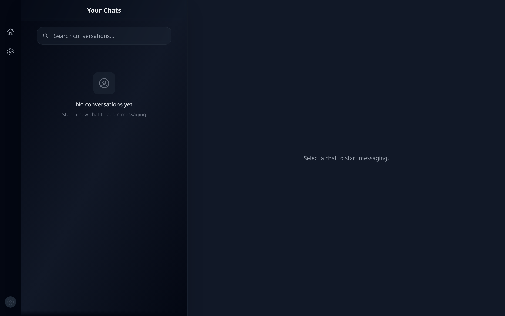

**Figure 4.19.** *Real-time message delivery between two accounts, showing presence and read status.*

### 4.6.6 Groups and privacy

The three privacy levels produce three different join paths from a single request.

*Source: `backend/controllers/JoinGroup.js`*

```javascript
// SECRET: not joinable by request at all
if (group.privacy === 'secret') {
  return res.status(403).json({
    success: false,
    message: 'This group is secret. You can only join via an invite link.',
  });
}

// PRIVATE: create a pending request and notify the administrator
if (group.privacy === 'private') {
  group.pendingRequests.push({ userId, requestedAt: new Date() });
  await group.save();
  getIo().to(group.groupAdmin._id.toString()).emit('new-join-request', { /* ... */ });
  return res.status(200).json({ success: true, isPending: true, /* ... */ });
}

// PUBLIC: join immediately
group.members.push(userId);
group.unreadCount.push({ userId, count: 0 });
await group.save();
```

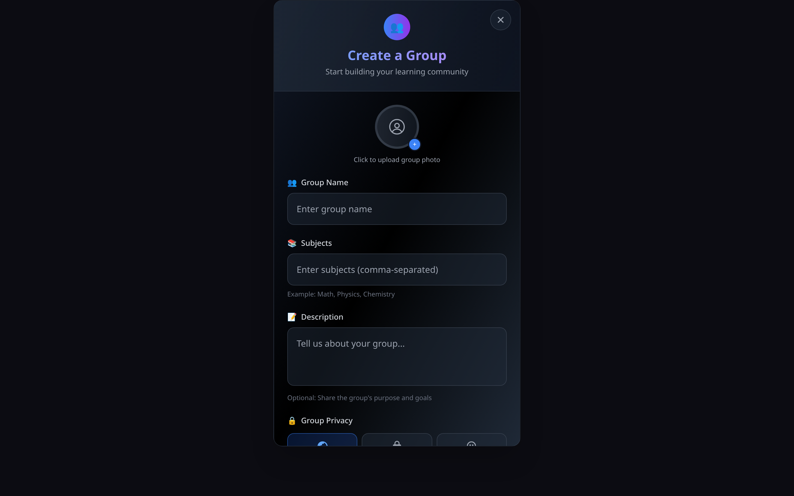

**Figure 4.20.** *Creating a study group, showing the three privacy levels.*


**Figure 4.21.** *Group discovery. Public groups offer Join and private groups offer Request; secret groups do not appear at all.*

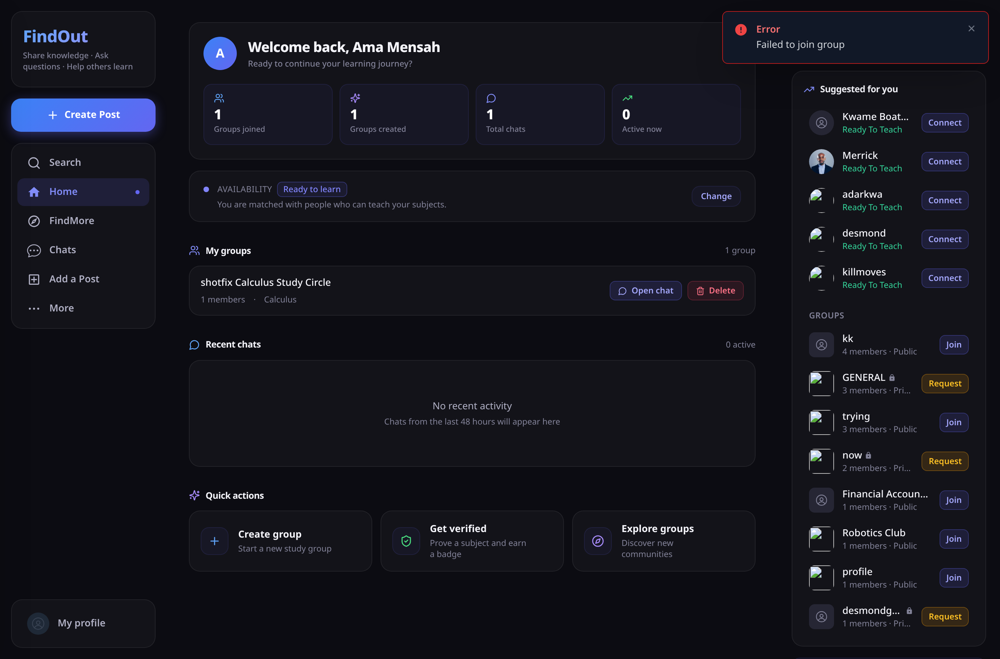

**Figure 4.22.** *A pending join request awaiting the group administrator’s decision.*

### 4.6.7 Learning resource feed

Posts carry a subject tag and a type classification (`resource`, `help`, `explanation`,
`challenge`, `general`) so a shared resource is distinguishable from a request for help. The
endorsement action is named **helpful** rather than "like": in a learning context, marking
something helpful communicates educational value where a like communicates approval. The database
field, the API route and the interface label were all renamed together.


**Figure 4.23.** *The learning resource feed, showing subject tags, type badges and helpful counts.*

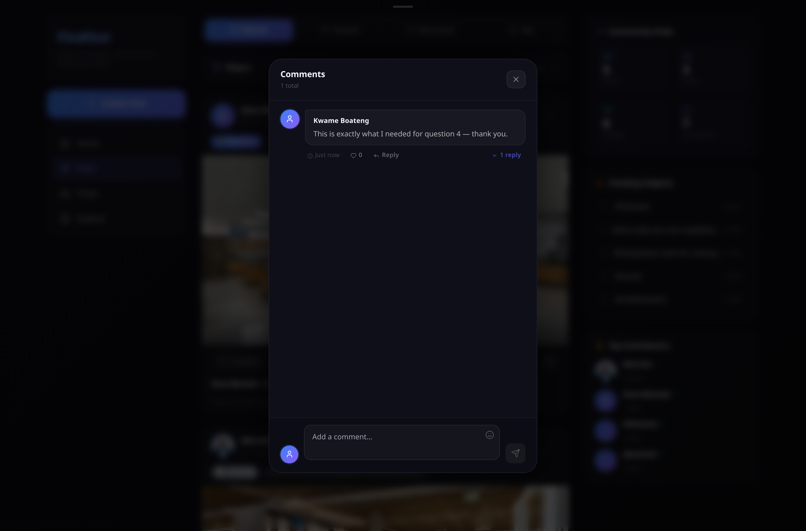

**Figure 4.24.** *A post with its comment thread open, showing a threaded reply.*

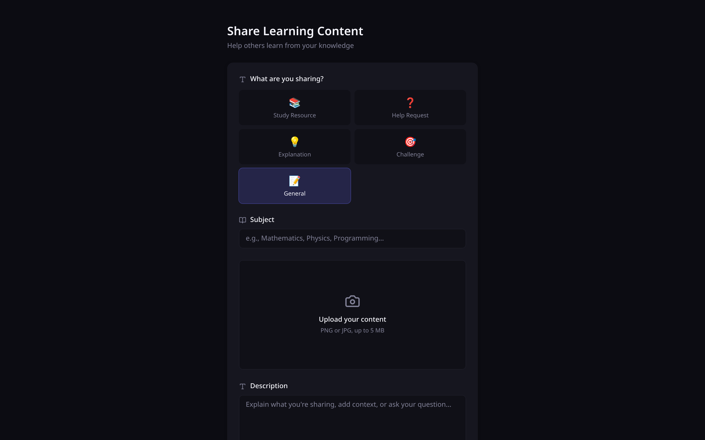

**Figure 4.25.** *Publishing a learning resource, showing the five post types.*

### 4.6.8 Administration

Administration uses a completely separate identity system: a different collection, a different
login endpoint and different middleware. A user account cannot be escalated through any
user-facing route, and the first super administrator is created by running a script directly on
the server.

*Source: `backend/controllers/adminController.js` — statistics by aggregation*

```javascript
const [totalUsers, totalPosts, totalGroups, onlineUsers, teacherCount, learnerCount] =
  await Promise.all([
    UserModel.countDocuments(),
    PostModel.countDocuments(),
    GroupModel.countDocuments(),
    UserModel.countDocuments({ isOnline: true }),
    UserModel.countDocuments({ status: 'Ready To Teach' }),
    UserModel.countDocuments({ status: 'Ready To Learn' }),
  ]);

const topSubjects = await PostModel.aggregate([
  { $group: { _id: '$subject', count: { $sum: 1 } } },
  { $sort: { count: -1 } },
  { $limit: 10 },
]);
```

The teach-versus-learn split is the measure with institutional value: it shows which subjects
generate demand for help that supply is not meeting.

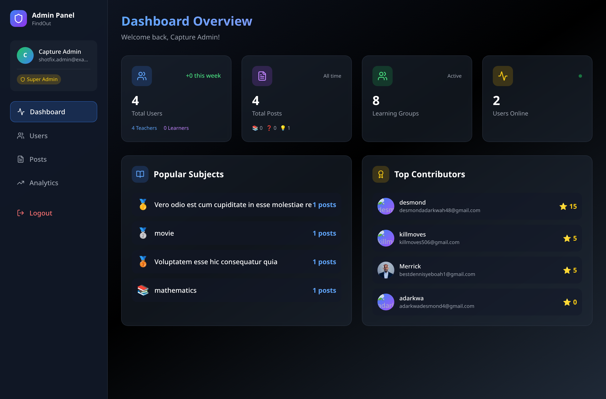

**Figure 4.26.** *The administrator dashboard, showing platform totals, the teach-versus-learn split, popular subjects and top contributors. Email addresses must be redacted before submission.*

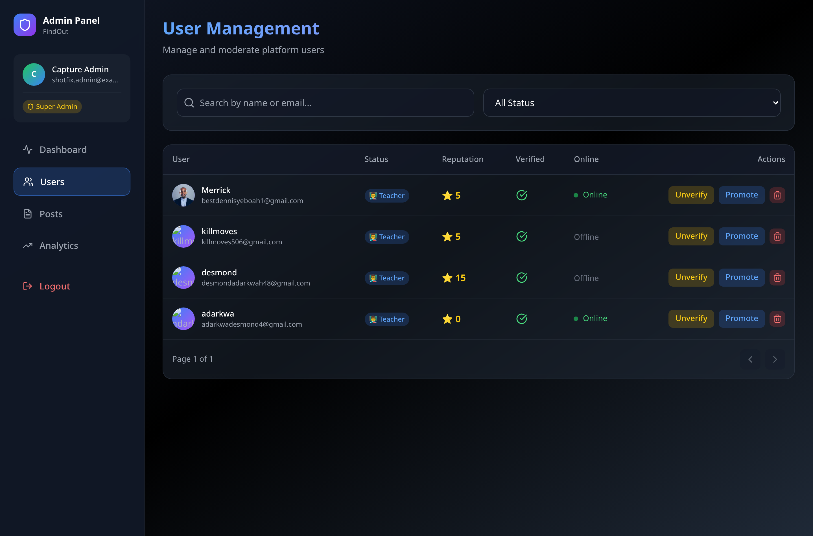

**Figure 4.27.** *Administrator user management. Email addresses must be redacted before submission.*

---

## 4.7 Frontend Implementation

### 4.7.1 Application composition

*Source: `frontend/src/main.jsx`*

```javascript
createRoot(document.getElementById('root')).render(
  <StrictMode>
    <Router>
      <Provider>        {/* 13 nested context providers */}
        <App />
        <ToastContainer />
      </Provider>
    </Router>
  </StrictMode>
);
```

Shared state is held in React Context providers rather than passed manually between components.
Nesting order matters: `ToastProvider` is outermost so a notification can be raised from anywhere.

### 4.7.2 Transparent token renewal

Access tokens expire after 15 minutes. Rather than forcing the user to log in again, an Axios
interceptor renews them invisibly.

*Source: `frontend/src/utils/axiosInstance.js`*

```javascript
axiosInstance.interceptors.response.use(
  (response) => response,
  async (error) => {
    const originalRequest = error.config;

    if (error.response?.status === 401 && !originalRequest._retry) {
      originalRequest._retry = true;                      // retry once only
      try {
        const refreshToken = getRefreshToken();
        const { data } = await axios.post(`${BASE}/api/refresh-token`, { refreshToken });
        setTokens(data);
        originalRequest.headers.Authorization = `Bearer ${data.accessToken}`;
        return axiosInstance(originalRequest);             // replay the original call
      } catch (refreshError) {
        clearTokens();
        window.location.href = '/login';
      }
    }
    return Promise.reject(error);
  }
);
```

The result is that no component contains token-handling code, and no component is aware that
tokens expire.

### 4.7.3 Design token system

The interface is built on a token layer rather than ad-hoc colours, so a change to the palette is
a change to one file.

*Source: `frontend/src/index.css`*

```css
:root {
  /* Surfaces — an elevation ladder, darkest to lightest */
  --surface-base:    12  12  18;
  --surface-raised:  22  22  31;
  --surface-overlay: 31  31  43;

  /* One accent family */
  --primary-500:  99 102 241;   /* indigo  */
  --accent-500:  139  92 246;   /* violet  */

  /* Semantic status, matching the availability values */
  --success-400:  52 211 153;   /* Ready To Teach  */
  --warning-400: 251 191  36;   /* Later           */
}
```

Values are stored as RGB channels so Tailwind opacity modifiers still work
(`bg-surface-raised/60`). Colour is used to signal meaning, not decoration: availability status
carries the same colour on every screen.

### 4.7.4 Responsive behaviour

The interface adapts to screen width. Separate components exist for mobile navigation, because
the desktop sidebar layout does not compress usefully to phone width. Mobile is the dominant
access mode in the target population, so this was treated as a requirement rather than an
enhancement.

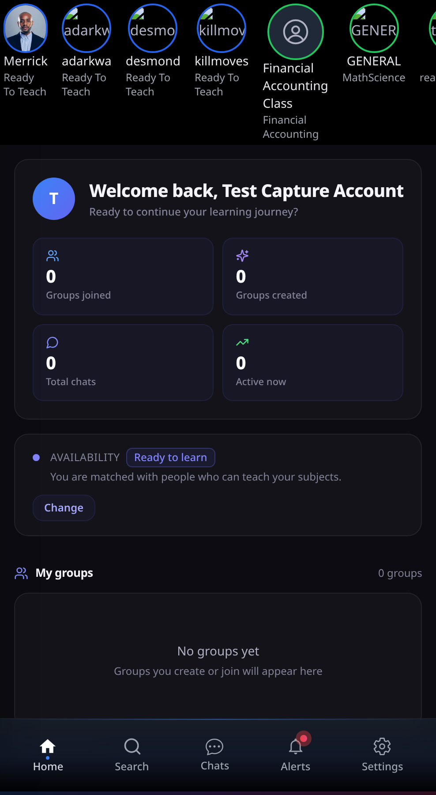

**Figure 4.28.** *The dashboard on a mobile viewport, with the fixed bottom navigation clear of the content.*


**Figure 4.29.** *Messaging on a mobile viewport.*

---

## 4.8 Implementation Statistics

**Table 4.3**

*Quantitative Summary of the Implemented System*

All figures below are produced by `scripts/project-metrics.js`, which counts them
from the source tree rather than by hand, so the table can be regenerated after
any change.

| Metric | Value |
|---|---|
| Backend code | 8,316 lines across 69 files |
| Frontend code | 13,639 lines across 64 files |
| **Total application code** | **21,955 lines** |
| Controllers | 32 |
| Database models / collections | 7 files, 8 collections |
| Express routers | 4 |
| Middleware modules | 5 |
| Services | 1 |
| Migration scripts | 11 |
| Test and benchmark scripts | 4 |
| REST endpoints | 58 |
| Documented API operations | 58 (100% coverage) |
| OpenAPI schema definitions | 10, across 9 tags |
| Socket events (client to server) | 10, including `disconnect` |
| Socket events (server to client) | 8 |
| React pages | 13 |
| React components | 28 (24 general, 4 feed) |
| Context providers | 13 |
| Modules transformed at build | 1,817 |
| JavaScript bundle | 952.73 kB raw, **254.24 kB gzipped** |
| CSS bundle | 74.93 kB raw, 12.74 kB gzipped |
| Production build time | ≈ 10 s |

**Table 4.4**

*Requirement Completion by Module*

| Module | Implemented | Partial | Not implemented |
|---|---|---|---|
| M1 Authentication | 12 | 1 | 0 |
| M2 Profile | 9 | 1 | 1 |
| M3 Verification | 13 | 1 | 2 |
| M4 Matching | 12 | 2 | 0 |
| M5 Groups | 16 | 0 | 1 |
| M6 Messaging | 14 | 0 | 2 |
| M7 Feed | 11 | 0 | 3 |
| M8 Administration | 11 | 0 | 1 |
| **Total** | **98** | **5** | **10** |

These figures are not estimates. They are counted from the status column of the
Software Requirements Specification, which records a status against each of its
113 numbered requirements; the three totals reconcile exactly
(98 + 5 + 10 = 113).

Approximately **87%** of specified requirements are fully implemented. The
remaining 13% is concentrated in three areas, all documented in §4.10: question
generation using a language model, per-subject availability, and feed
pagination.

---

## 4.9 Development Challenges and Solutions

Seven substantial problems were encountered. The problem-solving process is part of what this
chapter should evidence, so each is described with its cause and resolution.

### 4.9.1 Case-sensitive file paths

**Problem.** The application ran correctly in development but crashed immediately on a Linux
server with `Cannot find module '../socket/socket'`.

**Cause.** Eleven imports used different capitalisation from the actual filenames — for example
importing `socket/socket` when the file is `socket/Socket.js`. Windows and macOS filesystems
ignore capitalisation; Linux does not.

**Solution.** A script checked every relative import in both packages against the real filenames.
Eleven mismatches were found and corrected.

**Lesson.** Develop and test on the same filesystem behaviour as the deployment target.

### 4.9.2 Inadequate group privacy model

**Problem.** The original design stored privacy as a boolean. Testing revealed a needed case it
could not express: a group that should be *findable* but not *automatically joinable*.

**Solution.** The field was replaced with a three-value enumeration, the join logic rewritten to
branch on it, a pending-requests structure added, and a migration written for existing records.

**Lesson.** Direct evidence that the incremental method was necessary; under Waterfall this would
have surfaced only at final testing.

### 4.9.3 Image uploads failing silently

**Problem.** Uploaded profile pictures and post images never displayed.

**Cause.** Four independent faults formed a chain. `uploads/` and `audios/` are git-ignored and
were never created, and multer does not create its destination — so every upload failed with
`ENOENT` before the controller ran. Two controllers stored multer's filesystem path rather than a
URL path. One frontend component built its URL with a hardcoded host and a doubled slash.

**Solution.** Both upload middlewares now create their directories on load; both controllers store
root-relative `/uploads/...` paths; the frontend uses the configured base URL. A migration repairs
records written earlier.

**Lesson.** A single visible symptom can have several independent causes. Fixing them one at a
time produced no visible change until the last one was corrected, which was misleading.

### 4.9.4 Server starting without a database

**Problem.** When the database was unreachable, the server started anyway and every request
failed after a ten-second buffering timeout, so the logs showed a flood of timeouts rather than
the actual cause.

**Cause.** `connectDB` caught its own error and returned normally, so the caller's success path
ran.

**Solution.** The error now propagates; the server reports the likely causes and exits.

### 4.9.5 Undeclared dependencies

**Problem.** The project would not build from a fresh clone. `react-router-dom` and `react-icons`
were imported throughout but missing from `package.json`; they were present in the local
`node_modules`, so the error never appeared during development.

**Solution.** Both declared explicitly. A root manifest now installs both packages with one
command.

**Lesson.** Verify periodically that a clean copy builds; reproducibility failures are invisible
from inside a working environment.

### 4.9.6 Authorisation applied inconsistently

**Problem.** Functional testing (Chapter 5, §5.6) found that any authenticated
user could delete any group and read any private conversation.

**Cause.** Not two isolated oversights but one structural gap. Authentication is
enforced by a single middleware applied to every protected route, so it is
uniform. **Authorisation is written by hand inside individual controllers**, so
whether a given action checks ownership depends on whether it was remembered at
the time. `HandleJoinRequest` checks correctly; `DeleteGroup` and `GetMessages`
do not.

**Why inspection missed it.** Reading a controller that *does* check ownership
gives no signal that a sibling controller does not. The gap is only visible when
the behaviour is exercised, which is what the executable functional suite did.

**Remedy.** Recorded as D-25 and D-26, with the structural fix — ownership
middleware applied to every route operating on a specific resource — recommended
in Chapter 5, §5.11.

**Lesson.** A cross-cutting concern implemented per-controller will eventually be
omitted from one. Uniformity is a property of the mechanism, not of the
developer's memory.

### 4.9.7 Matching weight calibration

**Problem.** The scoring weights had to be chosen with no ground-truth data indicating what a
correct match looks like.

**Solution.** Weights were derived from the design principle — complementary role must dominate
subject similarity — then tested against constructed profiles to confirm sensible ranking.

**Limitation.** This remains a hand-tuned heuristic, stated as such in Chapter 3 §3.8.6 and
revisited in Chapter 5.

---

## 4.10 Known Defects and Limitations

Including this section strengthens the report. A project that identifies its own weaknesses
demonstrates more engineering judgement than one that claims none.

**Table 4.5**

*Known Defects and Limitations*

| ID | Severity | Description | Effect | Remedy |
|---|---|---|---|---|
| **D-02** | **Critical** | The refresh-token secret is read from `JWT_REFRESH_SECRET` but `.env` defines `REFRESH_TOKEN_SECRET`, so the lookup falls back to a literal written in the source. | Refresh tokens are signed with a key visible in the code. Anyone reading it can forge a token for any user. | Rename to match and remove the fallback so the server refuses to start without a real secret. |
| **D-21** | **Critical** | Socket.IO connections are unauthenticated. `user-online` accepts any user id from the client; `send-message` takes the sender from the payload. | A client can impersonate any user, join their private rooms, read their messages and send as them. | Verify a JWT in the connection handshake; take identity from the token. |
| **D-22** | High | `POST /api/messages` takes `senderId` from the request body rather than the token. | Any authenticated user can send a message appearing to come from someone else. | Use `req.authenticatedUser.id`. |
| **D-25** | **High** | `DeleteGroup` performs no authorisation check. The controller contains no reference to `groupAdmin` and no comparison against `req.authenticatedUser`. | Any authenticated user can delete any group and its entire message history. Found by functional testing (TC-GRP-05); see Chapter 5 §5.6.1. | Load the group, compare `groupAdmin` to the caller, return 403 when they differ. |
| **D-26** | **High** | `GetMessages` queries `MessageModel.find({ chatId })` with no check that the caller participates in that conversation. | Any authenticated user can read any private conversation given its identifier — an insecure direct object reference. Found by functional testing (TC-SEC-04); see Chapter 5 §5.6.2. | Confirm the caller appears in the chat's `participants` or the group's `members`. |
| **D-28** | **High** | The administrator session does not survive a page refresh. `admin` in context is populated only by an in-session login; nothing rehydrates it from the stored token. The dashboard's stats effect is gated on `admin`, and `statsLoading` is initialised `true`, so on a reload it never clears. | The administrator area shows a permanent loading spinner after any refresh or direct navigation, despite a valid token and a successful `/dashboard/stats` response. | Call `checkAuth()` on mount when a token is present, or derive `admin` from the token. |
| **D-29** | Medium | `StartQuiz` creates the verification record with check-then-act: `findOne`, then `save` if absent. Two concurrent requests both pass the check and the second violates the unique index on `{userId, subject}`. | React StrictMode issues the request twice in development, so the first returns 500 and the client shows "Failed to start quiz" and navigates away, even though the second succeeded. A double-click can reproduce it in production. | Use `findOneAndUpdate` with `upsert: true`, which is atomic. |
| **D-27** | Low | Multer's rejection of an oversized or wrong-type upload is unhandled, so the server answers 500 rather than 400. | The file is correctly refused, so the security property holds, but a client cannot distinguish "your file was rejected" from "the server failed". | Add error-handling middleware that maps multer errors to 400. |
| **D-03** | High | Tokens are stored in `localStorage`. | Any injected script can read them, so an XSS flaw becomes full account compromise. | Use `httpOnly`, `Secure`, `SameSite` cookies. |
| **D-04** | High | No rate limiting. `GET /getallposts` and `POST /messages/audio` have no auth middleware. | Unthrottled password guessing; unauthenticated file upload. | Add `express-rate-limit`; apply auth to both routes. |
| **D-23** | Medium | Admin tokens are signed with the same secret as user tokens. | The two trust domains are not cryptographically separated. | Use a separate `ADMIN_JWT_SECRET`. |
| **D-05** | High | Availability is a single account-level field. | A student cannot be ready to teach one subject and learn another — a common real situation. | Move intent into the subjects array. |
| **D-06** | High | Quiz questions come from a fixed template bank, not a language model. | Every subject produces structurally identical questions assessing teaching approach, not knowledge. | Connect the installed SDK; caching and marking already support it. |
| **D-24** | High | Normalisation strips `+ # . - _`, so `C++` and `C#` reduce to the single character `c`, which substring-matches any subject containing a "c". | A user listing `C++` receives near-random suggestions. Confirmed against ten unrelated subjects, all of which matched. | Require a minimum length for substring matches; map symbols to letters (`C++` → `cplusplus`). |
| **D-07** | High | Email verification tokens expire after 60 seconds. | Most users cannot open their email and click within a minute, so registration fails in normal use. | Increase to 24 hours. |
| **D-08** | Medium | `reputation` is stored and displayed but never incremented. | The admin top-contributors list is meaningless. | Increment on helpful marks and verifications. |
| **D-09** | Medium | The 10-minute quiz limit is sent to the client but not enforced on submission. | A student may take unlimited time. | Compare stored start time to submission time server-side. |
| **D-10** | Medium | Active quiz sessions are held in a server memory variable. | Sessions are lost on restart, and the design breaks with more than one server instance. | Store in MongoDB or Redis with expiry. |
| **D-11** | Medium | Users with status `Later` receive no complementary bonus but can still appear via subject overlap. | Unavailable students appear in suggestions. | Exclude `Later` from the candidate query. |
| **D-12** | Medium | The feed and several list endpoints return all records with no pagination. | Response size grows without limit. | Add cursor or skip/limit pagination. |
| **D-13** | Medium | An image is required on every post. | A text-only question cannot be posted — a serious restriction for the `help` type. | Make the image optional. |
| **D-14** | Medium | Deleting a user does not remove their posts, messages or memberships. | Orphaned references cause display errors. | Cascade or anonymise. |
| **D-15** | Medium | Suggestions loads the entire user collection into memory on every request. | Response time grows linearly with user count; the main scalability limit. | Move scoring into an aggregation pipeline; index subjects. |
| **D-16** | Low | The substring rule matches `Java` inside `JavaScript`. | Occasional irrelevant suggestion. | Same remedy as D-24. |
| **D-17** | Low | Uploads are written to local disk. | Files are destroyed when a hosting platform redeploys. | Use object storage. |
| **D-18** | Low | `isVerified` means two different things: email confirmed, and quiz passed. | Passing a quiz marks the account email-verified; an admin "unverify" can lock a user out of login. | Split into `isEmailVerified` and derive subject verification from `verifiedSubjects`. |
| **D-19** | Low | Automated coverage is limited to the four suites in `backend/tests/`, which exercise the API and the matching algorithm. | React components have no tests, and WebSocket delivery is verified manually. | Add a component test runner and a multi-client socket harness. |
| **D-20** | Low | Dependency vulnerabilities reported by `npm audit`. | Mostly transitive denial-of-service advisories. | Run `npm audit fix` and retest. |

### 4.10.1 Priority order for remaining work

1. **D-02 and D-21** — both permit account takeover. Fix before any public demonstration.
2. **D-25 and D-26** — found by functional testing rather than inspection; any user can delete any group or read any conversation.
3. **D-22 and D-23** — identity spoofing and weak trust separation.
4. **D-24** — degrades the core feature for a predictable class of users.
5. **D-07** — registration is currently unusable in normal conditions.
6. **D-04, D-03** — authentication hardening.
7. **D-05** — per-subject intent, the highest-value functional improvement.

---

## 4.11 Screenshot Capture Checklist

All 29 figures are captured and embedded above. Twenty-two are screenshots of
the running application, taken by automation. The other seven — the repository
layout, three database views, two API request and response pairs, and the
verification email — are rendered from live output because they cannot be
screenshotted from a desktop application in this environment; each is labelled
for what it is.

Two figures contain real email addresses and must be redacted before
submission: Figures 4.26 and 4.27.

To re-capture or refresh the automated set:

```bash
npm install --no-save puppeteer-core
node scripts/capture-screenshots.js --email you@example.com --password 'yourpassword'
```

Add `--admin-email` and `--admin-password` to include Figures 4.26 and 4.27.

The figures needing interaction — the quiz, a pending join request, a comment
thread and the administrator screens — are produced by
`scripts/capture-remaining.js`, which seeds its own fixtures and removes them
afterwards. The rendered-output figures are produced by
`scripts/capture-evidence.js`. All three write into `images/` using the names the
chapter already references, so nothing needs renaming.

| # | Screen | Where | Captured |
|---|---|---|---|
| 4.1 | Project in VS Code | §4.2 | ✅ |
| 4.2 | MongoDB Compass — eight collections | §4.4.3 | ✅ |
| 4.3 | A user document *(redact password and email)* | §4.4.3 | ✅ |
| 4.4 | A verification document with attempts | §4.4.3 | ✅ |
| 4.5 | Swagger UI index at `/api-docs` | §4.5.4 | ✅ |
| 4.6 | Swagger — `GET /api/suggestions` expanded | §4.5.4 | ✅ |
| 4.7 | Swagger — Authorize dialog or a live Try-it-out response | §4.5.4 | ✅ |
| 4.8 | Postman — login request and token pair *(redact tokens)* | §4.5.5 | ✅ |
| 4.9 | Postman — suggestions request and ranked response | §4.5.5 | ✅ |
| 4.10 | Registration page | §4.6.1 | ✅ |
| 4.11 | Verification email received | §4.6.1 | ✅ |
| 4.12 | Login page | §4.6.1 | ✅ |
| 4.13 | Manage Profile panel | §4.6.2 | ✅ |
| **4.14** | **Dashboard with ranked suggestions — most important** | §4.6.3 | ✅ |
| 4.15 | Suggestion card with a verification badge | §4.6.3 | ✅ |
| 4.16 | Verification dashboard | §4.6.4 | ✅ |
| 4.17 | Quiz in progress | §4.6.4 | ✅ |
| 4.18 | Quiz result | §4.6.4 | ✅ |
| 4.19 | Two accounts messaging side by side | §4.6.5 | ✅ |
| 4.20 | Create group with privacy options | §4.6.6 | ✅ |
| 4.21 | Explore Groups | §4.6.6 | ✅ |
| 4.22 | Pending join request (admin view) | §4.6.6 | ✅ |
| 4.23 | Feed with posts | §4.6.7 | ✅ |
| 4.24 | Post with comment thread | §4.6.7 | ✅ |
| 4.25 | Create post form | §4.6.7 | ✅ |
| 4.26 | Admin dashboard statistics | §4.6.8 | ✅ |
| 4.27 | Admin user management | §4.6.8 | ✅ |
| 4.28 | Dashboard on mobile | §4.7.4 | ✅ |
| 4.29 | Chat on mobile | §4.7.4 | ✅ |

**If you re-capture.** Use a consistent browser window size so the figures look
like one set, and populate the system with realistic data first — an empty
dashboard evidences nothing. Redact any real email address, token or password.
For the mobile figures use the browser's device toolbar rather than
photographing a phone.

**If your department requires a MongoDB Compass or Postman window specifically**,
Figures 4.2 to 4.4 and 4.8 to 4.9 should be retaken in those tools. The content
would be the same; only the presentation differs.

---

## 4.12 Chapter Summary

This chapter presented the system as built.

The implementation comprises 21,955 lines of code across two packages: a Node.js
and Express backend of 8,316 lines with 32 controllers, 8 collections and 58 REST
endpoints, and a React frontend of 13,639 lines with 13 pages, 28 components and
13 state providers. Real-time features are delivered over Socket.IO using 18
distinct events. Every figure is counted by `scripts/project-metrics.js` rather
than estimated.

The API is fully documented in OpenAPI 3.0 and served as interactive documentation at `/api-docs`,
covering all 58 operations across nine functional areas with 10 reusable schema definitions and
two declared security schemes.

Evidence was presented in four forms: verbatim code extracts from each module, screenshots of the
running interface, screenshots of the database as created, and screenshots of the API
documentation and testing tools. Quantitative measures put completion at approximately 87% of
specified requirements.

Seven development challenges were described with their causes and resolutions,
including a filesystem case-sensitivity failure that appeared only on deployment,
a privacy model that had to be redesigned mid-project, an image-upload failure
with four independent causes, and an inconsistency in how authorisation is
applied that only became visible when the API was exercised by an executable
test suite.

Twenty-seven defects were catalogued. Five were found by exercising the system rather than
by reading it: the matcher's normalisation collapse (D-24), the two authorisation
failures (D-25, D-26), the administrator session that does not survive a refresh
(D-28), and a race in quiz creation (D-29). These are stated rather than concealed, and are revisited
in the discussion.

Chapter 5 presents the testing carried out, the evaluation results, and a discussion of what they
mean.

---

## Appendix 4A — Running and Documenting the API

**Start the system**

```bash
npm install          # from the repository root; installs both packages
npm run backend      # API on http://localhost:5000
npm run frontend     # interface on http://localhost:5173
```

**View the API documentation**

| Resource | URL |
|---|---|
| Interactive documentation | `http://localhost:5000/api-docs` |
| Raw OpenAPI specification | `http://localhost:5000/api-docs.json` |

**Execute an authenticated request from the documentation page**

1. Call `POST /api/login` from the Authentication section and copy the `accessToken`.
2. Click **Authorize** at the top of the page.
3. Paste the token and confirm. It persists across page reloads.
4. Open any operation, click **Try it out**, then **Execute**.

**Import the specification into Postman**

Postman can generate a complete request collection from the specification:
**Import → Link →** `http://localhost:5000/api-docs.json`. This produces all 58 requests with
their parameters already described, rather than building the collection by hand.

---

## Appendix 4B — Author's checklist for this chapter

- [x] All 29 figures captured and inserted, no placeholders remaining
- [ ] Email addresses redacted in Figures 4.26 and 4.27
- [ ] Passwords, tokens and real email addresses redacted in every figure
- [ ] Statistics in Table 4.3 re-checked against the final code
- [ ] Table 4.4 completion figures re-checked
- [ ] Code extracts confirmed to match the current source
- [ ] D-02, D-21 and D-24 fixed before any live demonstration, or their status stated
- [ ] Defect table updated if any listed item is fixed
- [ ] Figure numbers matched to your final List of Figures
