# CHAPTER FOUR
# IMPLEMENTATION

---

> **Note to author.**
>
> This chapter describes what was **actually built**, not what was planned. Every statement here
> was checked against the source code. Where the built system differs from the design in Chapter
> 3, the difference is stated.
>
> **All diagrams are written in Mermaid.** They render automatically on GitHub, GitLab, Notion,
> Obsidian, and VS Code with the Markdown Preview Mermaid extension. If your department requires
> Microsoft Word, see §4.19 for how to export each diagram as an image.
>
> Figures are numbered in academic style (Figure 4.1, 4.2, …) with captions below each, so they
> can be referenced from your text and listed in a List of Figures.
>
> **§4.17 contains two security defects found while writing this chapter.** Read it before your
> demonstration.

---

## 4.1 Introduction

Chapter 3 explained how the system was designed. This chapter describes how it was built.

It covers the structure of the code, how each major feature was implemented, the diagrams that
describe the working system, the statistics of what was produced, the problems encountered during
development, and an honest account of what was completed and what was not.

The chapter follows the system from the outside in: first the overall structure (§4.2–§4.4), then
the backend (§4.5–§4.11), then the frontend (§4.12–§4.13), then security (§4.14), and finally the
results of the build (§4.15–§4.18).

---

## 4.2 Deployment Architecture

The system runs as two separate applications that communicate over a network, plus a database and
an email service.

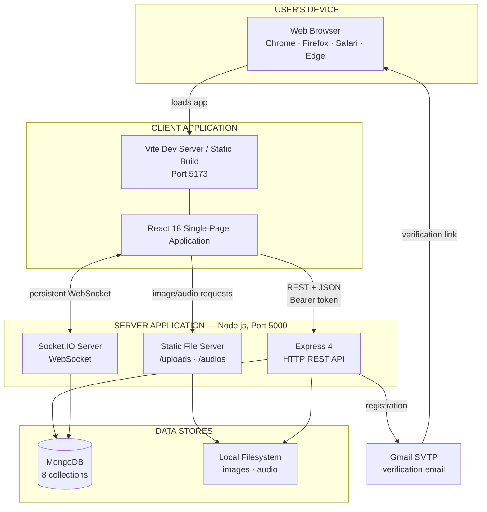

**Figure 4.1.** *Deployment architecture of the implemented system, showing the two applications,
their communication channels, and external dependencies.*

The important feature of this architecture is the **two separate channels** between the client
and the server. The REST API handles operations the user starts. The WebSocket handles messages
that arrive without being requested. Section 3.6.2 explained why both are needed.

---

## 4.3 Code Organisation

The project is a single repository containing two independent packages.

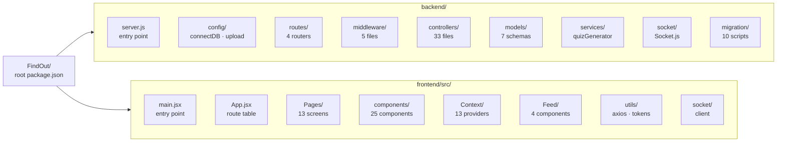

**Figure 4.2.** *Package and folder structure of the implemented codebase.*

Each backend folder holds one kind of thing, and nothing else:

| Folder | Contains | Rule followed |
|---|---|---|
| `routes/` | URL definitions | Declares paths only; contains no business logic |
| `middleware/` | Functions that run before handlers | Cross-cutting concerns only: authentication, file upload |
| `controllers/` | Request handlers | One file per operation |
| `models/` | Mongoose schemas | Data shape and validation only |
| `services/` | Shared logic | Code used by more than one controller |
| `socket/` | Real-time event handlers | All WebSocket behaviour |
| `migration/` | One-off data scripts | Run manually when a schema changes |

This separation means that changing a URL touches only `routes/`, and changing a validation rule
touches only `models/`.

---

## 4.4 Database Implementation

### 4.4.1 Entity relationship diagram

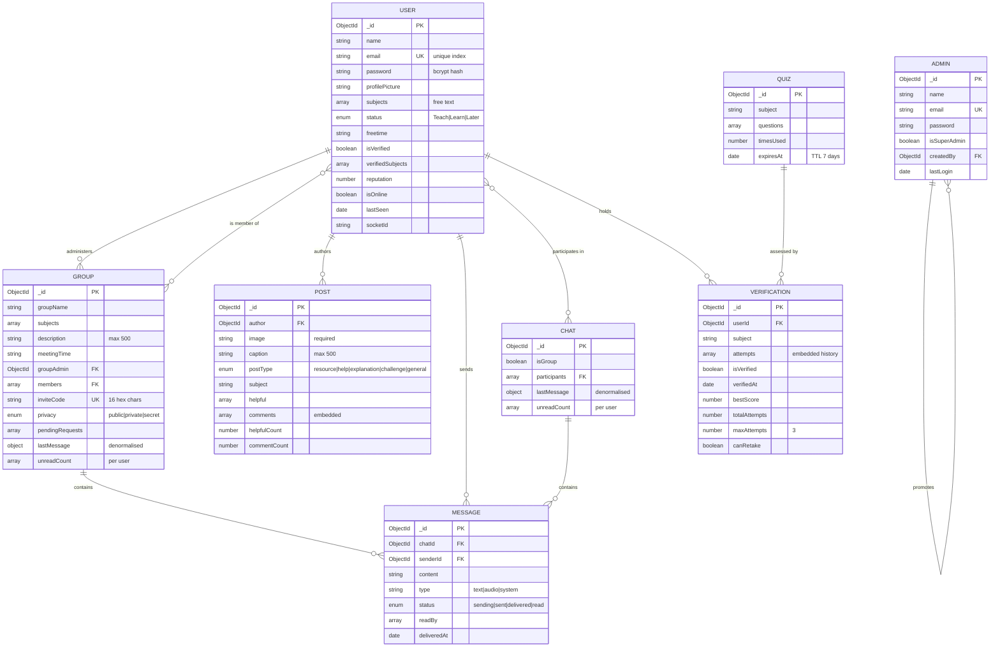

**Figure 4.3.** *Entity relationship diagram of the implemented database, showing all eight
collections, their fields, and the relationships between them.*

### 4.4.2 The nested comment structure

Posts embed their entire discussion. This is worth showing separately because it is three levels
deep.

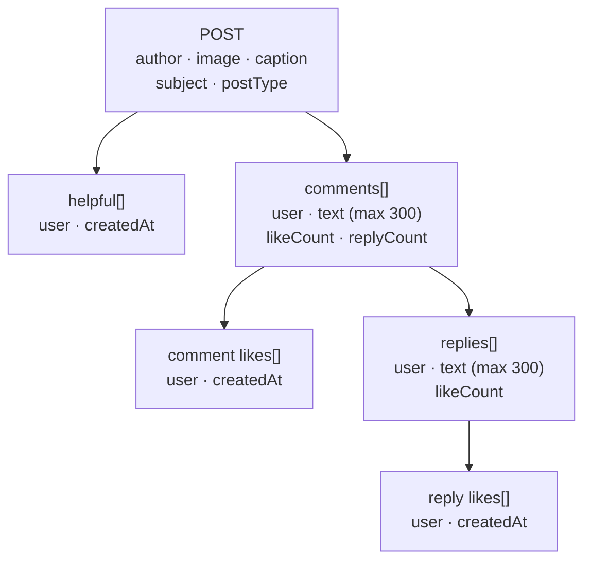

**Figure 4.4.** *Embedded document structure of a post. The entire discussion thread is stored
inside the post document, so retrieving a post with all its comments and replies requires a
single database read.*

The benefit is speed: one read returns everything needed to display a post. The cost is that a
MongoDB document cannot exceed 16 MB, which places an upper limit on how many comments a single
post can hold. For the expected usage this limit is not reached, but it is a real ceiling and is
noted in §4.17.

---

## 4.5 Request Processing Pipeline

Every HTTP request passes through the same sequence of stages before reaching the code that
answers it.

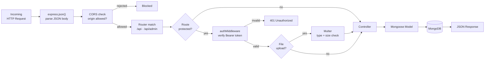

**Figure 4.5.** *Request processing pipeline showing the middleware chain applied to every
incoming HTTP request.*

The authentication middleware is only 20 lines of code but is the single point through which all
protected access passes. It extracts the token from the `Authorization` header, verifies the
signature, and attaches the decoded user identity to the request object. If verification fails it
returns 401 and the controller never runs.

---

## 4.6 Authentication Implementation

### 4.6.1 Registration and login flow

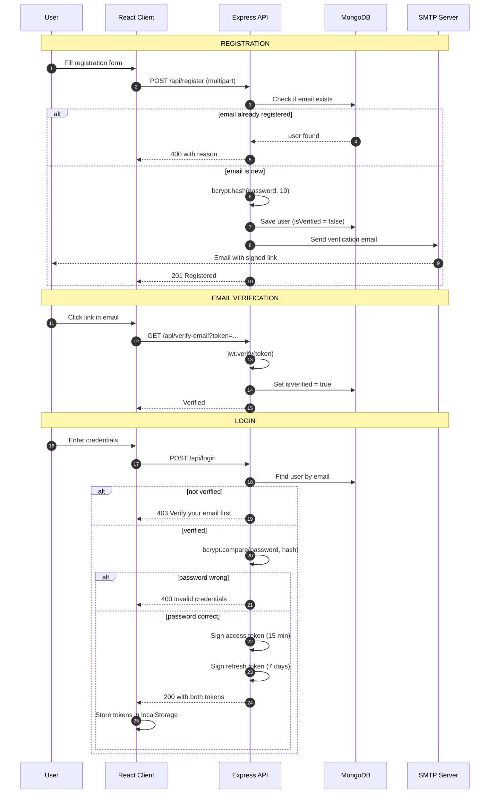

**Figure 4.6.** *Sequence diagram of registration, email verification, and login.*

### 4.6.2 Automatic token renewal

The access token expires after 15 minutes. Rather than forcing the user to log in again, the
frontend renews it automatically. This is implemented in `utils/axiosInstance.js` using an Axios
*interceptor* — a function that inspects every response before the application sees it.

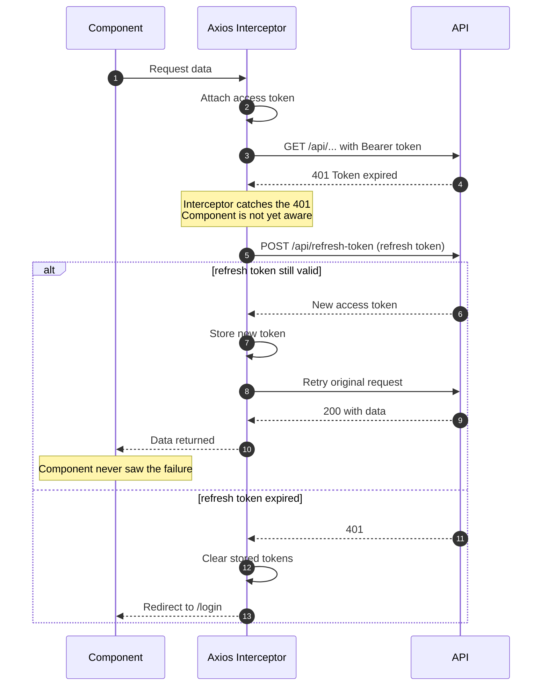

**Figure 4.7.** *Automatic access-token renewal. The interceptor handles expiry transparently, so
no component contains token-handling code.*

This design means token expiry is invisible to the rest of the application. No component needs to
know that tokens exist.

---

## 4.7 Matching Algorithm Implementation

The algorithm specified in §3.8 is implemented in `controllers/Suggestions.js`. Figure 4.8 shows
the executed flow.

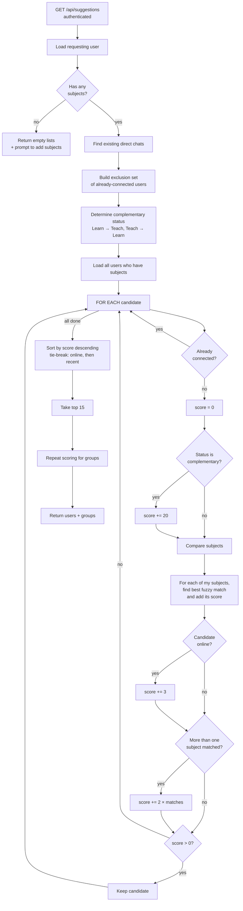

**Figure 4.8.** *Execution flow of the peer matching algorithm.*

### 4.7.1 The fuzzy subject matcher

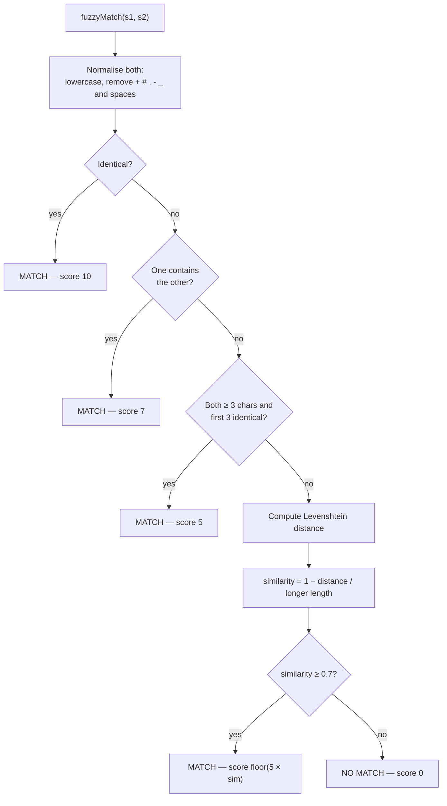

**Figure 4.9.** *Four-tier decision flow of the fuzzy subject matcher. Evaluation stops at the
first tier that matches, so the expensive Levenshtein calculation runs only when the cheaper
tests fail.*

The tiers are ordered by confidence and by computational cost together, which is why the cheapest
and most confident test comes first.

---

## 4.8 Verification Module Implementation

### 4.8.1 Quiz lifecycle

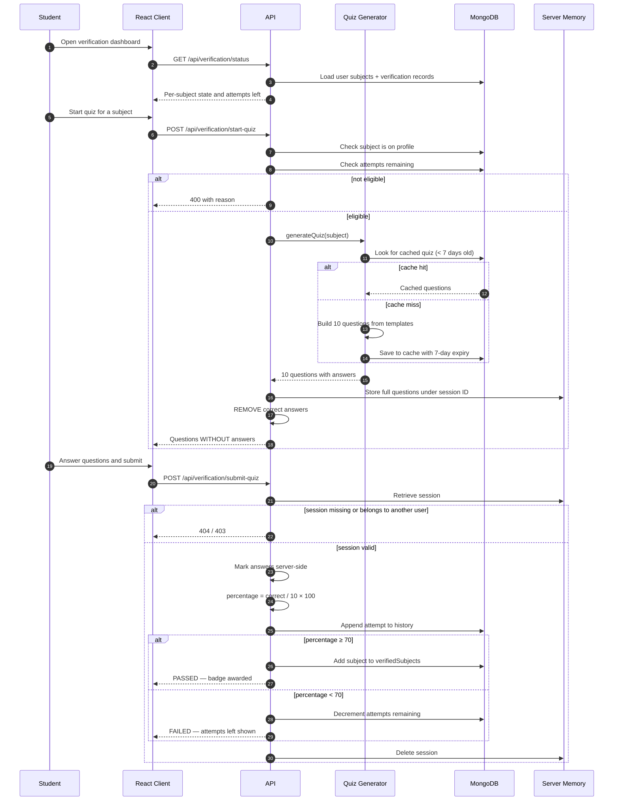

**Figure 4.10.** *Complete quiz lifecycle, showing that correct answers are removed before
transmission and that all marking occurs on the server.*

The critical security property visible in this diagram is that **the correct answers never leave
the server**. They are stripped from the response before it is sent, and marking happens
server-side only. A student inspecting the page source cannot find the answers.

### 4.8.2 Verification state machine

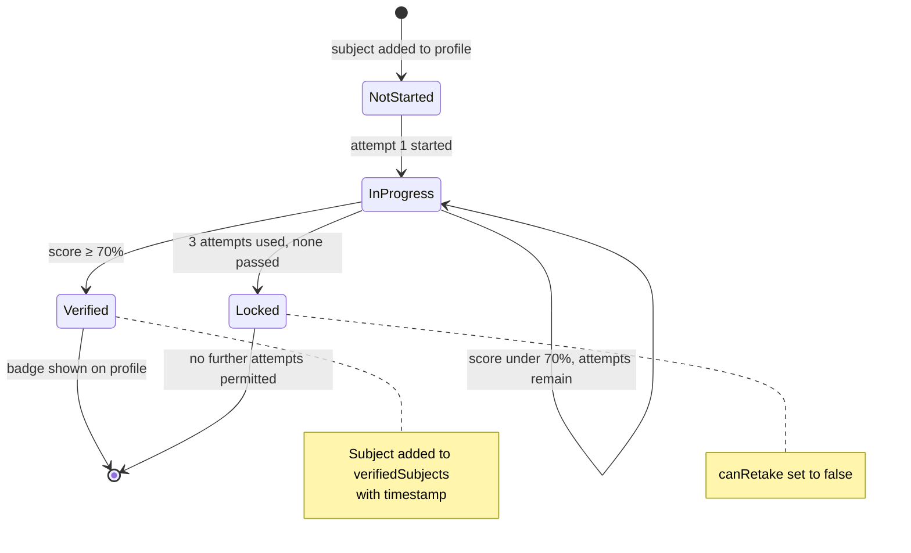

**Figure 4.11.** *Verification state machine for a single subject.*

---

## 4.9 Real-Time Messaging Implementation

### 4.9.1 Room membership model

Socket.IO *rooms* are named groups of connections. Understanding the room model is necessary to
understand how messages reach the right people.

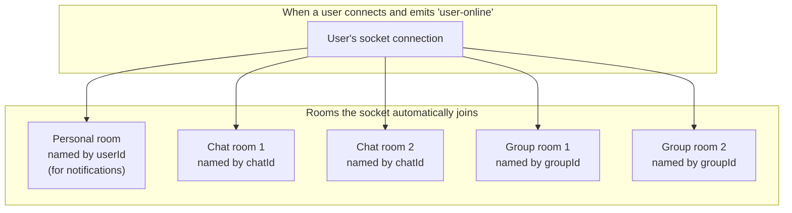

**Figure 4.12.** *Socket room membership. On connection the server finds every chat and group the
user belongs to and joins the socket to the corresponding rooms, plus a personal room used for
direct notifications such as join requests.*

Sending a message to a room reaches exactly the participants of that conversation. No manual
recipient list is needed.

### 4.9.2 Message delivery sequence

```mermaid
sequenceDiagram
    autonumber
    participant S as Sender
    participant IO as Socket.IO Server
    participant D as MongoDB
    participant R as Recipient

    Note over S,R: CONNECTION AND PRESENCE
    S->>IO: connect
    S->>IO: 'user-online' (userId)
    IO->>D: isOnline = true, store socketId
    IO->>D: Find all chats and groups for user
    IO->>IO: Join personal room + all chat rooms
    IO->>D: Mark pending 'sent' messages as 'delivered'
    IO-->>S: 'messages-delivered'
    IO-->>R: broadcast 'user-status-changed'

    Note over S,R: SENDING A MESSAGE
    S->>IO: 'send-message' {chatId, content, type}
    IO->>D: Save message (status = 'sent')
    IO->>D: Update chat lastMessage
    IO->>D: Increment recipient unread count
    IO-->>R: 'message-received'
    IO-->>S: 'message-confirmed'

    Note over S,R: READ RECEIPTS
    R->>IO: 'mark-messages-read' {chatId}
    IO->>D: status = 'read', append to readBy[]
    IO->>D: Reset unread count to 0
    IO-->>S: 'messages-read'

    Note over S,R: DISCONNECTION
    R->>IO: disconnect
    IO->>D: isOnline = false, lastSeen = now
    IO-->>S: broadcast 'user-status-changed'
```

**Figure 4.13.** *Real-time message delivery sequence, from connection through to disconnection.*

An important implementation rule is visible at step 8: the message is **saved to the database
before it is broadcast**. Broadcasting first would be marginally faster but risks a message
appearing on screen and then disappearing if the save fails.

### 4.9.3 Message status state machine

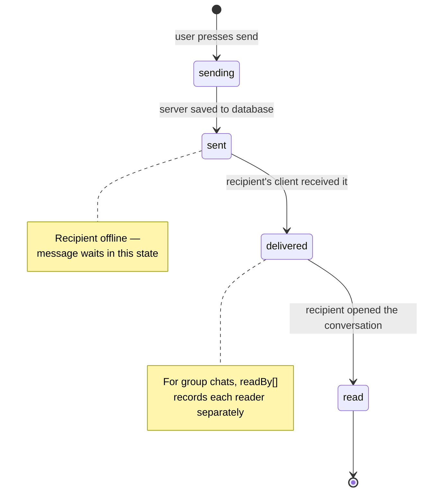

**Figure 4.14.** *Message status state machine. In group chats, "read" is not a single event, so
the system records which specific users have read each message.*

---

## 4.10 Group Management Implementation

The three privacy levels produce three different join paths. Figure 4.15 shows how the same
request is handled differently depending on the group's privacy setting.

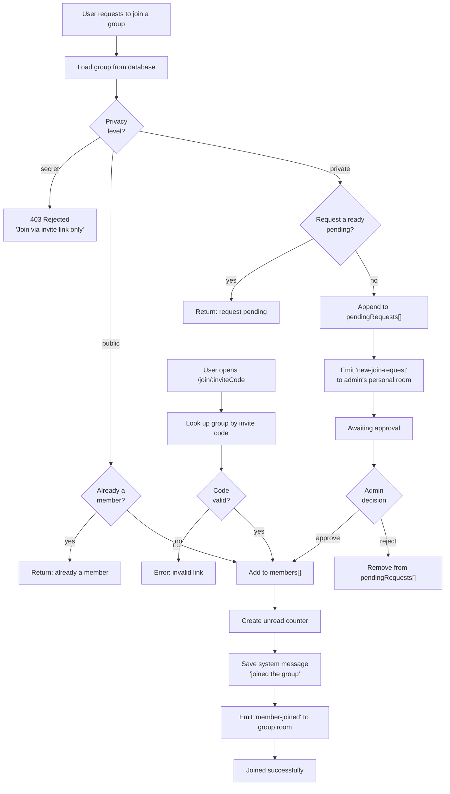

**Figure 4.15.** *Group join flow. The privacy level determines which of three paths a join
request follows. The invite-code path (bottom) bypasses privacy checks entirely, which is how
secret groups are joined.*

This diagram makes clear why the boolean design of increment I5 was inadequate. A boolean can
express "open" and "hidden" but cannot express the middle path — visible in search, but requiring
approval — which is what the `private` level provides.

---

## 4.11 Feed and Administration Modules

### 4.11.1 Feed

The feed implements posts with a subject tag and a type classification. The type values
(`resource`, `help`, `explanation`, `challenge`, `general`) exist so that the feed can distinguish
a shared resource from a request for help.

The endorsement action is named **helpful** rather than "like". This was a deliberate rename
during increment I6: in a learning context, marking something helpful communicates educational
value, while a "like" communicates approval. The database field, the API endpoint and the
interface label were all changed together.

Comments support one level of threaded replies, and both comments and replies can be liked
independently.

### 4.11.2 Administration

The administration module uses a **completely separate identity system**: a different collection
(`admins`), a different login endpoint, and different middleware. An ordinary user account cannot
be escalated to administrator through any user-facing route.

Two levels exist. A standard administrator can view statistics, manage users and remove posts. A
super administrator can additionally promote a user to administrator. The first super
administrator is created by running a script directly on the server, which means the privilege
cannot be obtained through the web interface at all.

The dashboard computes its statistics using MongoDB aggregation, including counts by user status,
posts grouped by type, and the ten subjects with the most posts.

---

## 4.12 Frontend Implementation

### 4.12.1 Application structure

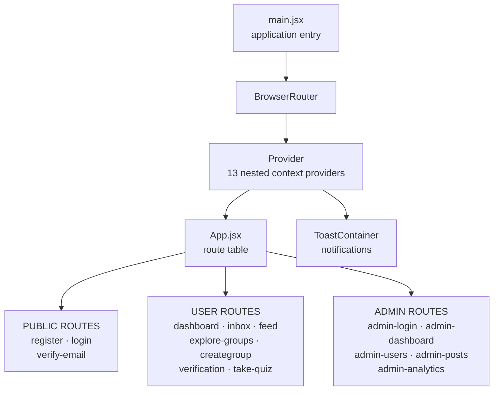

**Figure 4.16.** *Frontend application structure showing the provider tree wrapping the router and
the three groups of routes.*

### 4.12.2 State management

Shared state is held in React Context providers rather than passed between components manually. A
Context provider makes a value available to every component beneath it in the tree.

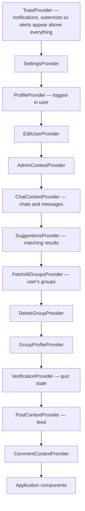

**Figure 4.17.** *Context provider hierarchy as implemented in `Providers/Provider.jsx`. Nesting
order matters: `ToastProvider` is outermost so that notifications can be raised from anywhere in
the application.*

### 4.12.3 Responsive design

The interface adapts to screen width using Tailwind's breakpoint utilities. Separate components
exist for mobile navigation (`MobileViewBar`, `MobileViewIcons`, `MobileViewSuggest`) because the
desktop sidebar layout does not compress usefully to phone width. Mobile is the dominant access
mode in the target population, so this was treated as a requirement rather than an enhancement.

---

## 4.13 Implementation Statistics

**Table 4.1**

*Quantitative Summary of the Implemented System*

| Metric | Value |
|---|---|
| Total application code | ≈ 18,985 lines |
| Backend controllers | 33 |
| Database models | 7 files, 8 collections |
| Express routers | 4 |
| Middleware modules | 5 |
| REST API endpoints | ≈ 55 |
| Socket events (client → server) | 10 |
| Socket events (server → client) | 8 |
| React pages | 13 |
| React components | 25 |
| Context providers | 13 |
| Migration scripts | 10 |
| Production bundle size (gzipped) | 251 kB |
| Modules transformed at build | 1,817 |

**Table 4.2**

*Requirement Completion by Module*

| Module | Implemented | Partial | Not implemented |
|---|---|---|---|
| M1 Authentication | 12 | 1 | 0 |
| M2 Profile | 9 | 1 | 1 |
| M3 Verification | 13 | 1 | 2 |
| M4 Matching | 12 | 2 | 0 |
| M5 Groups | 16 | 0 | 1 |
| M6 Messaging | 14 | 0 | 2 |
| M7 Feed | 11 | 0 | 3 |
| M8 Administration | 11 | 0 | 1 |
| **Total** | **98** | **5** | **10** |

Approximately **87%** of specified requirements are fully implemented. All requirements of *Must*
priority are met except those recorded in §4.17.

---

## 4.14 Security Implementation

**Table 4.3**

*Security Controls as Implemented*

| Control | Implementation | Verified |
|---|---|---|
| Password hashing | bcrypt, cost factor 10 | ✅ |
| Access token | JWT, 15-minute expiry | ✅ |
| Refresh token | JWT, 7-day expiry | ⚠️ See D-02 |
| Protected routes | Bearer token verified by middleware | ✅ |
| Admin separation | Separate collection, login and middleware | ✅ |
| Super-admin gate | Promotion restricted | ✅ |
| Quiz answer protection | Answers stripped before transmission | ✅ |
| Upload restriction | JPEG/PNG only, 2 MB maximum | ✅ |
| CORS | Single configured origin | ✅ |
| Secret storage | Environment variables, git-ignored | ✅ |
| Socket authentication | — | ❌ See D-21 |
| Rate limiting | — | ❌ See D-04 |

---

## 4.15 Development Challenges and Solutions

Five substantial problems were encountered. Each is described with its cause and resolution,
since the problem-solving process is part of what this chapter should evidence.

### 4.15.1 Case-sensitive file paths

**Problem.** The application ran correctly during development but crashed immediately on a Linux
server with `Cannot find module '../socket/socket'`.

**Cause.** Eleven import statements used different capitalisation from the actual filenames — for
example importing `socket/socket` when the file is `socket/Socket.js`. Windows and macOS
filesystems ignore capitalisation, so the error was invisible during development. Linux
filesystems do not.

**Solution.** Every relative import in both packages was checked against the real filenames using
a script written for the purpose. Eleven mismatches were found and corrected.

**Lesson.** Develop and test on the same filesystem behaviour as the deployment target. This class
of error is invisible until deployment and then fatal.

### 4.15.2 Inadequate group privacy model

**Problem.** The original design stored privacy as a true/false field. Testing revealed a needed
case it could not express: a group that should be *findable* but not *automatically joinable*.

**Solution.** The field was replaced with a three-value enumeration, the join logic was rewritten
to branch on it, a pending-requests structure was added, and a migration script converted existing
records.

**Lesson.** This is direct evidence that the incremental method was necessary. Under Waterfall the
inadequacy would have surfaced only at final testing.

### 4.15.3 Real-time state consistency

**Problem.** Unread counts, delivery status and presence had to remain consistent across multiple
clients connected simultaneously, including clients that disconnect and reconnect.

**Solution.** Unread counts were restructured from a single number per chat to an array of
per-user counters. Message state was formalised into the four-state machine of Figure 4.14.
Pending deliveries are reconciled when a user reconnects, by updating all `sent` messages in their
chats to `delivered`.

### 4.15.4 Undeclared dependencies

**Problem.** The project would not build from a fresh copy of the repository. Two packages —
`react-router-dom` and `react-icons` — were imported throughout the frontend but were missing
from `package.json`.

**Cause.** They had been installed locally at some point without being saved to the manifest.
Because the local `node_modules` folder still contained them, the error never appeared during
development.

**Solution.** Both were added as explicit dependencies. A root `package.json` was also created so
that a single `npm install` sets up both packages.

**Lesson.** Verify periodically that a clean copy of the project builds. Reproducibility failures
are invisible from inside a working development environment.

### 4.15.5 Matching weight calibration

**Problem.** The relative weights in the scoring function had to be chosen with no ground-truth
data indicating what a "correct" match looks like.

**Solution.** Weights were set by reasoning from the design principle — complementary role must
dominate subject similarity — and then tested against constructed sample profiles to confirm the
resulting ranking was sensible.

**Limitation.** This remains a hand-tuned heuristic. It is stated as such in §3.8.6 and revisited
in Chapter 5.

---

## 4.16 Deployment Considerations

The system has been run and tested in a local environment. Before deployment to a public server,
the following are required:

| Requirement | Reason |
|---|---|
| Fix D-02 (§4.17) | Critical authentication vulnerability |
| Fix D-21 (§4.17) | Socket connections are unauthenticated |
| HTTPS with a valid certificate | Tokens must not travel in clear text |
| Move uploads to object storage | Local files are destroyed on redeploy |
| Set all environment secrets | High-entropy values, never defaults |
| Increase email token lifetime (D-07) | Registration currently fails in practice |
| Add rate limiting | Protects against brute-force attempts |

---

## 4.17 Known Defects and Limitations

This section records defects found in the implemented system. **Including it strengthens the
report.** A project that identifies its own weaknesses demonstrates more engineering judgement
than one that claims none exist.

**Table 4.4**

*Known Defects and Limitations*

| ID | Severity | Description | Effect | Remedy |
|---|---|---|---|---|
| **D-02** | **Critical** | The code reads the refresh-token secret from `JWT_REFRESH_SECRET`, but the environment file defines `REFRESH_TOKEN_SECRET`. The lookup fails and falls back to a hardcoded string written in the source. | Refresh tokens are signed with a key visible in the source code. Anyone who reads it can create a valid refresh token for any user and take over that account. | Rename the variable to match, and remove the fallback so the server refuses to start without a real secret. |
| **D-21** | **Critical** | Socket.IO connections are not authenticated. The `user-online` event accepts any user ID sent by the client, with no token check. The `send-message` event takes the sender identity from the message payload. | A client can claim to be any user, join that user's private rooms, read their incoming messages, and send messages appearing to come from them. | Add a Socket.IO authentication handshake that verifies a JWT on connection, and take the user identity from the verified token rather than from the client payload. |
| **D-22** | High | The REST endpoint `POST /api/messages` takes `senderId` from the request body rather than from the authenticated token. | Any logged-in user can send a message that appears to come from another user. | Use `req.authenticatedUser.id` as the sender; ignore any value supplied by the client. |
| **D-03** | High | Tokens are stored in browser `localStorage`. | Any injected script can read them, so a cross-site scripting flaw becomes full account compromise. | Store tokens in `httpOnly`, `Secure`, `SameSite` cookies. |
| **D-04** | High | No rate limiting anywhere. `GET /getallposts` and `POST /messages/audio` have no authentication middleware. | Password guessing is unthrottled; unauthenticated file upload is possible. | Add `express-rate-limit`; apply the auth middleware to both routes. |
| **D-23** | Medium | Admin tokens are signed with the same secret as user tokens (`JWT_SECRET`). | The two trust domains are not cryptographically separated. An admin token is accepted as a user token on user routes. | Use a separate `ADMIN_JWT_SECRET`. |
| **D-05** | High | Status is a single account-level field. | A student cannot be `Ready To Teach` for one subject and `Ready To Learn` for another — a common real situation the model cannot represent. | Move intent into the subjects array as `{name, intent, verified}`. |
| **D-06** | High | Quiz questions come from a fixed template bank, not a language model. | Every subject produces structurally identical questions assessing teaching approach rather than subject knowledge. | Connect the installed SDK to `services/quizGenerator.js`; caching and marking already support it. |
| **D-07** | High | Email verification tokens expire after 60 seconds. | Most users cannot open their email and click within a minute, so registration fails in normal use. | Increase to 24 hours. |
| **D-08** | Medium | `reputation` is stored and displayed but never increased. | The admin "top contributors" list is meaningless. | Increment on helpful marks received and verifications earned. |
| **D-09** | Medium | The 10-minute quiz limit is sent to the browser but not enforced on submission. | A student may take unlimited time. | Compare the stored session start time against submission time on the server. |
| **D-10** | Medium | Active quiz sessions are held in a server memory variable. | Sessions are lost if the server restarts, and the design breaks if more than one server instance runs. | Store sessions in MongoDB or Redis with an expiry. |
| **D-11** | Medium | Users with status `Later` receive no complementary bonus but can still appear through subject overlap. | Unavailable students appear in suggestions. | Exclude `Later` from the candidate query. |
| **D-12** | Medium | The feed and several list endpoints return all records with no pagination. | Response size and rendering cost grow without limit. | Add skip/limit or cursor pagination. |
| **D-13** | Medium | An image is required on every post. | A text-only question cannot be posted, which is a serious restriction for the `help` post type. | Make the image field optional. |
| **D-14** | Medium | Deleting a user does not remove their posts, messages or group memberships. | Orphaned references cause display errors where an author cannot be loaded. | Cascade the deletion or anonymise the records. |
| **D-15** | Medium | Suggestions loads the entire user collection into memory on every request. | Response time grows linearly with user count. This is the main scalability limit. | Move scoring into a MongoDB aggregation pipeline; add a subject index. |
| **D-16** | Low | The substring rule matches `Java` inside `JavaScript`. | Occasional irrelevant suggestion. | Require a minimum length ratio, or adopt a fixed subject list. |
| **D-17** | Low | Uploads are written to the local filesystem. | Files are destroyed when a hosting platform redeploys. | Use object storage. |
| **D-18** | Low | `isVerified` on the user record means two different things: email confirmed, and quiz passed. | Passing a quiz marks the account email-verified. An administrator using "unverify" could lock a user out of login. | Split into `isEmailVerified` and derive subject verification from `verifiedSubjects`. |
| **D-19** | Low | No automated test suite. | Regressions are caught only by manual testing. | Add Jest and Supertest. |
| **D-20** | Low | Dependency vulnerabilities reported by `npm audit`. | Mostly transitive denial-of-service advisories. | Run `npm audit fix` and retest. |

### 4.17.1 Priority order for remaining work

1. **D-02 and D-21** — both allow account takeover. Fix before any public demonstration.
2. **D-22 and D-23** — identity spoofing and weak trust separation.
3. **D-07** — registration is currently unusable in practice.
4. **D-04 and D-03** — authentication hardening.
5. **D-06** — either connect real question generation, or describe the templates accurately.
6. **D-05** — per-subject intent, the highest-value functional improvement.

---

## 4.18 Chapter Summary

This chapter described the system as built.

The implementation comprises approximately 18,985 lines of code across two packages: a Node.js
and Express backend with 33 controllers, 8 database collections and around 55 REST endpoints, and
a React frontend with 13 pages, 25 components and 13 state providers. Real-time features are
delivered over Socket.IO using 18 distinct events.

The chapter presented seventeen diagrams describing the deployment architecture, code
organisation, data model, request pipeline, authentication flows, the matching algorithm, the
verification lifecycle, real-time messaging, group joining, and frontend structure.

Approximately 87% of specified requirements are fully implemented. Five development challenges
were described with their causes and resolutions, including a filesystem case-sensitivity failure
that appeared only on deployment and a group privacy model that had to be redesigned mid-project.

Twenty-two defects and limitations were catalogued, including two critical authentication
weaknesses that must be corrected before deployment. These are reported rather than concealed,
and are revisited in Chapter 5.

Chapter 5 presents the testing carried out, the evaluation results, and a discussion of what they
mean.

---

## 4.19 Note on Diagram Formats

All diagrams in this chapter are written in **Mermaid**, a text-based diagram format.

**They render automatically in:** GitHub, GitLab, Notion, Obsidian, and VS Code with the Markdown
Preview Mermaid Support extension.

**To export as images for Microsoft Word:**

1. Open <https://mermaid.live> in a browser.
2. Paste the diagram code (everything between the ` ```mermaid ` markers).
3. Click **Actions → PNG** or **SVG**. Choose SVG if your department accepts it, since it stays
   sharp when printed.
4. Insert the image into your document and add the figure caption beneath it.

Keep the figure numbers and captions exactly as given here, so cross-references in your text
remain correct.

---

## Appendix 4A — Author's checklist for this chapter

- [ ] All statistics in Table 4.1 re-checked against the final code
- [ ] Table 4.2 completion figures re-checked before submission
- [ ] Screenshots of the running system added alongside the relevant diagrams
- [ ] Diagrams exported as images if your department requires Word format
- [ ] D-02 and D-21 fixed before any live demonstration
- [ ] Defect table updated if you fix any of the listed items
- [ ] Figure numbers matched to your final List of Figures
