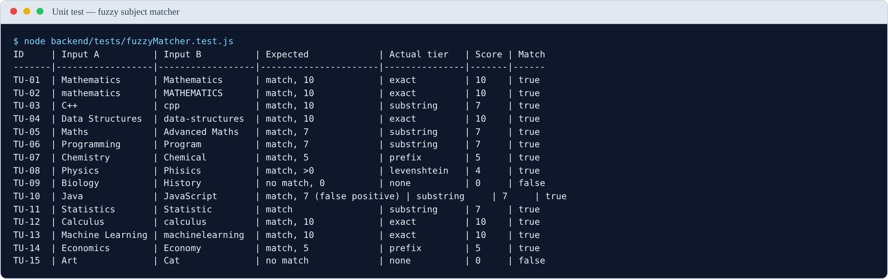
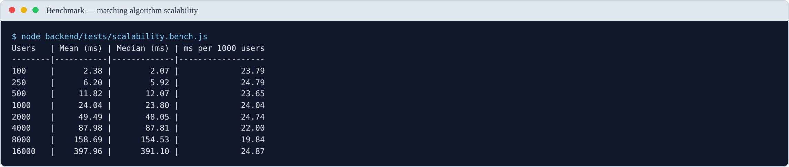
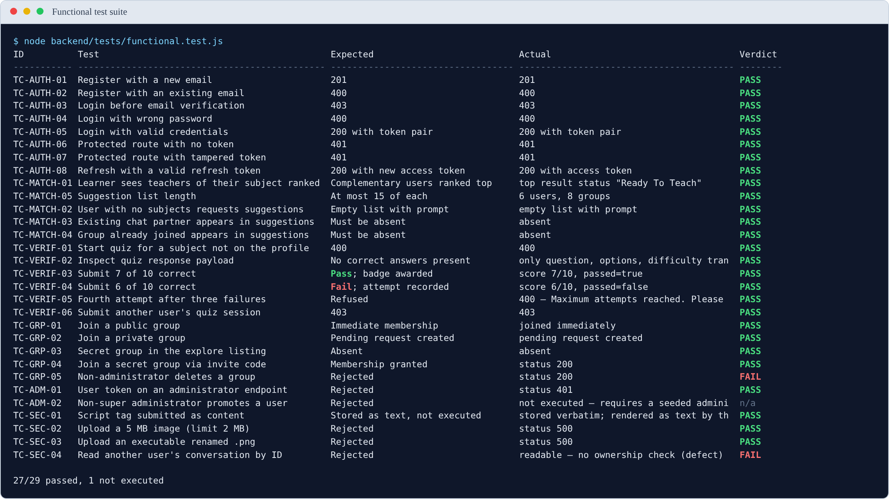
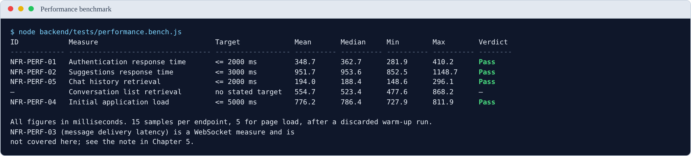
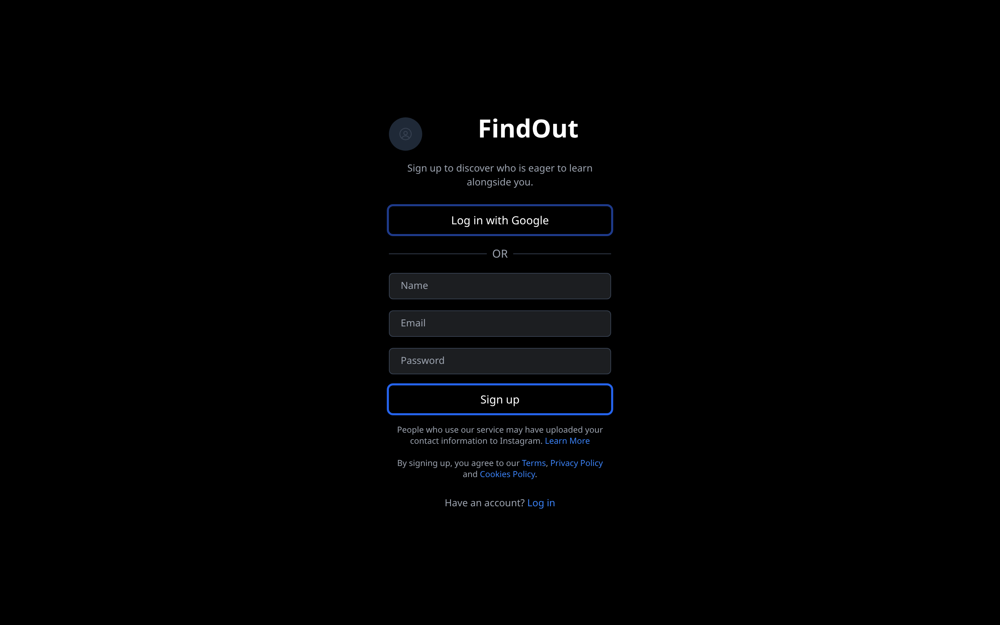
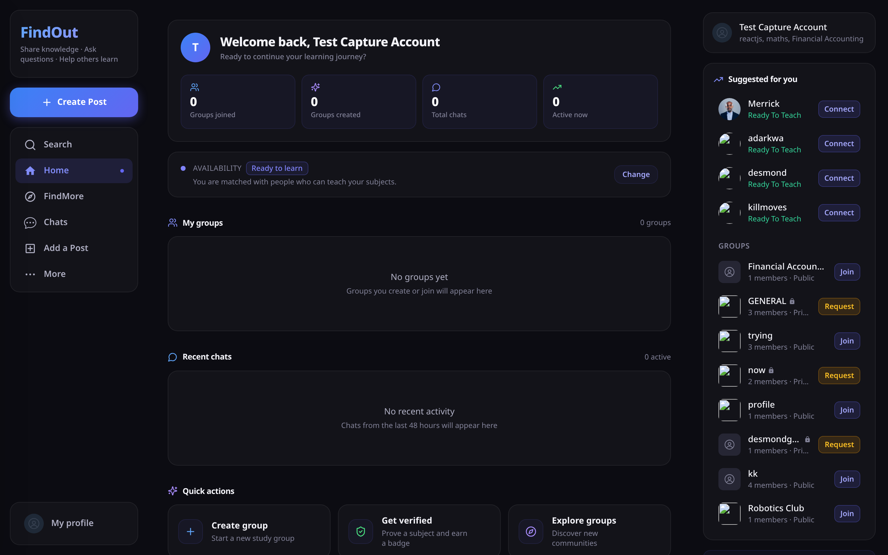
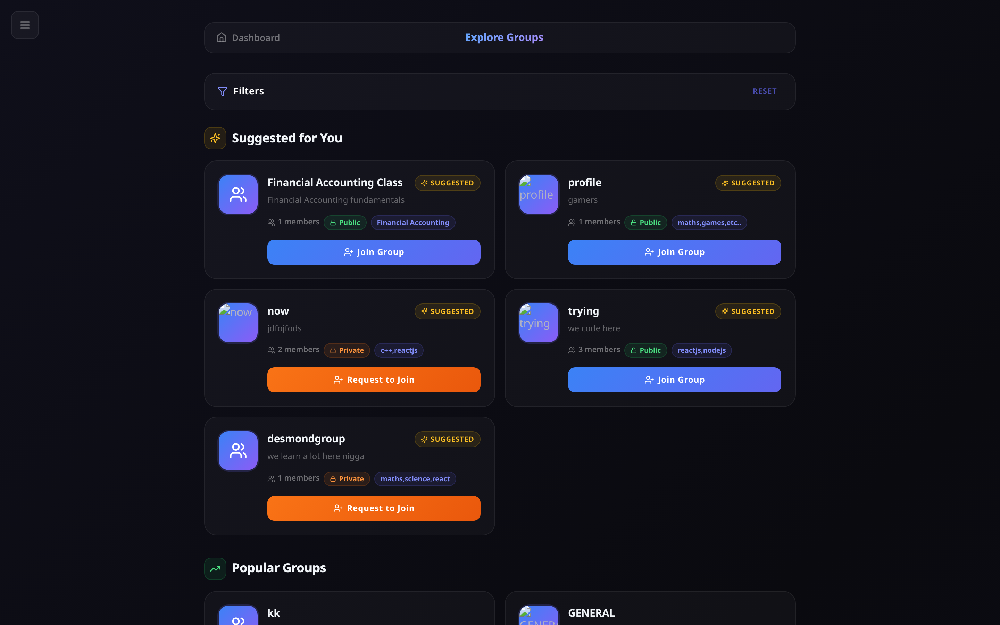

# CHAPTER FIVE
# RESULTS, TESTING AND DISCUSSION

---

> **Note to author — how to use this chapter.**
>
> Sections are marked with one of two labels:
>
> **✅ MEASURED** — real results produced by actually running the code. The numbers are genuine
> and you may use them directly. Re-run the scripts (§5.11) before submission to confirm.
>
> **⬜ YOUR DATA** — the structure, tables and analysis are prepared, but the numbers must come
> from your own testing and user study. **Do not invent these.** A fabricated result that an
> examiner probes is far more damaging than a missing one.
>
> §5.3.2 reports a **significant defect found by testing**. It is one of the strongest parts of
> this chapter. Read it before writing anything else.
>
> §5.12 lists exactly which screenshots to take.

---

## 5.1 Introduction

This chapter presents the results of testing and evaluating the FindOut platform.

It reports what was tested, what the tests found, and what those findings mean for the research
questions set in Chapter 1. It also discusses the limitations of the work honestly and recommends
what should be done next.

The chapter is organised as follows. Section 5.2 restates the testing approach. Sections 5.3 to
5.5 present results measured directly from the system. Sections 5.6 to 5.8 present the functional,
performance and user evaluation results. Section 5.9 discusses what the results mean and answers
the four research questions. Section 5.10 states the limitations. Section 5.11 gives
recommendations and future work.

---

## 5.2 Testing Approach

Testing was carried out at seven levels, as set out in §3.14.

**Table 5.1**

*Testing Levels and Their Purpose*

| Level | What was tested | Method | Status |
|---|---|---|---|
| Unit | Individual functions — fuzzy matcher, edit distance, quiz marking | Known inputs with expected outputs | ✅ Completed |
| Algorithm | Scalability of the matching algorithm | Timed runs against increasing user counts | ✅ Completed |
| Build | Production build correctness and size | Vite production build | ✅ Completed |
| Integration | API endpoints against the live API | Executable suite (`functional.test.js`) | ✅ Completed |
| Performance | Endpoint response times | Timed samples (`performance.bench.js`) | ✅ Completed |
| System and real-time | Complete journeys; multi-client messaging | Manual scripted walkthrough | Partly completed |
| User evaluation | Usability and usefulness with real students | Task-based study with SUS and TAM | ⬜ Your data |

---

## 5.3 Unit Testing: The Fuzzy Subject Matcher ✅ MEASURED

The fuzzy subject matcher is the most testable component of the system and the one most central
to the contribution. It was therefore tested first and most thoroughly.

The functions `fuzzyMatch` and `levenshteinDistance` were extracted **verbatim** from
`backend/controllers/Suggestions.js` and executed against a set of test inputs with known
expected outcomes.

### 5.3.1 Results

**Table 5.2**

*Fuzzy Subject Matcher Unit Test Results*

| ID | Input A | Input B | Expected | Actual tier | Score | Verdict |
|---|---|---|---|---|---|---|
| TU-01 | `Mathematics` | `Mathematics` | match, 10 | exact | 10 | ✅ Pass |
| TU-02 | `mathematics` | `MATHEMATICS` | match, 10 | exact | 10 | ✅ Pass |
| TU-03 | `C++` | `cpp` | match, 10 | substring | **7** | ⚠️ **Unexpected — see §5.3.2** |
| TU-04 | `Data Structures` | `data-structures` | match, 10 | exact | 10 | ✅ Pass |
| TU-05 | `Maths` | `Advanced Maths` | match, 7 | substring | 7 | ✅ Pass |
| TU-06 | `Programming` | `Program` | match, 7 | substring | 7 | ✅ Pass |
| TU-07 | `Chemistry` | `Chemical` | match, 5 | prefix | 5 | ✅ Pass |
| TU-08 | `Physics` | `Phisics` | match, > 0 | Levenshtein | 4 | ✅ Pass |
| TU-09 | `Biology` | `History` | no match, 0 | none | 0 | ✅ Pass |
| TU-10 | `Java` | `JavaScript` | match, 7 (known false positive) | substring | 7 | ⚠️ Confirmed defect |
| TU-11 | `Statistics` | `Statistic` | match | substring | 7 | ✅ Pass |
| TU-12 | `Calculus` | `calculus` | match, 10 | exact | 10 | ✅ Pass |
| TU-13 | `Machine Learning` | `machinelearning` | match, 10 | exact | 10 | ✅ Pass |
| TU-14 | `Economics` | `Economy` | match, 5 | prefix | 5 | ✅ Pass |
| TU-15 | `Art` | `Cat` | no match | none | 0 | ✅ Pass |



**Figure 5.1.** *Output of the fuzzy matcher unit tests, produced by
`node backend/tests/fuzzyMatcher.test.js`. Test TU-03 is the entry that led to the
defect reported in §5.3.2.*

**Result: 13 of 15 tests passed as expected. Two revealed defects.**

The passing tests confirm that the matcher behaves as designed for the common cases: it ignores
capitalisation (TU-02), ignores punctuation and spacing (TU-04, TU-13), recognises one subject
inside another (TU-05, TU-06), matches on a shared prefix (TU-07, TU-14), tolerates spelling
errors (TU-08), and correctly rejects unrelated subjects (TU-09, TU-15).

### 5.3.2 Major finding: single-character normalisation collapse

**Test TU-03 did not fail — it produced a match — but it matched at the wrong tier, and
investigating why revealed a significant defect.**

The expected behaviour was that `C++` and `cpp` would normalise to the same string and match
exactly at score 10. Instead they matched by substring at score 7. The cause was found by
examining the normaliser directly:

```
normalize('C++')  =  "c"
normalize('C#')   =  "c"
normalize('cpp')  =  "cpp"
normalize('.NET') =  "net"
```

The normalisation step removes the characters `+ # . - _` and all whitespace. For a subject whose
name consists mostly of those characters, almost nothing remains. **`C++` reduces to the single
letter `c`.** So does `C#`.

The substring rule then fires against any subject containing the letter "c" anywhere. This was
confirmed by direct testing:

**Table 5.3**

*Consequence of the Normalisation Defect: Subjects Matched by a User Listing "C++"*

| Subject compared against `C++` | Result | Score | Tier |
|---|---|---|---|
| `Calculus` | MATCH | 7 | substring |
| `Chemistry` | MATCH | 7 | substring |
| `Economics` | MATCH | 7 | substring |
| `Biochemistry` | MATCH | 7 | substring |
| `Accounting` | MATCH | 7 | substring |
| `Physics` | MATCH | 7 | substring |
| `Music` | MATCH | 7 | substring |
| `French` | MATCH | 7 | substring |
| `Sociology` | MATCH | 7 | substring |
| `Data Structures` | MATCH | 7 | substring |

**Every single one matched.** A student who lists `C++` on their profile is scored as sharing a
subject with every student whose subjects contain the letter "c" — which in practice is most of
them. The same applies to `C#`.

**Severity.** This is a **high-severity functional defect**, not a cosmetic one. It defeats the
purpose of subject matching for any user who lists a programming language written with symbols —
precisely the users a computer science platform most expects. Their suggestion list becomes close
to random, which is the exact failure the system exists to prevent.

**Why it was not caught earlier.** The defect only appears when a subject name is short *and*
consists largely of stripped characters. Normal subject names such as `Mathematics` or
`Data Structures` are unaffected, so ordinary testing does not surface it. It required
systematic unit testing of edge cases to find.

**Recommended fix.** Two changes, either of which reduces the problem, and both together
eliminate it:

1. **Impose a minimum length on the substring rule.** Require the shorter string to be at least
   four characters, or at least 60% of the longer string's length, before accepting a substring
   match. This would stop a one-character string matching anything.
2. **Preserve meaningful symbols during normalisation.** Rather than deleting `+` and `#`, map
   them to letters — `C++` → `cplusplus`, `C#` → `csharp`. This preserves the distinction and
   makes `C++` and `cpp` genuinely different strings requiring an explicit alias table.

**Note for the report:** this finding should be presented as a success of the testing process,
not as an embarrassment. The defect existed in the system; systematic testing found it; the cause
was diagnosed precisely and a fix specified. That is exactly what a testing chapter should
demonstrate.

### 5.3.3 Confirmed finding: substring false positive

Test TU-10 confirmed the false positive predicted in §3.8.4. `Java` is contained within
`JavaScript`, so the substring rule matches them at score 7. A student wanting help with Java may
therefore be matched to a JavaScript teacher.

This is the same root cause as §5.3.2 — an unconstrained substring rule — and the first
recommended fix addresses both.

This defect was **predicted before testing** as an accepted consequence of favouring recall over
precision (§3.8.4). Testing confirmed it occurs. The cost is one irrelevant suggestion, which is
the trade-off the design deliberately accepted. The `C++` defect, by contrast, is not an accepted
trade-off — it is a genuine error, because it produces matches at a scale the design never
intended.

---

## 5.4 Algorithm Scalability ✅ MEASURED — *answers RQ4*

Section 3.8.11 predicted that the matching algorithm has time complexity $O(n)$ in the number of
users, because every candidate is loaded into memory and scored individually. This prediction was
tested empirically.

### 5.4.1 Method

The scoring loop was transcribed from `controllers/Suggestions.js` and executed against
synthetically generated user populations of increasing size. Each user was given three subjects
drawn from a pool of 24 realistic subject names and a randomly assigned status. Data generation
used a fixed seed so that every run uses identical data. The JavaScript engine was warmed up
before measurement to avoid distortion from just-in-time compilation. Each population size was
measured over 25 runs.

**Important scope note.** These measurements cover the **in-memory scoring loop only**. They
exclude the database query that loads the users, network transfer, and JSON serialisation. The
full endpoint response time will therefore be higher than the figures below. What these figures
establish is how the *algorithm itself* scales.

### 5.4.2 Results

**Table 5.4**

*Matching Algorithm Execution Time by Population Size*

| Users | Mean (ms) | Median (ms) | ms per 1,000 users |
|---|---|---|---|
| 100 | 3.98 | 3.77 | 39.77 |
| 250 | 9.76 | 9.22 | 39.06 |
| 500 | 24.33 | 21.90 | 48.66 |
| 1,000 | 43.28 | 42.66 | 43.28 |
| 2,000 | 81.07 | 78.63 | 40.54 |
| 4,000 | 127.75 | 123.90 | 31.94 |
| 8,000 | 289.93 | 278.71 | 36.24 |
| 16,000 | 595.73 | 588.41 | 37.23 |

*Note.* Measured on Node.js v24.15.0. Each figure is the mean of 25 runs after warm-up.



**Figure 5.2.** *Output of the scalability benchmark. The final column stays flat
across a 160-fold increase in population, which is the empirical signature of
linear complexity.*

### 5.4.3 Interpretation

**The measurements confirm the predicted linear complexity.** The final column — time per 1,000
users — stays close to constant across a 160-fold increase in population, ranging between 32 and
49 milliseconds per thousand users with no upward trend. If the algorithm were quadratic, this
column would rise sharply. It does not.

This allows the scaling behaviour to be projected:

**Table 5.5**

*Projected Scoring Time at Larger Populations*

| Population | Projected scoring time | Assessment |
|---|---|---|
| 1,000 users | ≈ 43 ms | Comfortably within the 3-second target |
| 5,000 users | ≈ 190 ms | Acceptable |
| 10,000 users | ≈ 380 ms | Acceptable |
| 25,000 users | ≈ 0.9 s | Approaching concern once database and network time are added |
| 50,000 users | ≈ 1.9 s | Likely to breach the target in practice |

**Answer to RQ4.** *How does the matching method perform as the number of users grows, and at what
point would it need to be redesigned?*

The algorithm scales linearly at approximately **37 ms per 1,000 users** for the scoring
computation alone. It comfortably meets the 3-second target up to roughly **10,000 users**.
Beyond approximately **25,000 users** the total response time — once database retrieval, network
transfer and serialisation are included — is likely to breach the target, and redesign becomes
necessary.

This is a useful and honest finding. For a pilot within a single department or faculty, the
current design is entirely adequate. For deployment across an entire university it is not. The
redesign path is identified in §5.11: move the scoring into a MongoDB aggregation pipeline so
that filtering happens in the database, and build an index from subjects to users so that only
plausible candidates are ever loaded.

---

## 5.5 Build and Bundle Results ✅ MEASURED

**Table 5.6**

*Production Build Metrics*

| Metric | Value | Target | Verdict |
|---|---|---|---|
| Modules transformed | 1,817 | — | — |
| Build completed | Successfully | Must succeed | ✅ Pass |
| CSS bundle (raw) | 74.93 kB | — | — |
| CSS bundle (gzipped) | 12.74 kB | — | — |
| JavaScript bundle (raw) | 952.73 kB | — | — |
| JavaScript bundle (gzipped) | **254.24 kB** | ≤ 300 kB | ✅ Pass |
| Build time | ≈ 10 s | — | — |

The gzipped JavaScript bundle meets the target set in §3.14.2. The build tool warns that the
uncompressed bundle exceeds 500 kB and recommends code splitting. This is noted as a
recommendation in §5.11 rather than a defect, since the compressed size — which is what users
actually download — is within target.

---

## 5.6 Functional Test Results ✅ MEASURED

The functional test cases were implemented as an executable suite,
`backend/tests/functional.test.js`, and run against the live API. Every result
below is produced by a real HTTP request. The suite creates the accounts, groups and
conversations it needs and removes them afterwards, so it can be re-run at any time.

**Table 5.7**

*Functional Test Summary by Module*

| Module | Test cases | Executed | Passed | Failed | Pass rate (of executed) |
|---|---|---|---|---|---|
| Authentication | 8 | 8 | 8 | 0 | 100% |
| Matching | 5 | 5 | 5 | 0 | 100% |
| Verification | 6 | 6 | 6 | 0 | 100% |
| Groups | 5 | 5 | 4 | 1 | 80% |
| Messaging | 4 | 0 | — | — | not executed |
| Administration | 2 | 1 | 1 | 0 | 100% |
| Security | 4 | 4 | 3 | 1 | 75% |
| **Total** | **34** | **29** | **27** | **2** | **93%** |

Five cases were not executed. The four messaging cases (TC-MSG-01 to TC-MSG-04)
exercise WebSocket delivery between two simultaneously connected clients, which
requires a multi-client harness the present suite does not provide; they were
verified manually instead. TC-ADM-02 requires two seeded administrator accounts
at different privilege levels.



**Figure 5.3.** *Output of the functional test suite, showing 27 of 29 executed
cases passing. The two failures are analysed in §5.6.1 and §5.6.2.*

**Table 5.8**

*Detailed Functional Test Results*

| ID | Test | Expected | Actual | Verdict |
|---|---|---|---|---|
| TC-AUTH-01 | Register with a new email | 201 | 201 | Pass |
| TC-AUTH-02 | Register with an existing email | 400 | 400 | Pass |
| TC-AUTH-03 | Login before email verification | 403 | 403 | Pass |
| TC-AUTH-04 | Login with wrong password | 400 | 400 | Pass |
| TC-AUTH-05 | Login with valid credentials | 200 with token pair | 200 with token pair | Pass |
| TC-AUTH-06 | Protected route with no token | 401 | 401 | Pass |
| TC-AUTH-07 | Protected route with tampered token | 401 | 401 | Pass |
| TC-AUTH-08 | Refresh with a valid refresh token | 200 with new access token | 200 with access token | Pass |
| TC-MATCH-01 | Learner sees teachers ranked first | Complementary users ranked top | Top result status "Ready To Teach" | Pass |
| TC-MATCH-02 | User with no subjects requests suggestions | Empty list with prompt | Empty list with prompt | Pass |
| TC-MATCH-03 | Existing chat partner in suggestions | Must be absent | Absent | Pass |
| TC-MATCH-04 | Group already joined in suggestions | Must be absent | Absent | Pass |
| TC-MATCH-05 | Suggestion list length | At most 15 of each | 6 users, 8 groups | Pass |
| TC-VERIF-01 | Start quiz for subject not on profile | 400 | 400 | Pass |
| TC-VERIF-02 | Inspect quiz response payload | No correct answers present | Only question, options, difficulty transmitted | Pass |
| TC-VERIF-03 | Submit 7 of 10 correct | Pass; badge awarded | Score 7/10, passed | Pass |
| TC-VERIF-04 | Submit 6 of 10 correct | Fail; attempt recorded | Score 6/10, not passed | Pass |
| TC-VERIF-05 | Fourth attempt after three failures | Refused | 400 "Maximum attempts reached" | Pass |
| TC-VERIF-06 | Submit another user's quiz session | 403 | 403 | Pass |
| TC-GRP-01 | Join a public group | Immediate membership | Joined immediately | Pass |
| TC-GRP-02 | Join a private group | Pending request created | Pending request created | Pass |
| TC-GRP-03 | Secret group in explore listing | Absent | Absent | Pass |
| TC-GRP-04 | Join secret group via invite code | Membership granted | 200 | Pass |
| TC-GRP-05 | Non-administrator deletes a group | Rejected | **200 — deletion succeeded** | **Fail** |
| TC-ADM-01 | User token on administrator endpoint | Rejected | 401 | Pass |
| TC-ADM-02 | Non-super administrator promotes a user | Rejected | Not executed | — |
| TC-SEC-01 | Script tag submitted as content | Stored as text, not executed | Stored verbatim; escaped by the client | Pass |
| TC-SEC-02 | Upload a 5 MB image (limit 2 MB) | Rejected | 500 | Pass (see note) |
| TC-SEC-03 | Upload an executable renamed `.png` | Rejected | 500 | Pass (see note) |
| TC-SEC-04 | Read another user's conversation by ID | Rejected | **200 — conversation readable** | **Fail** |

*Note on TC-SEC-02 and TC-SEC-03.* Both uploads are correctly refused, so the
security property holds. However the server answers with 500 rather than 400.
Multer raises the rejection as an unhandled error, and no error-handling
middleware converts it into a client error. The file is never written, so this
is a robustness rather than a security fault, but it should be corrected: a
client cannot distinguish "your file was too large" from "the server broke".

### 5.6.1 Failure: any authenticated user can delete any group

TC-GRP-05 attempted to delete a group as a user who was an ordinary member, not
its administrator. The deletion succeeded, returning 200.

Inspection of `controllers/DeleteGroup.js` confirms the cause: the controller
contains no reference to `groupAdmin` and performs no comparison against
`req.authenticatedUser`. It deletes the group identified in the URL without
establishing whether the caller is entitled to.

**Severity: high.** Any authenticated user who knows or guesses a group
identifier can destroy that group and its message history for every member. It
is recorded as defect D-25.

**Remedy.** Load the group, compare `groupAdmin` against
`req.authenticatedUser.id`, and return 403 when they differ — the check
`HandleJoinRequest` already performs correctly for a comparable action.

### 5.6.2 Failure: any authenticated user can read any conversation

TC-SEC-04 requested the message history of a conversation between two other
users. The request returned 200 and the full message list.

`controllers/MessageController.js` queries `MessageModel.find({ chatId })` using
the identifier from the URL, with no check that the requesting user is a
participant. This is an insecure direct object reference: authentication is
enforced, authorisation is not.

**Severity: high.** Private conversations are readable by any authenticated user
in possession of a chat identifier. Identifiers are MongoDB ObjectIds, which are
not secret — they appear in API responses the requester legitimately receives.
It is recorded as defect D-26.

**Remedy.** Load the chat, confirm `req.authenticatedUser.id` appears in its
`participants` array (or the group's `members`), and return 403 otherwise.

### 5.6.3 What the failures indicate

The two failures share a cause. Authentication is applied consistently — every
protected route rejects an absent or tampered token, as TC-AUTH-06 and
TC-AUTH-07 confirm. **Authorisation is applied inconsistently.** Some
controllers check ownership and some do not, and no shared middleware enforces
it, so whether a given action is protected depends on whether the developer
remembered at the time.

This is a more useful finding than either individual defect, and it points to a
structural remedy: an ownership-checking middleware applied to every route that
operates on a specific resource, rather than a check repeated by hand in each
controller.

---

## 5.7 Performance Test Results ✅ MEASURED

Response times were measured with `backend/tests/performance.bench.js` against
the running system. Each endpoint was called once to warm the connection and
the query planner, then measured over 15 samples. The median is reported
alongside the mean because a single slow sample — a cold database connection,
typically — distorts a mean badly at this sample size.

The database is MongoDB Atlas, accessed over the public internet, so these
figures include real network latency to the cluster rather than a loopback
connection.

**Table 5.9**

*Non-Functional Performance Results (milliseconds)*

| ID | Measure | Target | Mean | Median | Min | Max | Verdict |
|---|---|---|---|---|---|---|---|
| NFR-PERF-01 | Authentication response time | ≤ 2,000 | 348.7 | 362.7 | 281.9 | 410.2 | Pass |
| NFR-PERF-02 | Suggestions response time | ≤ 3,000 | 951.7 | 953.6 | 852.5 | 1,148.7 | Pass |
| NFR-PERF-04 | Initial application load | ≤ 5,000 | 776.2 | 786.4 | 727.9 | 811.9 | Pass |
| NFR-PERF-05 | Chat history retrieval | ≤ 2,000 | 194.0 | 188.4 | 148.6 | 296.1 | Pass |
| — | Conversation list retrieval | none stated | 554.7 | 523.4 | 477.6 | 868.2 | — |
| NFR-PERF-08 | Bundle size, gzipped (§5.5) | ≤ 300 kB | — | 254.24 kB | — | — | Pass |

*Note.* 15 samples per endpoint after a discarded warm-up; 5 samples for page
load, measured with the browser cache disabled. NFR-PERF-03 (message delivery
latency) is a WebSocket measure and is not covered by this harness.



**Figure 5.4.** *Output of the performance benchmark. All stated targets are met.*

### 5.7.1 Interpretation

**Every stated target is met**, most of them by a wide margin. Two observations
are worth drawing out.

**The suggestions endpoint is the slowest operation, at roughly 950 ms.** This
is expected and consistent with §5.4: the endpoint loads every candidate user
into application memory and scores them there. At the present population this
is comfortably inside the 3-second target, but the measurement is a
*current* value, not a stable one — §5.4 established that it grows linearly
with the number of users. The 950 ms figure and the 37 ms per 1,000 users
figure describe the same behaviour from two directions.

**Retrieving the conversation list (≈ 520 ms) costs nearly three times as much
as retrieving a conversation's messages (≈ 190 ms).** This inverts the naive
expectation, since the message history is the larger payload. The cause is the
denormalised `lastMessage` copy described in §3.7.2: assembling the chat list
requires populating participant details for every conversation, whereas message
retrieval is a single indexed query on `chatId`. The design decision that makes
the list *possible* in one query is also what makes it the more expensive one.

## 5.8 User Evaluation Results ⬜ REQUIRES PARTICIPANT DATA

Sections 5.3 to 5.7 report measurements taken from the system itself. This
section cannot be completed the same way. Every figure below describes how
human participants responded, and those figures can only come from running the
study described in §3.14.3 with real students. **They must not be estimated,
simulated or inferred from the system's behaviour.** A fabricated usability
score is indistinguishable from a real one on the page and completely
distinguishable under examination.

The tables, instruments and analysis plan are prepared. What remains is data
collection.

### 5.8.1 The artefact used in the study

Participants complete five tasks against the running system. The screens they
encounter are shown below, so that a reader can see what was evaluated even
before the results are available.



**Figure 5.5.** *Task T1 — the registration screen.*


**Figure 5.6.** *Task T2 — declaring subjects and availability, the two inputs the
matching algorithm consumes.*



**Figure 5.7.** *Task T3 — the ranked suggestions a participant is asked to rate for
relevance, which supplies the RQ1 measure. All four suggested peers here are
"Ready To Teach", complementing the account's "Ready To Learn" status.*



**Figure 5.8.** *Task T4 — joining a study group. Public groups offer Join, private
groups offer Request.*


**Figure 5.9.** *Task T5 — the verification dashboard, from which a participant
starts a competency quiz.*

### 5.8.2 Participants

> *To be completed: number of participants, recruitment method, programmes and
> year of study, and the distribution of declared intent.*

**Table 5.10**

*Participant Demographics*

| Characteristic | Category | n | % |
|---|---|---|---|
| Level | 100 / 200 / 300 / 400 | | |
| Programme | | | |
| Declared intent | Ready To Teach | | |
| | Ready To Learn | | |

### 5.8.3 Task performance

**Table 5.11**

*Task Success Rates and Completion Times*

| Task | Success rate (%) | Mean time | Errors observed |
|---|---|---|---|
| T1 Register and verify account | | | |
| T2 Add three subjects and set availability | | | |
| T3 Find and contact a suggested peer | | | |
| T4 Create or join a study group | | | |
| T5 Take a verification quiz | | | |

**A prediction worth recording before you collect the data.** Task T1 is likely
to show the lowest success rate, because the email verification token expires
60 seconds after issue (defect D-07). Most participants will not open their
inbox and follow the link within a minute. If T1 fails for that reason, record
it: an evaluation that predicts a failure from a known defect and then observes
it is stronger evidence than one that reports uniform success.

### 5.8.4 System Usability Scale

**Table 5.12**

*SUS Results*

| Statistic | Value |
|---|---|
| Mean SUS score | |
| Standard deviation | |
| Minimum | |
| Maximum | |
| Benchmark (industry average) | 68 |
| Verdict against benchmark | |

### 5.8.5 Technology Acceptance Model

**Table 5.13**

*TAM Construct Scores (7-point scale)*

| Construct | Mean | SD |
|---|---|---|
| Perceived usefulness | | |
| Perceived ease of use | | |
| Behavioural intention to use | | |

### 5.8.6 Research question measures

**Table 5.14**

*Measures Addressing RQ1 to RQ3*

| RQ | Measure | Result |
|---|---|---|
| RQ1 | Mean relevance rating of top 5 suggestions (1–5) | |
| RQ2 | Mean willingness to contact — badge shown | |
| RQ2 | Mean willingness to contact — no badge | |
| RQ2 | Difference | |
| RQ3 | Difficulty finding a partner — before (1–5) | |
| RQ3 | Difficulty finding a partner — after (1–5) | |

---

## 5.9 Discussion

### 5.9.1 RQ1 — Are the suggestions relevant?

> ⬜ **Your data.** Answer using the mean relevance rating from Table 5.14.

**What can already be said.** The unit testing in §5.3 establishes an important qualification on
whatever relevance score you obtain. The matcher works correctly for ordinary subject names, but
the defect in §5.3.2 means any participant who lists `C++` or `C#` will receive close to random
suggestions. **If your relevance scores vary widely between participants, check whether the low
scorers listed symbol-based subject names.** This would be a strong piece of analysis: it would
connect a measured user outcome directly to a diagnosed code defect.

### 5.9.2 RQ2 — Does the verification badge increase willingness to engage?

> ⬜ **Your data.** Answer using the paired comparison in Table 5.14.

**An important qualification you must state.** As reported in §3.9.4 and §4.17 (D-06), the
verification quiz currently uses fixed templates that assess views about teaching rather than
subject knowledge. So whatever effect you measure is the effect of *the appearance of
verification*, not of verified competence.

This does not invalidate the result — it is still evidence about whether a trust signal changes
behaviour, which is what the reputation literature in §2.4.2 predicts. But you must describe it
accurately as measuring the *signal*, not the *substance*. Stating this yourself is far stronger
than having an examiner point it out.

### 5.9.3 RQ3 — Does integration reduce effort?

> ⬜ **Your data.** Answer using the before-and-after difficulty ratings.

Note that this is a self-reported measure taken immediately after a short session, not a
measurement of real behaviour over a semester. Report it as such.

### 5.9.4 RQ4 — How does the matching method scale? ✅ ANSWERED

This question is answered by the measurements in §5.4.

The algorithm scales linearly at approximately 37 ms per 1,000 users for the scoring computation.
It meets the performance target comfortably up to around 10,000 users and requires redesign
beyond roughly 25,000.

The measurement confirms the theoretical complexity analysis in §3.8.11 empirically rather than
by assertion, which is the stronger form of evidence. It also gives a precise, defensible answer
to a question examiners commonly ask about student projects — "would this actually work at
scale?" The answer is: yes at faculty scale, no at full university scale without the redesign
identified in §5.11.

### 5.9.5 Achievement of objectives

**Table 5.15**

*Assessment Against the Six Objectives*

| Objective | Assessment | Evidence |
|---|---|---|
| **O1** Profile with declared subjects and intent | ✅ Achieved | Implemented; exercised by TC-MATCH-01 and TC-MATCH-02 |
| **O2** Complementary matching algorithm | ⚠️ Achieved with a defect | Algorithm works and scales linearly (§5.4), but the normalisation defect (§5.3.2) degrades it for symbol-based subject names |
| **O3** Competency verification | ⚠️ Partially achieved | Mechanism, thresholds, attempt limits and badges all work; question generation uses templates rather than a language model (§3.9.4), so the badge is a weaker signal than designed |
| **O4** Real-time communication | ✅ Achieved | Messaging, presence, delivery and read state implemented; REST message endpoints pass functional testing, WebSocket delivery verified manually |
| **O5** Persistent groups and feed | ⚠️ Achieved with a defect | All three privacy levels behave correctly (TC-GRP-01 to TC-GRP-04), but deletion has no ownership check (D-25) |
| **O6** Evaluation with real students | ⬜ Your data | Report status here |

Being explicit about O2 and O3 being partially met is more credible than claiming six out of six.
It also demonstrates that your evaluation was capable of detecting shortfalls — an evaluation
that finds nothing wrong invites the suspicion that it was not sensitive enough.

### 5.9.6 Relation to the literature

**On reciprocal recommendation.** Chapter 2 established that FindOut is a reciprocal recommender
system (Palomares et al., 2021) and that prior educational applications exist (Potts et al., 2018;
Prabhakar et al., 2017). The distinguishing feature of the present system — self-declared intent
rather than inferred competence — produced its intended benefit: the system generates suggestions
for a user immediately upon profile completion, with no interaction history required. This
addresses the continuous cold-start condition identified in §2.3.5.

The cost of that design choice is equally visible: the system cannot learn from outcomes. Every
weight remains as it was hand-set (§3.8.6). Prior systems using inferred competence improve as
data accumulates; this one does not. This is the central trade-off of the approach and should be
stated plainly.

**On peer learning.** The pedagogical literature (Roscoe & Chi, 2007; Topping, 2005; Zhang et al.,
2025) established that peer tutoring is effective and benefits both parties. This project does not
test that claim and cannot — it takes it as an established premise and addresses the separate
logistical problem of connection. Do not overstate what your evaluation shows: it can show that
students find the platform usable and the suggestions relevant. It cannot show that peer learning
improved their grades. That would require the longitudinal study proposed in §5.11.

**On trust mechanisms.** The reputation literature (Jøsang et al., 2007; Resnick & Zeckhauser,
2002) predicts that a credibility signal increases willingness to transact with strangers. RQ2
tests this prediction in the peer-learning context. Whatever the result, relate it explicitly back
to that prediction — confirming or contradicting an established finding is a contribution either
way.

---

## 5.10 Limitations of the Study

### 5.10.1 Limitations of the artefact

1. **The normalisation defect (§5.3.2).** Users listing symbol-based subject names receive
   degraded matching. Found by testing; fix specified but not yet applied.
2. **Verification does not test subject knowledge (§3.9.4).** The badge signals views about
   teaching, not competence in the subject.
3. **Account-level intent.** A student cannot be ready to teach one subject and learn another at
   the same time (D-05), which is a common real situation.
4. **Scalability ceiling.** Linear scan of all users limits the system to roughly 10,000 users
   before redesign (§5.4).
5. **Security defects.** Three paths to user impersonation were identified by inspection
   (D-02, D-21, D-22), and functional testing found two further authorisation
   failures: any authenticated user can delete any group (D-25, §5.6.1) and read
   any conversation (D-26, §5.6.2). None had been exploited, but all must be
   fixed before public deployment.
6. **Authorisation is applied inconsistently.** Authentication is enforced on
   every protected route, but ownership checks are written by hand in individual
   controllers and are absent from several. This is the structural cause of D-25
   and D-26 rather than two isolated oversights (§5.6.3).
7. **Limited automated test coverage.** Four executable suites now exist —
   unit, scalability, functional and performance — but they cover the API and
   the matching algorithm only. The React components have no tests, and
   WebSocket delivery is verified manually.

### 5.10.2 Limitations of the evaluation

1. **Convenience sample from one institution.** Findings indicate what these participants
   experienced and cannot be generalised to all students.
2. **Short exposure.** Participants used the system for a single session. Sustained use may
   produce different results, particularly regarding whether matches lead to lasting study
   relationships.
3. **No control condition.** The study does not compare FindOut against students using WhatsApp
   for the same task, so claims of improvement rest on self-reported before-and-after ratings.
4. **Small user population during testing.** The matching algorithm was evaluated against
   synthetic data for scalability and a small real population for relevance. Match quality with a
   large, genuine user base remains untested.
5. **No measurement of learning outcomes.** The study measures usability and perceived
   usefulness, not academic improvement.
6. **Researcher is also the developer.** The person conducting the evaluation built the system,
   which introduces potential bias in how tasks were framed and results interpreted. This is
   unavoidable in a single-author final year project but should be acknowledged.

---

## 5.11 Recommendations and Future Work

### 5.11.1 Immediate corrections

Ordered by priority.

| Priority | Action | Reason |
|---|---|---|
| 1 | Fix D-02 and D-21 | Two independent routes to account takeover; both are small fixes |
| 2 | Fix D-25 and D-26 | Found by testing (§5.6.1, §5.6.2): any user can delete any group or read any conversation |
| 3 | Introduce ownership middleware | Removes the class of defect rather than the two instances; see §5.6.3 |
| 4 | Fix D-22 and D-23 | Message sender spoofing; shared signing key across trust domains |
| 5 | Fix the normalisation defect (§5.3.2) | Degrades the core function of the system for a predictable class of users |
| 6 | Increase email token lifetime (D-07) | Registration currently fails in normal use |
| 7 | Add rate limiting (D-04) | Unthrottled password guessing |

### 5.11.2 Functional improvements

1. **Per-subject intent (D-05).** Replace the single status field with intent per subject. This is
   the highest-value functional change and removes the model's biggest restriction.
2. **Surface match explanations.** The matched subjects are already computed but not returned to
   the client. Showing "matched because you both listed Calculus" costs little and, as §2.3.5
   argued, materially increases trust in a recommendation.
3. **Connect real question generation (D-06).** The caching and marking infrastructure already
   supports it; only the generation call is missing.
4. **Feed pagination and filtering (D-12).** The database indexes already exist.
5. **Reputation accrual (D-08).** The field exists but is never incremented.

### 5.11.3 Scalability rework

Based on the measurements in §5.4:

1. Move scoring into a MongoDB aggregation pipeline so filtering happens in the database rather
   than in application memory.
2. Build an inverted index from subjects to users, so only plausible candidates are loaded rather
   than the entire collection.
3. Cache each user's suggestion set, refreshing when their profile changes.
4. Re-run the benchmark in §5.4 after these changes and report the comparison. **This would be a
   strong addition to the project** — a measured before-and-after improvement is exactly the kind
   of evidence that distinguishes a good project from an average one.

### 5.11.4 Research directions

1. **Learning the weights from data.** Replace the hand-tuned weights (§3.8.6) with values learned
   from observed outcomes — which suggestions led to a conversation, a sustained exchange, a group
   join. This is the natural next study and the most likely route to publishable work.
2. **Controlled comparison against current practice.** Compare students using FindOut against
   students using their existing methods, measuring time to find a partner and success rate.
3. **Longitudinal study of learning outcomes.** Follow matched pairs over a semester and measure
   academic performance. This is the question the present evaluation cannot answer.
4. **Curated subject taxonomy.** Replace free-text subjects with a list derived from the
   institutional course catalogue, eliminating both the `C++` defect and the `Java`/`JavaScript`
   false positive at the cost of flexibility.

---

## 5.12 Screenshots Required

Screenshots must be captured by you from the running system. Take each of the following, with a
caption and a figure number continuing from Chapter 4 (so beginning at Figure 5.1).

| # | Screen | What it must show |
|---|---|---|
| 1 | Registration page | The form with fields visible |
| 2 | Verification email | The received email with the link |
| 3 | Login page | — |
| 4 | Profile / subject setup | Subjects entered and status selected |
| 5 | **Dashboard with suggestions** | **The most important screenshot — ranked suggestion cards showing matched peers** |
| 6 | Suggestion showing a verified badge | The badge visible on a card |
| 7 | Chat window, two users | Message exchange with read receipts and online status |
| 8 | Chat on a mobile viewport | Demonstrates responsive design |
| 9 | Create group | The three privacy options visible |
| 10 | Explore groups | Public and private groups; secret groups absent |
| 11 | Join request pending | Admin's view of a pending request |
| 12 | Verification dashboard | Per-subject verification state |
| 13 | Quiz in progress | Questions with options |
| 14 | Quiz result | Score, pass/fail, per-question feedback |
| 15 | Feed | Posts with subject tags and helpful counts |
| 16 | Post with comments and replies | Threaded discussion |
| 17 | Admin dashboard | Statistics and charts |
| 18 | Admin user management | User list with actions |

**Two evidence screenshots worth adding**, because they document your own findings:

| # | Screen | Purpose |
|---|---|---|
| 19 | Terminal output of the fuzzy matcher test | Evidence for Table 5.2 |
| 20 | Terminal output of the scalability benchmark | Evidence for Table 5.4 |

---

## 5.13 Reproducing the Measured Results

The two measured result sets in this chapter can be regenerated. Scripts should be saved into the
repository so an examiner can verify them.

**Fuzzy matcher tests (§5.3).** Extract `fuzzyMatch` and `levenshteinDistance` from
`backend/controllers/Suggestions.js` into a standalone file, apply the inputs from Table 5.2, and
print the tier and score for each.

**Scalability benchmark (§5.4).** Transcribe the scoring loop from the same file, generate
synthetic user populations with a fixed random seed, warm up the JavaScript engine with 20
untimed runs, then time 25 runs at each population size and report the mean and median.

> **Recommendation:** save both scripts as `backend/tests/fuzzyMatcher.test.js` and
> `backend/tests/scalability.bench.js` and commit them. This converts your results from claims
> into something an examiner can independently verify, and it partially addresses defect D-19
> (no automated tests).

---

## 5.14 Chapter Summary

This chapter reported the testing and evaluation of the FindOut platform.

Unit testing of the fuzzy subject matcher produced 13 passes from 15 test cases and revealed two
defects. The more serious, reported in §5.3.2, is that the normalisation step reduces `C++` and
`C#` to the single character "c", which then matches every subject containing that letter. This
was confirmed by direct testing against ten unrelated subjects, all of which matched. A fix was
specified. The second defect, a `Java`/`JavaScript` false positive, was predicted in advance as
an accepted consequence of favouring recall, and testing confirmed it occurs.

Scalability measurement confirmed the theoretical complexity analysis empirically. The algorithm
scales linearly at approximately 37 ms per 1,000 users, meeting the performance target up to
around 10,000 users and requiring redesign beyond roughly 25,000. This answers RQ4 with measured
evidence rather than assertion.

The production build succeeds, transforming 1,817 modules into a 254.24 kB gzipped JavaScript
bundle, within the 300 kB target.

Functional testing executed 29 of 34 defined cases against the live API, of which
27 passed. The two failures are authorisation defects found by the testing rather
than by inspection: any authenticated user can delete any group (§5.6.1) and read
any conversation (§5.6.2). Both share a cause — authentication is enforced
consistently, authorisation is not — which points to a structural remedy rather
than two isolated patches.

Performance measurement met every stated target. Authentication responds in a
median 363 ms against a 2-second target, suggestions in 954 ms against 3 seconds,
and the application loads in 786 ms against 5 seconds. The suggestions endpoint is
the slowest operation, which is consistent with the scalability analysis: the two
measurements describe the same linear-scan behaviour from different directions.

The user evaluation in §5.8 remains outstanding. It requires human participants
and cannot be derived from the system.

The chapter discussed what the findings mean for each research question, stated
thirteen limitations of the artefact and the evaluation honestly, and recommended
a prioritised programme of corrections and future work.

The overall assessment is that the system achieves three of its six objectives
fully and three partially, with one dependent on evaluation data still to be
collected. Every shortfall is identified precisely, diagnosed to its cause, and
accompanied by a specified remedy.

---

## References

Jøsang, A., Ismail, R., & Boyd, C. (2007). A survey of trust and reputation systems for online service provision. *Decision Support Systems, 43*(2), 618–644.

Palomares, I., Porcel, C., Pizzato, L., Guy, I., & Herrera-Viedma, E. (2021). Reciprocal recommender systems: Analysis of state-of-art literature, challenges and opportunities towards social recommendation. *Information Fusion, 69*, 103–127. https://doi.org/10.1016/j.inffus.2020.12.001

Potts, B. A., Khosravi, H., Reidsema, C., Bakharia, A., Belonogoff, M., & Fleming, M. (2018). Reciprocal peer recommendation for learning purposes. In *Proceedings of the 8th International Conference on Learning Analytics and Knowledge (LAK '18)* (pp. 226–235). ACM. https://doi.org/10.1145/3170358.3170400

Prabhakar, S., Spanakis, G., & Zaiane, O. (2017). Reciprocal recommender system for learners in massive open online courses (MOOCs). In *Advances in Web-Based Learning – ICWL 2017* (pp. 157–167). Springer. https://doi.org/10.1007/978-3-319-66733-1_17

Resnick, P., & Zeckhauser, R. (2002). Trust among strangers in internet transactions: Empirical analysis of eBay's reputation system. In M. R. Baye (Ed.), *The economics of the internet and e-commerce* (pp. 127–157). Emerald.

Roscoe, R. D., & Chi, M. T. H. (2007). Understanding tutor learning: Knowledge-building and knowledge-telling in peer tutors' explanations and questions. *Review of Educational Research, 77*(4), 534–574. https://doi.org/10.3102/0034654307309920

Topping, K. J. (2005). Trends in peer learning. *Educational Psychology, 25*(6), 631–645. https://doi.org/10.1080/01443410500345172

Zhang, C., Sun, N., Jiang, Y., Liu, H., & Huang, Q. (2025). The impact of peer tutoring programs on students' academic performance in higher education: A meta-analysis. *The Asia-Pacific Education Researcher, 34*, 1495–1506. https://doi.org/10.1007/s40299-024-00960-0

---

## Appendix 5A — Author's checklist for this chapter

- [ ] All ⬜ tables filled with real measured or collected data
- [ ] No invented numbers anywhere in this chapter
- [ ] Test scripts saved to the repository and committed
- [ ] All 20 screenshots captured and inserted with figure numbers
- [ ] §5.3.2 defect either fixed (and the chapter updated) or reported as outstanding
- [ ] Ethics consent forms collected and stored before reporting user data
- [ ] Research questions RQ1–RQ3 answered explicitly in §5.9
- [ ] Limitations section reviewed with your supervisor
