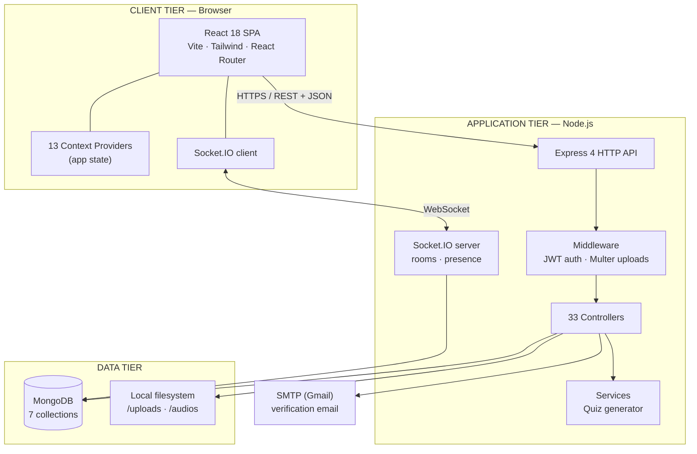
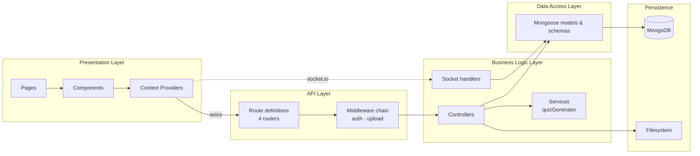
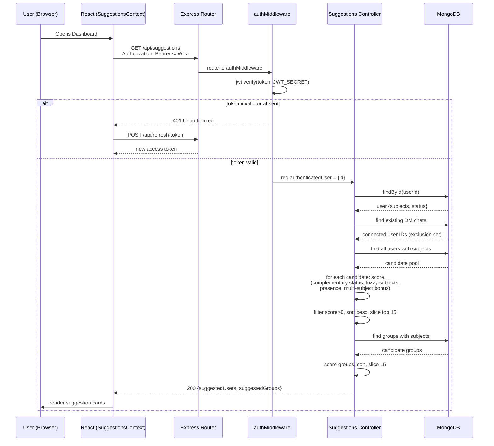
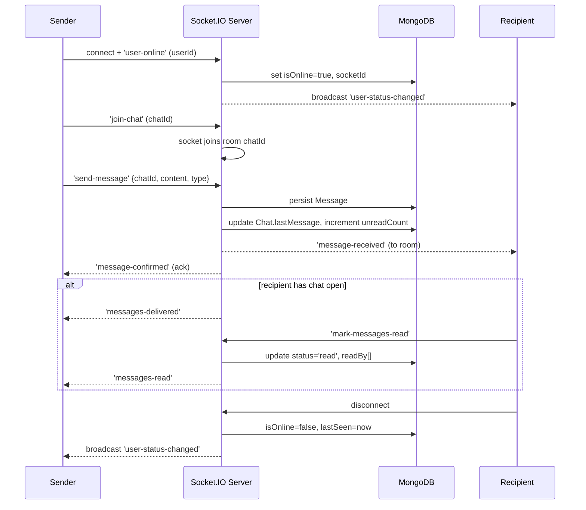
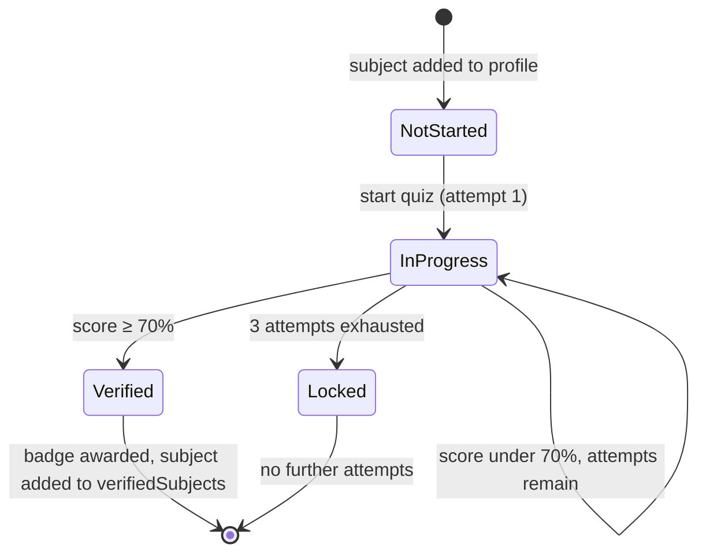
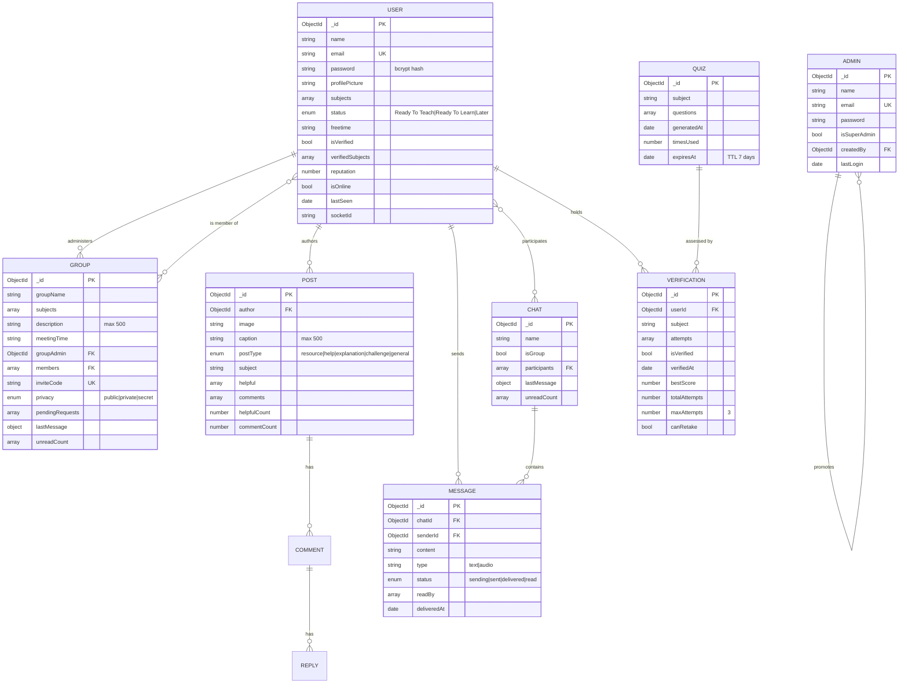

# Software Requirements Specification (SRS)
## FindOut — A Peer-Matching and Collaborative Learning Platform for Tertiary Students

---

| Field | Value |
|---|---|
| **Document title** | Software Requirements Specification — FindOut |
| **Version** | 1.0 |
| **Date** | 26 July 2026 |
| **Author** | *[Your full name]* |
| **Student ID** | *[Your ID]* |
| **Supervisor** | *[Supervisor name]* |
| **Institution** | *[Department, University of Ghana]* |
| **Programme** | *[BSc Computer Science / Information Technology]* |
| **Status** | Draft for supervisor review |
| **Standard followed** | IEEE 830-1998 / ISO/IEC/IEEE 29148:2018 (adapted) |

### Revision history

| Version | Date | Author | Description |
|---|---|---|---|
| 0.1 | *[date]* | *[you]* | Initial requirements capture |
| 1.0 | 26 Jul 2026 | *[you]* | Full SRS reverse-engineered from implemented system |

---

> ### ⚠️ How to use this document
>
> This SRS was written by reading the **actual implemented FindOut codebase**, not from an
> imagined design. Every functional requirement marked *Implemented* corresponds to code that
> exists in this repository, and the file is cited so you can point your examiner at it.
>
> **Three things you must do before submitting:**
>
> 1. **Verify every reference in §14.** The works cited are real and well known in the field,
>    but you must confirm each one's volume, issue, and page numbers against the original
>    source (Google Scholar or your university library). Never cite a source you have not
>    personally opened.
> 2. **Replace every `[SURVEY]` placeholder with your own data.** This document deliberately
>    contains *no invented statistics* about Ghanaian students. Those numbers must come from
>    your own requirements-gathering survey (instrument provided in Appendix D).
> 3. **Read §12 (Implementation Status) honestly.** Some features are partially built. Your
>    thesis is stronger — not weaker — for stating limitations precisely.

---

## Table of contents

1. [Introduction](#1-introduction)
2. [Problem Identification](#2-problem-identification) — *feeds Thesis Chapter 1*
3. [Literature Review](#3-literature-review) — *feeds Thesis Chapter 2*
4. [Overall Description](#4-overall-description)
5. [Methodology and System Architecture](#5-methodology-and-system-architecture) — *feeds Thesis Chapter 3*
6. [Functional Requirements](#6-functional-requirements)
7. [External Interface Requirements](#7-external-interface-requirements)
8. [Non-Functional Requirements](#8-non-functional-requirements)
9. [Data Requirements](#9-data-requirements)
10. [Use Cases and Traceability](#10-use-cases-and-traceability)
11. [Testing and Evaluation Plan](#11-testing-and-evaluation-plan) — *feeds Thesis Chapter 5*
12. [Implementation Status and Known Limitations](#12-implementation-status-and-known-limitations) — *feeds Thesis Chapter 4*
13. [Future Work](#13-future-work)
14. [References](#14-references)
15. [Appendices](#15-appendices)

---

### Mapping: SRS sections → your thesis chapters

Your `chapter-guide.md` specifies a five-chapter structure. This table tells you exactly which section
to draw on when writing each chapter.

| Thesis chapter | Draw primarily from | Supporting material |
|---|---|---|
| **Ch. 1 — Problem Identification** | §2 (all) | §1.2 Scope, §4.3 User classes |
| **Ch. 2 — Literature Review** | §3 (all) | §3.4 Gap analysis table, §14 References |
| **Ch. 3 — Methodology** | §5 (all) | §9 Data model, §6 (requirements as design inputs), §11.4 Evaluation instruments |
| **Ch. 4 — Implementation** | §12, §6 (implementation notes), §7 API catalogue | §5.3 Architecture, Appendix B |
| **Ch. 5 — Results, Testing & Discussion** | §11 (all) | §8 NFR targets as pass/fail criteria, §12.3 Defects, §13 Future work |

---

# 1. Introduction

## 1.1 Purpose

This document specifies the functional and non-functional requirements of **FindOut**, a
web-based platform that connects tertiary students who want to learn a subject with students
who are willing and able to teach it, and supports the collaborative study relationships that
result.

The document is intended for four audiences:

- **The developer** (the author), as the authoritative definition of what the system must do;
- **The project supervisor and examiners**, as the basis for assessing whether the delivered
  artefact meets its stated requirements;
- **Future maintainers**, as a technical reference for the system's structure and constraints;
- **Prospective users and pilot institutions**, as a plain description of the system's capability.

## 1.2 Scope

**Product name:** FindOut

**What the product does.** FindOut allows a registered student to declare (a) the subjects they
care about and (b) their current *intent* — whether they are **Ready To Teach**, **Ready To
Learn**, or unavailable (**Later**). The system then computes and ranks *complementary* matches:
learners are shown teachers, teachers are shown learners, on overlapping subjects. Users can
connect through direct messaging, form or join subject-based study groups with graded privacy,
share learning resources through a subject-tagged feed, and establish credibility in a subject
by passing a competency quiz that awards a verification badge.

**What the product does not do.** FindOut is *not* a learning management system. It does not
host courses, deliver curricula, issue academic credit, administer institutional assessment,
process payments, or replace formal instruction. It is a **connective layer**: it solves the
problem of *finding the right person*, and gives that pair or group somewhere to talk.

**Benefits and objectives.** The system aims to reduce the search cost of peer learning, to make
the willingness to teach visible and rewardable, and to give informal peer tutoring the
lightweight structure it usually lacks. Objectives are stated formally in §2.4.

## 1.3 Definitions, acronyms and abbreviations

| Term | Definition |
|---|---|
| **Intent / Status** | A user's declared availability: `Ready To Teach`, `Ready To Learn`, or `Later`. The central matching signal in FindOut. |
| **Complementary matching** | Matching a user to users with the *opposite* intent on a shared subject, rather than to similar users. |
| **Match score** | A non-negative integer expressing predicted relevance of a candidate peer or group (§5.5). |
| **Fuzzy subject matching** | Tolerant string comparison that treats `C++`, `c plus plus`, and `cpp` as the same subject (§5.6). |
| **Verification** | Confirmation that a user has demonstrated competence in a declared subject by passing a quiz at ≥70%. |
| **Verified subject** | A subject for which a user holds verification. Displayed as a badge. |
| **Group privacy level** | One of `public`, `private`, `secret` — governing discoverability and join mechanics (§6.5). |
| **Invite code** | A 16-character hexadecimal token permitting direct group joining via URL. |
| **Reputation** | An integer score on a user account intended to accumulate from helpful contributions. |
| **Helpful** | The endorsement action on a feed post (FindOut's learning-oriented replacement for a "like"). |
| **DM** | Direct message — a one-to-one chat between two users. |
| **JWT** | JSON Web Token — the signed token format used for stateless authentication (RFC 7519). |
| **CSCL** | Computer-Supported Collaborative Learning. |
| **ZPD** | Zone of Proximal Development (Vygotsky) — see §3.1.1. |
| **SUS** | System Usability Scale — a standardised usability questionnaire (Brooke, 1996). |
| **TAM** | Technology Acceptance Model (Davis, 1989). |
| **SPA** | Single-Page Application. |
| **MERN** | MongoDB, Express.js, React, Node.js — the stack used. |

## 1.4 References

See §14 for the full academic reference list. Technical standards referenced normatively:

- ISO/IEC/IEEE 29148:2018 — Requirements engineering
- IEEE 830-1998 — Recommended Practice for Software Requirements Specifications
- RFC 7519 — JSON Web Token
- RFC 6455 — The WebSocket Protocol
- WCAG 2.1 Level AA — Web Content Accessibility Guidelines

## 1.5 Overview of the document

§2 and §3 establish the problem and the state of the art, and are written to be lifted into
Chapters 1 and 2 of the thesis. §4 gives the broad system description. §5 covers methodology and
architecture. §6–§9 are the requirements proper. §10–§11 cover traceability and evaluation. §12
gives an honest account of what is and is not built.

---

# 2. Problem Identification

> **→ This section is the raw material for Thesis Chapter 1.**

## 2.1 Background and context

Peer learning — students teaching and studying with other students — is one of the most
consistently supported interventions in education research. Topping's (2005) review of peer
learning trends and Bloom's (1984) "2 sigma" work on tutoring both point the same direction:
learners supported by a more capable peer outperform those in conventional instruction alone,
and the *tutor* frequently gains as much as the tutee (Roscoe & Chi, 2007).

Every university already contains the raw material for this. On any given campus there is, for
almost any course, some student who has already mastered the material and some student currently
struggling with it. Frequently they are metres apart in the same hall of residence.

They do not find each other.

## 2.2 Problem statement

**The core problem addressed by this project is a matching and information problem, not a
pedagogical one.**

The peer with the knowledge and the peer who needs it are both present in the same institution,
but there is no mechanism that makes their respective states — *"I can teach this"* and *"I need
help with this"* — mutually visible. Consequently, students who need help do not get it, and
students who are willing to help are never asked.

The failure decomposes into five specific deficiencies:

**P1 — Willingness to teach is invisible.**
A student who has mastered Data Structures and would happily explain it has no way to broadcast
that fact. There is no field anywhere in the university's systems for "I am available to help
with X." The supply of peer teaching exists but is unpublished, and therefore uncapturable.

**P2 — Search is unstructured and high-cost.**
A student seeking help must ask friends, post in a general-purpose WhatsApp group, or approach
strangers. Each channel has a high social cost and a low hit rate. The search is serial,
manual, and repeated from scratch by every student independently.

**P3 — Existing channels are organised by class, not by need.**
Institutional and ad-hoc groups (course WhatsApp groups, departmental pages) are organised
around *enrolment* — everyone in CS 202 is in one group. They are not organised around
*capability and need*. A request for help is broadcast to 200 people, most of whom are equally
lost, and is buried within minutes by unrelated traffic. There is no persistent, queryable
structure connecting a specific need to a specific capability.

**P4 — Competence is unverifiable, so trust does not form.**
Where a student *does* find someone claiming to be able to teach a subject, there is no signal
distinguishing genuine competence from confidence. In an anonymous or semi-anonymous online
context this is the classic information asymmetry problem, and it suppresses participation:
learners will not invest time with an unproven tutor, so the market for peer teaching stays thin.

**P5 — Peer relationships, once formed, have no supporting infrastructure.**
Even a successful match typically degenerates into an unstructured chat thread. There is no
shared space tied to the *subject*, no persistence of shared resources, no way for the pair to
become a group, and no record that the collaboration ever happened.

## 2.3 Aim of the project

> To design, implement and evaluate a web-based platform that makes students' teaching capability
> and learning need mutually visible, automatically matches complementary pairs and groups on
> shared subjects, establishes trust through competency verification, and provides real-time
> collaborative infrastructure to sustain the resulting learning relationships.

## 2.4 Objectives

The aim decomposes into six specific, verifiable objectives. Each maps to requirements in §6 and
to evaluation criteria in §11.

| # | Objective | Addresses | Verified by |
|---|---|---|---|
| **O1** | Provide a profile model in which a student explicitly declares subjects of interest and a teach/learn intent, making capability and need machine-readable. | P1 | FR-PROF-02, FR-PROF-03 |
| **O2** | Design and implement a matching algorithm that ranks candidate peers by *complementary* intent and fuzzy subject overlap, and returns ranked suggestions without user search effort. | P2, P3 | FR-MATCH-01…05; §11.3 TC-MATCH |
| **O3** | Implement a competency verification mechanism that awards a per-subject badge on passing an assessment, providing a trust signal prior to engagement. | P4 | FR-VERIF-01…06 |
| **O4** | Provide real-time one-to-one and group messaging with presence, delivery and read state, so that a match converts into an actual conversation without leaving the platform. | P5 | FR-MSG-01…10 |
| **O5** | Provide subject-scoped study groups with graduated privacy and a subject-tagged resource feed, so collaboration persists beyond a single conversation. | P5 | FR-GRP-01…12, FR-FEED-01…08 |
| **O6** | Evaluate the platform with real student users against defined usability and effectiveness criteria, and report the results. | All | §11.4 |

## 2.5 Research questions

- **RQ1.** Can complementary intent (teach ↔ learn) combined with fuzzy subject overlap produce
  peer suggestions that students judge relevant?
- **RQ2.** Does a lightweight, automated competency badge increase students' stated willingness
  to engage with an unknown peer tutor?
- **RQ3.** Does integrating discovery with communication in a single platform reduce the effort
  students report in finding a study partner, relative to their existing methods?
- **RQ4.** What are the architectural and scalability characteristics of the proposed matching
  approach, and at what population size does it require redesign?

## 2.6 Scope and delimitations

**In scope:** account management with email verification; profile with subjects, intent and free
time; complementary matching for users and groups; competency quiz and badge; direct and group
messaging with presence and read receipts; audio messages; study groups with three privacy
levels, invite codes and join requests; subject-tagged post feed with helpful-marks, comments and
threaded replies; global search; administrative dashboard with moderation and analytics.

**Out of scope (with justification):**

| Excluded | Justification |
|---|---|
| Video/voice calling | Substantial WebRTC infrastructure; not required to demonstrate the matching thesis. Users can escalate to external tools. |
| Native mobile apps | Responsive web delivers the same functionality within project time. |
| Payment / paid tutoring | Introduces financial-regulatory and trust concerns orthogonal to the research question. |
| Institutional SSO / student-record integration | Requires institutional authority not available to an undergraduate project. |
| Automated content moderation | Manual admin moderation is implemented; ML moderation is future work. |
| Formal accreditation of badges | Badges signal peer competence only, explicitly not academic credit. |

**Delimitations:** the evaluation is conducted with a convenience sample of students at a single
institution; findings are indicative rather than generalisable. Subject taxonomy is free-text
rather than drawn from an institutional course catalogue.

## 2.7 Significance of the project

- **Practical:** delivers a working system that a student body could pilot immediately.
- **Academic:** contributes an implemented and evaluated instance of *complementary* social
  matching applied to peer learning — a design point that, as §3.4 shows, existing platforms do
  not occupy.
- **Institutional:** the admin analytics surface reveals which subjects generate the most demand
  for help, which is directly actionable intelligence for a department allocating tutorial
  resources.

---

# 3. Literature Review

> **→ This section is the raw material for Thesis Chapter 2.**
> **Verify every citation against the original source before submission (see §14).**

## 3.1 Theoretical foundations

### 3.1.1 Zone of Proximal Development

Vygotsky's (1978) Zone of Proximal Development defines the gap between what a learner can do
unaided and what they can do with guidance from a more capable other. The theory's operational
implication for this project is precise and load-bearing: **effective help comes from someone
positioned just beyond the learner, not necessarily from an expert.** A student who passed Data
Structures last semester is often a *better* ZPD partner than the professor, because the distance
is small and the recently-overcome difficulties are still salient.

This directly justifies FindOut's central design decision. The system does not attempt to rank
teachers by absolute expertise; it matches on *declared complementary intent within a shared
subject*. The peer who says "I can teach this" is by construction a more capable other for the
peer who says "I need to learn this."

### 3.1.2 Peer learning and the tutor effect

Topping (1996, 2005) and Boud, Cohen and Sampson (2001) establish peer learning as effective
across higher-education contexts. Critically for FindOut's incentive model, Roscoe and Chi (2007)
show that tutors benefit substantially through *knowledge-building* — the act of explaining
forces reorganisation of the tutor's own understanding. Chi's (2009) ICAP framework
(Interactive > Constructive > Active > Passive) ranks interactive dialogue as the highest-value
learning mode.

**Design implication:** the platform must present teaching as a *reciprocally* valuable act, not
altruism. This motivates the `Ready To Teach` status being a first-class, badge-bearing identity
rather than a favour flag, and motivates the reputation and verification mechanisms.

### 3.1.3 Social learning theory and communities of practice

Bandura's (1977) social learning theory and Wenger's (1998) communities of practice frame
learning as participation in a social group rather than individual acquisition. Lave and Wenger's
notion of *legitimate peripheral participation* describes newcomers moving from the edge of a
community toward full participation.

**Design implication:** subject-scoped groups with graded privacy (§6.5) provide the community
structure; the public feed provides the peripheral participation route by which a new user can
observe and contribute before committing to a group.

### 3.1.4 Computer-Supported Collaborative Learning

Dillenbourg (1999) and Stahl, Koschmann and Suthers (2006) situate CSCL as the study of how
technology mediates collaborative learning. A recurring CSCL finding is that **group composition
is a primary determinant of collaborative success** — badly formed groups do not improve through
better tooling.

**Design implication:** this is the strongest theoretical argument for investing engineering
effort in the matching algorithm rather than in richer collaboration features. FindOut treats
*group formation* as the intervention point.

### 3.1.5 Self-determination and motivation

Deci and Ryan's self-determination theory identifies autonomy, competence and relatedness as
motivational needs. FindOut's mechanisms map onto these: user-controlled intent status (autonomy),
verification badges (competence), and matched peers plus groups (relatedness).

## 3.2 Review of matching and recommender approaches

### 3.2.1 Social matching systems

Terveen and McDonald (2005) provide the foundational framework for *social matching systems* —
systems that recommend people rather than items. They distinguish similarity-based matching
(recommend people like you) from complementarity-based matching (recommend people who have what
you need), and note that the social-matching literature is dominated by the former.

**This is the gap FindOut occupies.** Nearly all deployed people-recommenders — social network
"people you may know", collaborative-filtering friend suggestion — optimise for *similarity*. A
peer-tutoring system requires the opposite: the ideal match is a user whose intent is inverted
relative to yours while the subject is shared. FindOut implements complementary matching directly
(§5.5), and this is the primary novel claim of the project.

### 3.2.2 Recommender system paradigms

Adomavicius and Tuzhilin (2005) and Ricci, Rokach and Shapira (2011) classify recommenders as
content-based, collaborative-filtering, or hybrid. Collaborative filtering requires an
interaction history and suffers the well-documented **cold-start problem** for new users and new
items.

**Design implication and justification of approach.** FindOut deliberately adopts a
*content-based, rule-weighted* approach over collaborative filtering. The justification is
directly tied to the deployment context: a student platform has continuous cold-start — every new
semester introduces a cohort with zero interaction history, and a student's subject needs change
every semester. A content-based scheme using explicitly declared attributes (subjects, intent) is
immediately effective with zero history, and is additionally *explainable* — the system can tell
the user "matched because you both listed Calculus", which collaborative filtering cannot.
Explainability matters disproportionately here because the recommendation is a request to spend
social effort on a stranger.

### 3.2.3 Approximate string matching

Because subjects are free-text, `Data Structures`, `data-structures` and `DataStructures` must
match. Levenshtein (1966) edit distance provides the standard measure of string similarity.
FindOut applies a tiered strategy — normalised exact match, substring containment, prefix match,
then normalised Levenshtein similarity — trading precision for recall, on the reasoning that a
missed match costs a user an opportunity while a loose match costs only a dismissal (§5.6).

### 3.2.4 Trust and reputation systems

Resnick and Zeckhauser's (2002) analysis of eBay's reputation system and Jøsang, Ismail and
Boyd's (2007) survey establish that online reputation systems reduce information asymmetry and
enable transactions between strangers. Kollock (1999) analyses the economics of online
cooperation and the free-rider problem.

**Design implication:** peer tutoring between strangers is exactly such a transaction. FindOut
addresses P4 with a *competency verification* mechanism (a quiz-gated per-subject badge) rather
than a purely social rating system, because ratings require prior interaction volume that a new
platform does not have — reputation systems have their own cold-start.

## 3.3 Review of existing systems

**Course management platforms (Moodle, Google Classroom, Blackboard).** Organise content and
enrolment. Peer interaction is confined to instructor-created forums, structured by class rather
than by capability. No concept of student-declared teaching availability.

**Q&A platforms (Brainly, Chegg Study, Stack Overflow, Quora).** Optimise for a *question*
receiving *an answer*. The unit is the transaction, not the relationship — there is no persistent
partner, no ongoing study relationship, and typically no locality. Chegg additionally paywalls
access. Stack Overflow's reputation model is instructive and partially adopted here.

**Flashcard/study-tool platforms (Quizlet, Anki).** Excellent content tools, fundamentally
single-player. Content sharing is not partner matching.

**General messaging platforms (WhatsApp, Discord, Telegram, Slack).** This is what students
actually use, and therefore the true baseline for comparison. They provide excellent
communication and *zero* discovery: you cannot query a WhatsApp group for "who here can teach me
recursion." Membership is by enrolment or invitation, so the platform structurally cannot solve
P1 or P2. Discord's topic-based servers come closest but still lack per-user capability declaration.

**Peer-learning-specific platforms.** OpenStudy (later absorbed into Brainly) attempted study-group
formation around courses. P2PU supports peer-led learning circles but is course-centric and
facilitator-driven rather than dynamically matching individuals. StudyStream and Focusmate match
students for *co-working presence* — deliberately not subject-matched, and explicitly not for
teaching; the match is for accountability, not knowledge transfer.

**Professional networks (LinkedIn) and mentorship platforms.** Implement genuine complementary
matching (mentor↔mentee) and validate the pattern, but target career mentorship with long
horizons and formal profiles, not same-campus, same-semester, subject-level academic help.

## 3.4 Gap analysis

| System | Declared teach/learn intent | Subject-level matching | Competency verification | Integrated real-time chat | Persistent subject groups | Free |
|---|---|---|---|---|---|---|
| Moodle / Classroom | ✗ | ✗ (enrolment-based) | ✗ | Partial (forums) | ✓ (by class) | ✓ |
| Brainly / Chegg | ✗ | ✓ (per question) | Partial (Chegg: paid experts) | ✗ | ✗ | ✗ / Partial |
| Stack Overflow | ✗ | ✓ (tags) | Partial (reputation) | ✗ | ✗ | ✓ |
| Quizlet | ✗ | ✓ (content only) | ✗ | ✗ | Partial | Partial |
| WhatsApp / Discord | ✗ | ✗ | ✗ | ✓ | ✓ (not subject-derived) | ✓ |
| StudyStream / Focusmate | ✗ | ✗ (deliberately) | ✗ | ✓ | ✗ | Partial |
| LinkedIn / mentorship apps | ✓ (career) | ✗ (academic subjects) | Partial (endorsements) | ✓ | ✗ | Partial |
| **FindOut** | **✓** | **✓ (fuzzy)** | **✓ (quiz badge)** | **✓** | **✓ (subject-scoped)** | **✓** |

### 3.4.1 Statement of the research gap

The literature and the market review converge on a single unoccupied position:

> No reviewed platform combines **explicitly declared complementary teach/learn intent** with
> **fuzzy subject-level matching**, **automated competency verification**, and **integrated
> real-time collaboration** in one free system targeted at same-institution tertiary students.

Existing systems occupy one or two of these dimensions. Messaging platforms have collaboration
without discovery; Q&A platforms have subject matching without relationships; mentorship
platforms have complementary matching but not academic subjects. FindOut's contribution is the
integration, with complementary intent matching as the organising principle.

## 3.5 Technology review and justification

| Layer | Chosen | Alternatives considered | Justification |
|---|---|---|---|
| **Frontend** | React 18 + Vite | Angular, Vue, Next.js | Component model suits a highly stateful chat UI; largest ecosystem and hiring pool; Vite gives sub-second HMR versus Webpack. Next.js SSR benefits are minimal for an authenticated app behind a login. |
| **Styling** | Tailwind CSS 3 | Bootstrap, MUI, plain CSS | Utility-first avoids the naming overhead of BEM at this scale and produces a smaller shipped stylesheet through purging; no imposed visual identity. |
| **Backend** | Node.js + Express 4 | Django, Spring Boot, Laravel | Single language across the stack reduces context-switching cost for a solo developer; Node's event-driven non-blocking I/O is well suited to many concurrent idle socket connections, which is exactly the chat workload. |
| **Database** | MongoDB + Mongoose | PostgreSQL, MySQL | The domain is document-shaped: a post owns its comments which own their replies; a group owns its pending requests. Retrieving a post with its full comment tree is one document read rather than a three-way join. Schema flexibility suited the iterative development method (§5.1). *Acknowledged trade-off:* no referential integrity or multi-document ACID guarantees in this configuration — see §12.3. |
| **Real-time** | Socket.IO 4 | Raw WebSocket (RFC 6455), SSE, polling | Automatic reconnection, room abstraction, and long-polling fallback for unreliable mobile networks — a material consideration in the deployment context. Room semantics map directly onto chats and groups. |
| **Auth** | JWT (RFC 7519) + bcrypt | Sessions, OAuth, Passport | Stateless tokens avoid server-side session storage and scale horizontally. bcrypt (Provos & Mazières, 1999) is deliberately slow, resisting brute force. *Acknowledged trade-off:* JWTs cannot be revoked before expiry — mitigated by a 15-minute access-token lifetime. |
| **Email** | Nodemailer + SMTP | SendGrid, SES | No cost, adequate for project-scale volume. |
| **Uploads** | Multer (local disk) | Cloudinary, S3 | Zero-cost and simple. *Acknowledged limitation:* ephemeral filesystems on PaaS hosts destroy uploads on redeploy — §12.3, §13. |

---

# 4. Overall Description

## 4.1 Product perspective

FindOut is a **new, self-contained** system, not a component of a larger product and not a
replacement for an existing one. It follows a three-tier client–server architecture with an
additional persistent bidirectional channel for real-time features.



**Interfaces to external systems:** an SMTP relay for verification email is the only mandatory
external dependency. No institutional systems are integrated.

## 4.2 Product functions — summary

| Module | Summary of function |
|---|---|
| **M1 Account & Authentication** | Registration, email verification, login, JWT issuance and refresh, logout. |
| **M2 Profile & Intent** | Subjects, teach/learn/later status, free time, profile picture, verified badges. |
| **M3 Competency Verification** | Per-subject quiz, grading at a 70% threshold, attempt limits, badge award. |
| **M4 Matching & Discovery** | Complementary-intent + fuzzy-subject scoring; ranked user and group suggestions; global search; group exploration. |
| **M5 Study Groups** | Creation, three privacy levels, membership, join requests, invite codes, admin controls. |
| **M6 Messaging** | Real-time DM and group chat, presence, typing/read/delivery state, audio messages, unread counts. |
| **M7 Learning Feed** | Subject-tagged, type-classified posts; helpful-marks; comments and threaded replies. |
| **M8 Administration** | Admin auth, dashboard analytics, user and post moderation, admin promotion. |

## 4.3 User classes and characteristics

| Class | Description | Technical skill | Frequency | Privilege |
|---|---|---|---|---|
| **UC1 — Learner** (`Ready To Learn`) | Student seeking help in one or more subjects. The primary demand side. | Low–moderate; assumed competent with social apps | Daily–weekly | Standard |
| **UC2 — Peer Teacher** (`Ready To Teach`) | Student with competence in a subject, willing to help. The supply side; the scarce resource the system must attract and retain. | Low–moderate | Daily–weekly | Standard + may hold verified badges |
| **UC3 — Dormant User** (`Later`) | Registered but currently unavailable (exams, break). Must not receive match traffic. | — | Occasional | Standard, excluded from complementary matching |
| **UC4 — Group Administrator** | A user who created a group. A role, not an account type — any user can hold it. | Moderate | Weekly | Group-scoped: edit, privacy, members, requests, delete |
| **UC5 — System Administrator** | Platform staff. Separate credential store and login path. | High | Daily | Platform-wide: analytics, user/post moderation |
| **UC6 — Super Administrator** | Bootstrap admin. | High | Rare | UC5 + promote users to admin |

**Critical design consequence.** UC1 and UC2 are not distinct populations — the same student is
typically a learner in one subject and a teacher in another. The status field is therefore
*global to the account* in the current implementation, which is a known modelling limitation
(§12.3, D-05): a student who can teach Java but needs help with Statistics cannot express both
simultaneously. Per-subject intent is the highest-priority item in §13.

## 4.4 Operating environment

| Element | Requirement |
|---|---|
| Client OS | Any — Windows, macOS, Linux, Android, iOS |
| Browser | Chrome/Edge ≥ 90, Firefox ≥ 88, Safari ≥ 14. Must support ES2020, WebSocket, MediaRecorder (audio messages) |
| Client hardware | Any device with ≥ 2 GB RAM; screens 320 px–1920 px wide |
| Server runtime | Node.js ≥ 22.19 (developed and tested on v24.15.0) |
| Database | MongoDB ≥ 6.0 (local or Atlas) |
| Network | Broadband or 3G+; the system must degrade gracefully on intermittent connectivity |
| Server OS | Linux (case-sensitive filesystem — see §12.3 D-01) |

## 4.5 Design and implementation constraints

| ID | Constraint |
|---|---|
| **C1** | Must be delivered by a single developer within one academic year. |
| **C2** | Zero-budget: only free tiers and open-source components. Excludes paid APIs, managed search, paid SMS. |
| **C3** | Web-only delivery; no app-store distribution. |
| **C4** | Passwords must never be stored in plaintext; bcrypt with cost factor ≥ 10. |
| **C5** | All state-changing endpoints must require a valid JWT (exception noted in §12.3 D-04). |
| **C6** | Must be responsive from 320 px upward — mobile is the dominant access mode in the target population. |
| **C7** | Image uploads limited to JPEG/PNG at ≤ 2 MB to bound storage. |
| **C8** | Must run on a case-sensitive filesystem (Linux deployment). |
| **C9** | Secrets must be supplied by environment variables, never committed. |

## 4.6 Assumptions and dependencies

**Assumptions**

- A1 — Users possess a working email address and can complete email verification.
- A2 — Users declare subjects and intent honestly; the verification quiz is the only enforcement.
- A3 — A sufficient population exists for matching to produce results. **This is the system's
  principal external risk:** below a critical density the platform returns empty suggestions and
  fails regardless of implementation quality. Mitigation: seed a pilot cohort within one
  department rather than launching institution-wide.
- A4 — Users have a device with a working microphone if they use audio messages.
- A5 — Free-text subject naming, with fuzzy matching, is adequate without a controlled taxonomy.

**Dependencies**

- D1 — MongoDB availability. Total outage on failure.
- D2 — SMTP provider availability. New registrations cannot complete without it (login is gated
  on email verification).
- D3 — Continued availability of the npm dependency set.
- D4 — Client browser support for WebSocket; degraded to long-polling by Socket.IO otherwise.

---

# 5. Methodology and System Architecture

> **→ This section is the raw material for Thesis Chapter 3. Examiners weight this chapter
> heavily — it must contain enough detail for another researcher to reproduce your work.**

## 5.1 Software development methodology

### 5.1.1 Selection and justification

An **incremental and iterative** model with agile practices was adopted, rather than Waterfall or
full Scrum.

*Why not Waterfall.* Waterfall requires requirements to be fully known and stable before design.
For FindOut they were neither: the matching algorithm's weighting could not be specified in
advance of observing real profile data, and the group privacy model expanded from a boolean to
three levels only after use cases emerged. Waterfall's sequential structure would have deferred
all learning to the end of the project.

*Why not full Scrum.* Scrum's ceremonies (daily stand-ups, sprint reviews, retrospectives) and
roles (Product Owner, Scrum Master, Development Team) presuppose a team. With a single developer
they degenerate into overhead without their coordinating benefit.

*Why incremental/iterative.* Each increment delivered a vertically complete, demonstrable slice
of functionality — database model, API, and UI together — which could be shown to the supervisor
and revised. This matches Sommerville's (2016) characterisation of incremental development as
appropriate where requirements are expected to evolve and early feedback is valuable.

### 5.1.2 Increments delivered

Evidence of iteration is visible in the version history and in the code (fields such as
`privacy` replacing `isPrivate`; `helpful` replacing `likes`).

| Increment | Focus | Key outcome |
|---|---|---|
| **I1** | Foundation | Project scaffolding, MongoDB connection, User model, registration, bcrypt hashing, email verification, JWT login |
| **I2** | Profile & intent | Subjects, status enum, free time, profile picture upload, edit flows |
| **I3** | Matching | Suggestions endpoint; fuzzy matcher with Levenshtein; complementary-status weighting |
| **I4** | Messaging | Chat/Message models, Socket.IO integration, rooms, presence, delivery/read state |
| **I5** | Groups | Group model, creation, membership, invite codes; boolean privacy **later refactored** to three-level enum with pending join requests |
| **I6** | Feed | Post model with subject and postType; "likes" **refactored** to "helpful"; comments and threaded replies |
| **I7** | Verification | Verification model, quiz generation and grading, 70% threshold, attempt limiting, badges |
| **I8** | Administration | Separate Admin model and auth, dashboard aggregation, moderation |
| **I9** | Hardening | Search, audio messaging, unread counts, migration scripts, cross-platform path fixes |

### 5.1.3 Requirements elicitation methods

1. **Literature-driven derivation** — objectives O1–O3 derive from the gap analysis in §3.4.
2. **Competitive analysis** — feature-by-feature review of the systems in §3.3.
3. **Student survey** — instrument in Appendix D. `[SURVEY]` **Report your N, sampling method,
   and findings here.**
4. **Iterative supervisor review** — requirements refined at each increment boundary.

### 5.1.4 Development tools

| Purpose | Tool |
|---|---|
| Editor | Visual Studio Code |
| Version control | Git (13 commits from 19 Dec 2024) |
| API testing | Postman / Thunder Client |
| Database inspection | MongoDB Compass |
| Runtime reload | nodemon (backend), Vite HMR (frontend) |
| Linting | ESLint 9 with React plugins |

## 5.2 System architecture

FindOut uses a **layered (n-tier) architecture** with a **dual-channel** communication model —
REST over HTTP for request/response operations, and a persistent WebSocket for push. The
justification for the dual channel is that chat has fundamentally different semantics from CRUD:
a message must arrive at a recipient who did not ask for it, which request/response cannot
express without polling.



**Separation of concerns.** Routes declare the API surface only; middleware handles
cross-cutting authentication and file handling; controllers hold business logic; Mongoose models
own schema and validation. This is a conventional MVC-derived layering (Fowler, 2002) minus
server-side views, since the React SPA owns presentation entirely.

## 5.3 Request lifecycle — worked example

Authenticated request for peer suggestions:



## 5.4 Real-time message delivery flow



## 5.5 The matching algorithm — formal specification

This is the project's central algorithmic contribution and should be presented in full in your
methodology chapter.

**Reference implementation:** `backend/controllers/Suggestions.js`

### 5.5.1 Definitions

Let $u$ be the requesting user with subject set $S_u$ and status $\sigma_u$.
Let $c$ be a candidate user with subject set $S_c$ and status $\sigma_c$.

Define the complementary status function:

$$
\text{comp}(\sigma_u) =
\begin{cases}
\{\texttt{Ready To Teach}\} & \sigma_u = \texttt{Ready To Learn} \\
\{\texttt{Ready To Learn}\} & \sigma_u = \texttt{Ready To Teach} \\
\varnothing & \sigma_u = \texttt{Later}
\end{cases}
$$

### 5.5.2 Scoring function for candidate users

$$
\text{Score}(u,c) = \underbrace{20 \cdot [\sigma_c \in \text{comp}(\sigma_u)]}_{\text{complementary intent}}
+ \underbrace{\sum_{s \in S_u} \max_{t \in S_c} \text{fuzz}(s,t)}_{\text{subject overlap}}
+ \underbrace{3 \cdot [\text{online}(c)]}_{\text{presence}}
+ \underbrace{2 \cdot |M|}_{\text{multi-subject bonus}}
$$

where $M$ is the set of matched subject pairs, the multi-subject bonus applies only when
$|M| > 1$, and $[\cdot]$ is the Iverson bracket (1 if true, 0 otherwise).

Candidates with $\text{Score} = 0$ are discarded. Users with an existing direct-message chat are
excluded before scoring. Results are sorted by score descending, ties broken by online status
then by `lastSeen` recency, and truncated to the top 15.

### 5.5.3 Justification of the weights

| Component | Weight | Rationale |
|---|---|---|
| Complementary intent | **20** | Dominant term by design. A perfect subject match with the *wrong* intent (two learners) does not serve the platform's purpose; the weight ensures a single complementary match outranks any accumulation of subject similarity alone. This weighting is the operationalisation of §3.2.1. |
| Exact subject match | 10 | Strongest evidence of shared need. |
| Substring match | 7 | e.g. `Maths` ⊂ `Advanced Maths` — high confidence, slightly lower. |
| 3-char prefix match | 5 | e.g. `Programming` / `Program` — moderate confidence. |
| Levenshtein ≥ 0.7 | ⌊5·sim⌋ | Catches typos; capped low because false positives are likelier. |
| Online now | 3 | Small nudge; immediate availability has real value but must not outweigh subject fit. |
| Multi-subject bonus | 2·\|M\| | Multiple shared subjects predict a durable partnership rather than a one-off. |

**These weights are heuristic and hand-tuned.** State this explicitly in your thesis — it is a
legitimate limitation, and §13 proposes learning them from interaction data.

### 5.5.4 Scoring function for candidate groups

Groups use the same fuzzy subject sum, plus a size term and a stronger multi-subject bonus:

$$
\text{Score}(u,g) = \sum_{s \in S_u} \max_{t \in S_g} \text{fuzz}(s,t) + \min(|\text{members}(g)|, 15) + 3|M|
$$

The truncated size term rewards active groups while capping the advantage of large groups so that
new small groups remain discoverable. Groups the user already belongs to, or has a pending
request for, are excluded.

### 5.5.5 Complexity

For $n$ candidate users, $|S_u|$ and $|S_c|$ subjects each, and average subject string length
$\ell$, the cost is $O(n \cdot |S_u| \cdot |S_c| \cdot \ell^2)$ — the $\ell^2$ from Levenshtein's
dynamic-programming matrix. The full user collection is loaded into application memory per
request.

**This is acceptable at pilot scale and unacceptable at institutional scale.** State the boundary
honestly: with a few thousand users and short subject strings the endpoint responds well within
target, but the linear scan is the system's principal scalability limit. §13 proposes MongoDB
aggregation-pipeline pushdown, an inverted subject index, and caching.

## 5.6 The fuzzy subject matcher

```
FUNCTION fuzzyMatch(s1, s2):
    n1 ← normalise(s1)        # lowercase; strip + # . - _ and whitespace
    n2 ← normalise(s2)
    IF n1 = n2                       RETURN (match, 10)
    IF n1 ⊃ n2 OR n2 ⊃ n1            RETURN (match, 7)
    IF |n1|≥3 AND |n2|≥3 AND n1[0:3] = n2[0:3]   RETURN (match, 5)
    sim ← 1 − levenshtein(n1,n2) / max(|n1|,|n2|)
    IF sim ≥ 0.7                     RETURN (match, ⌊5·sim⌋)
    RETURN (no match, 0)
```

Normalisation is what allows `C++` ≡ `cpp` ≡ `c-plus-plus` after punctuation stripping, and
`Data Structures` ≡ `datastructures`. The tiers are ordered by descending confidence and the
function short-circuits at the first hit, so the expensive Levenshtein computation runs only when
cheaper tests fail.

**Recall/precision stance:** the 0.7 threshold and the 3-character prefix rule are deliberately
permissive. A false negative costs a student a learning opportunity they never learn existed; a
false positive costs one dismissed suggestion card. The asymmetry justifies favouring recall.

## 5.7 Verification mechanism design



**Design decisions and their justification:**

- **70% threshold** — set high enough to be a meaningful signal, low enough not to deter
  participation. The supply side (UC2) is the scarce resource; an excessively hard gate would
  starve the platform.
- **3-attempt limit** — prevents brute-forcing a fixed question bank.
- **Answers withheld from the client** — `StartQuiz` strips `correctAnswer` before responding;
  grading is server-side only. This is a deliberate security control against client-side
  tampering.
- **Server-side session** — questions are held server-side between issue and submission, keyed
  by a session ID, and the submitting user ID is checked against the session owner.
- **Per-subject, not global** — verification is claimed and held per subject, matching the
  reality that competence is subject-specific.

**Important disclosure for your thesis (§12.3 D-06):** the current build generates quiz questions
from a **deterministic template bank** parameterised by subject name, assessing *pedagogical
approach* rather than subject knowledge. An `ANTHROPIC_API_KEY` is provisioned in the environment
and `@anthropic-ai/sdk` is installed, but **LLM-based question generation is not wired up**. Do
not claim AI-generated assessment in your thesis. Present it as designed-and-provisioned future
work (§13), and describe the template mechanism accurately. Examiners respond far better to an
honest limitation than to a claim that collapses under a demo.

## 5.8 Security design

| Concern | Control | Location |
|---|---|---|
| Password storage | bcrypt, cost 10 | `RegisterUser.js` |
| Session management | JWT, 15-min access token | `LoginUser.js` |
| Session continuity | 7-day refresh token | `RefreshToken.js` |
| Route protection | Bearer-token middleware on protected routes | `middleware/authMiddleware.js` |
| Admin separation | Distinct `Admin` collection, separate login, separate middleware | `middleware/adminAuth.js` |
| Privilege escalation control | `superAdminAuth` gate on promotion | `adminRoutes.js` |
| Account enumeration | Email uniqueness enforced at schema level | `UserModel.js` |
| Upload abuse | Extension + MIME filter, 2 MB cap | `middleware/upload.js` |
| Cross-origin | CORS restricted to configured `FRONTEND_URL` | `server.js` |
| Assessment integrity | Answers never sent to client; server-side grading | `verificationController.js` |
| Secrets | Environment variables, `.env` git-ignored | `.gitignore` |

**Known weaknesses are documented in §12.3 (D-02, D-03, D-04) and must be disclosed in your
report.** A security section that admits findings demonstrates more competence than one that
claims perfection.

---

# 6. Functional Requirements

**Notation.** Each requirement has a unique ID, a priority (**M**ust / **S**hould / **C**ould,
after MoSCoW), and an implementation status: ✅ Implemented · ⚠️ Partial · ❌ Not implemented.

## 6.1 M1 — Account and Authentication

| ID | Requirement | Pri | Status |
|---|---|---|---|
| FR-AUTH-01 | The system shall allow a visitor to register with name, email, password, and optional profile picture. | M | ✅ |
| FR-AUTH-02 | The system shall reject registration where the email already exists, distinguishing a verified account from an unverified one in the error message. | M | ✅ |
| FR-AUTH-03 | The system shall hash passwords with bcrypt (cost ≥ 10) before persistence and shall never store or log plaintext. | M | ✅ |
| FR-AUTH-04 | The system shall send a verification email containing a signed, time-limited token link on registration. | M | ✅ |
| FR-AUTH-05 | The system shall mark an account verified when a valid, unexpired token is presented. | M | ✅ |
| FR-AUTH-06 | The system shall reject expired or malformed verification tokens with a clear message. | M | ✅ |
| FR-AUTH-07 | The system shall allow a user to request a new verification email. | S | ✅ |
| FR-AUTH-08 | The system shall refuse login to accounts that have not completed email verification. | M | ✅ |
| FR-AUTH-09 | The system shall issue an access token (15 min) and a refresh token (7 days) on successful login. | M | ✅ |
| FR-AUTH-10 | The system shall issue a new access token when presented with a valid refresh token. | M | ✅ |
| FR-AUTH-11 | The system shall reject any request to a protected endpoint that lacks a valid Bearer token, with HTTP 401. | M | ✅ |
| FR-AUTH-12 | The system shall provide logout, clearing client credentials and updating presence state. | M | ✅ |
| FR-AUTH-13 | The verification token lifetime shall be long enough for a user to act on it in normal conditions. | M | ⚠️ *Currently 1 minute — see §12.3 D-07* |

**Implementation:** `controllers/RegisterUser.js`, `LoginUser.js`, `VerifyEmail.js`,
`RefreshToken.js`, `Logout.js`, `resendVerificationEmail.js`, `middleware/authMiddleware.js`

## 6.2 M2 — Profile and Intent

| ID | Requirement | Pri | Status |
|---|---|---|---|
| FR-PROF-01 | The system shall allow a user to view their own profile. | M | ✅ |
| FR-PROF-02 | The system shall allow a user to declare a list of subjects. | M | ✅ |
| FR-PROF-03 | The system shall allow a user to set intent to exactly one of `Ready To Teach`, `Ready To Learn`, `Later`, defaulting to `Later`. | M | ✅ |
| FR-PROF-04 | The system shall allow a user to record free-time availability. | S | ✅ |
| FR-PROF-05 | The system shall allow a user to upload and replace a profile picture (JPEG/PNG ≤ 2 MB). | S | ✅ |
| FR-PROF-06 | The system shall reject uploads exceeding the size limit or of disallowed type, with a clear message. | M | ✅ |
| FR-PROF-07 | The system shall allow a user to edit name and other profile details. | M | ✅ |
| FR-PROF-08 | The system shall display verified-subject badges on a user's profile. | S | ✅ |
| FR-PROF-09 | The system shall allow a user to view another user's public profile. | M | ✅ |
| FR-PROF-10 | The system shall maintain a reputation score on each account. | C | ⚠️ *Field exists and is surfaced in admin analytics; no accrual logic — §12.3 D-08* |
| FR-PROF-11 | The system shall allow a user to declare intent **per subject**. | S | ❌ *§13 — highest-priority enhancement* |

**Implementation:** `controllers/EditUserDetails.js`, `GetUserDetails.js`,
`UpdateProfilePicture.js`, `models/UserModel.js`

## 6.3 M3 — Competency Verification

| ID | Requirement | Pri | Status |
|---|---|---|---|
| FR-VERIF-01 | The system shall show, for each subject on a user's profile, its verification state (`not_started`, `in_progress`, `verified`), attempts used, attempts remaining and best score. | M | ✅ |
| FR-VERIF-02 | The system shall allow a user to start a quiz only for a subject listed on their own profile. | M | ✅ |
| FR-VERIF-03 | The system shall generate a 10-question, 4-option multiple-choice quiz for the requested subject. | M | ✅ |
| FR-VERIF-04 | The system shall not transmit correct answers to the client when issuing a quiz. | M | ✅ |
| FR-VERIF-05 | The system shall grade submissions server-side and award a pass at ≥ 70%. | M | ✅ |
| FR-VERIF-06 | The system shall add the subject to the user's verified subjects on a pass and record the timestamp. | M | ✅ |
| FR-VERIF-07 | The system shall limit a user to 3 attempts per subject and refuse further attempts thereafter. | M | ✅ |
| FR-VERIF-08 | The system shall refuse a new quiz for an already-verified subject. | M | ✅ |
| FR-VERIF-09 | The system shall return per-question feedback with the correct answer and explanation after submission. | S | ✅ |
| FR-VERIF-10 | The system shall record time spent per attempt. | C | ✅ |
| FR-VERIF-11 | The system shall retain and expose quiz history per user per subject. | S | ✅ |
| FR-VERIF-12 | The system shall reject a submission whose session belongs to a different user. | M | ✅ |
| FR-VERIF-13 | The system shall cache generated quizzes per subject and expire them after 7 days. | C | ✅ |
| FR-VERIF-14 | The system shall enforce the advertised 10-minute quiz time limit server-side. | S | ⚠️ *Limit is advertised to the client; not enforced on submission — §12.3 D-09* |
| FR-VERIF-15 | The system shall generate subject-specific knowledge questions via an LLM. | S | ❌ *Templates only — §5.7, §13* |
| FR-VERIF-16 | Quiz sessions shall survive a server restart. | S | ❌ *In-memory `global` store — §12.3 D-10* |

**Implementation:** `controllers/verificationController.js`, `services/quizGenerator.js`,
`models/VerificationModel.js`, `models/QuizModel.js`

## 6.4 M4 — Matching and Discovery

| ID | Requirement | Pri | Status |
|---|---|---|---|
| FR-MATCH-01 | The system shall compute ranked peer suggestions for an authenticated user without explicit search input. | M | ✅ |
| FR-MATCH-02 | The system shall weight candidates with *complementary* intent above candidates with matching subjects alone. | M | ✅ |
| FR-MATCH-03 | The system shall match subjects tolerantly, treating differences in case, punctuation, spacing and minor spelling as equivalent. | M | ✅ |
| FR-MATCH-04 | The system shall exclude users with whom the requester already has a direct-message chat. | M | ✅ |
| FR-MATCH-05 | The system shall return at most 15 user suggestions and 15 group suggestions, ranked by score descending. | S | ✅ |
| FR-MATCH-06 | The system shall break score ties by online status, then by recency of last activity. | C | ✅ |
| FR-MATCH-07 | The system shall return an explanatory message rather than an empty list where the user has declared no subjects. | M | ✅ |
| FR-MATCH-08 | The system shall exclude groups the user already belongs to or has a pending request for. | M | ✅ |
| FR-MATCH-09 | The system shall favour groups with more members while capping that advantage. | C | ✅ |
| FR-MATCH-10 | The system shall provide global search across users and groups. | M | ✅ |
| FR-MATCH-11 | The system shall provide a browsable directory of discoverable groups. | S | ✅ |
| FR-MATCH-12 | The system shall provide user search by name or subject. | S | ✅ |
| FR-MATCH-13 | The system shall display *why* a suggestion was made (the matched subjects). | S | ⚠️ *Computed server-side; not surfaced in the response payload — §13* |
| FR-MATCH-14 | Matching shall exclude users whose intent is `Later`. | M | ⚠️ *`Later` users receive no complementary bonus but can still surface on subject overlap alone — §12.3 D-11* |

**Implementation:** `controllers/Suggestions.js`, `searchController.js`, `SearchUsers.js`

## 6.5 M5 — Study Groups

| ID | Requirement | Pri | Status |
|---|---|---|---|
| FR-GRP-01 | The system shall allow a user to create a group with name, subjects, description (≤ 500 chars), meeting time and picture. | M | ✅ |
| FR-GRP-02 | The system shall assign the creator as group administrator and first member. | M | ✅ |
| FR-GRP-03 | The system shall support three privacy levels: `public`, `private`, `secret`. | M | ✅ |
| FR-GRP-04 | `public` groups shall be discoverable and immediately joinable. | M | ✅ |
| FR-GRP-05 | `private` groups shall be discoverable but joinable only by approved request. | M | ✅ |
| FR-GRP-06 | `secret` groups shall not appear in discovery and shall be joinable only by invite code. | M | ✅ |
| FR-GRP-07 | The system shall generate a unique invite code per group at creation. | M | ✅ |
| FR-GRP-08 | The system shall allow joining via invite code URL. | M | ✅ |
| FR-GRP-09 | The system shall record join requests and allow the group admin to approve or reject them. | M | ✅ |
| FR-GRP-10 | The system shall allow the group admin to add and remove members. | M | ✅ |
| FR-GRP-11 | The system shall allow the group admin to edit group details and change privacy level. | M | ✅ |
| FR-GRP-12 | The system shall allow the group admin to delete the group. | M | ✅ |
| FR-GRP-13 | The system shall allow a member to leave a group. | M | ✅ |
| FR-GRP-14 | The system shall list all groups a user belongs to. | M | ✅ |
| FR-GRP-15 | The system shall restrict group-administrative actions to the group administrator. | M | ✅ |
| FR-GRP-16 | The system shall notify group members in real time of membership changes. | S | ✅ |
| FR-GRP-17 | The system shall transfer or reassign administration when the sole admin leaves. | S | ❌ *§13* |

**Implementation:** `controllers/CreateGroup.js`, `JoinGroup.js`, `JoinGroupViaInvite.js`,
`HandleJoinRequest.js`, `AddGroupMembers.js`, `RemoveGroupMember.js`, `LeaveGroup.js`,
`EditGroupDetails.js`, `UpdateGroupPrivacy.js`, `DeleteGroup.js`, `FetchAllGroups.js`,
`GetGroupDetails.js`, `UpdateGroupProfilePicture.js`

## 6.6 M6 — Messaging and Real-Time Collaboration

| ID | Requirement | Pri | Status |
|---|---|---|---|
| FR-MSG-01 | The system shall allow a user to start a direct chat with another user. | M | ✅ |
| FR-MSG-02 | The system shall list all chats for a user with last message and unread count. | M | ✅ |
| FR-MSG-03 | The system shall deliver messages in real time to connected participants without page refresh. | M | ✅ |
| FR-MSG-04 | The system shall persist all messages. | M | ✅ |
| FR-MSG-05 | The system shall retrieve message history for a chat. | M | ✅ |
| FR-MSG-06 | The system shall track and display message state: sending, sent, delivered, read. | S | ✅ |
| FR-MSG-07 | The system shall record which users have read a message in a group chat. | S | ✅ |
| FR-MSG-08 | The system shall maintain and display per-user unread counts, resetting on read. | M | ✅ |
| FR-MSG-09 | The system shall show online/offline presence and last-seen time. | S | ✅ |
| FR-MSG-10 | The system shall broadcast presence changes to other users in real time. | S | ✅ |
| FR-MSG-11 | The system shall support recording and sending audio messages. | S | ✅ |
| FR-MSG-12 | The system shall support emoji entry in messages. | C | ✅ |
| FR-MSG-13 | The system shall acknowledge message delivery to the sender and surface send failures. | S | ✅ |
| FR-MSG-14 | The system shall reconnect automatically after transient network loss. | S | ✅ *(Socket.IO)* |
| FR-MSG-15 | The system shall support message deletion or editing. | C | ❌ *§13* |
| FR-MSG-16 | The system shall support typing indicators. | C | ❌ *§13* |

**Implementation:** `socket/Socket.js`, `controllers/MessageController.js`, `GetAllChats.js`,
`StartNewChat.js`, `middleware/AudioHandler.js`, `models/MessageModel.js`

## 6.7 M7 — Learning Feed

| ID | Requirement | Pri | Status |
|---|---|---|---|
| FR-FEED-01 | The system shall allow an authenticated user to publish a post with an image, a caption (≤ 500 chars), a subject, and a type. | M | ✅ |
| FR-FEED-02 | Post type shall be one of `resource`, `help`, `explanation`, `challenge`, `general`. | M | ✅ |
| FR-FEED-03 | The system shall display a feed of posts with author, subject and type. | M | ✅ |
| FR-FEED-04 | The system shall allow a user to mark a post *helpful* and to undo that mark. | M | ✅ |
| FR-FEED-05 | The system shall maintain a helpful count per post. | M | ✅ |
| FR-FEED-06 | The system shall allow comments (≤ 300 chars) on posts. | M | ✅ |
| FR-FEED-07 | The system shall allow threaded replies to comments. | S | ✅ |
| FR-FEED-08 | The system shall allow liking comments and replies. | C | ✅ |
| FR-FEED-09 | The system shall allow an author to delete their own post. | M | ✅ |
| FR-FEED-10 | The system shall allow deletion of one's own reply. | S | ✅ |
| FR-FEED-11 | The system shall compute a total engagement metric per post. | C | ✅ |
| FR-FEED-12 | The system shall paginate the feed. | S | ❌ *§12.3 D-12* |
| FR-FEED-13 | The system shall allow filtering the feed by subject or type. | S | ❌ *Indexes exist; no filter endpoint — §13* |
| FR-FEED-14 | The system shall allow text-only posts (no image). | S | ❌ *Image is currently mandatory — §12.3 D-13* |

**Implementation:** `controllers/PostController.js`, `CommentController.js`, `models/PostModel.js`

## 6.8 M8 — Administration

| ID | Requirement | Pri | Status |
|---|---|---|---|
| FR-ADM-01 | The system shall provide administrator login separate from user login. | M | ✅ |
| FR-ADM-02 | The system shall restrict all admin endpoints to authenticated administrators. | M | ✅ |
| FR-ADM-03 | The system shall record administrator last-login time. | C | ✅ |
| FR-ADM-04 | The system shall present dashboard statistics: total users, posts, groups; online users; teacher/learner split; signups in the last 7 days. | M | ✅ |
| FR-ADM-05 | The system shall present post counts by type and the top 10 subjects by post volume. | S | ✅ |
| FR-ADM-06 | The system shall present the top 10 users by reputation. | C | ✅ |
| FR-ADM-07 | The system shall list all users with search and filtering. | M | ✅ |
| FR-ADM-08 | The system shall allow an administrator to verify or unverify a user. | M | ✅ |
| FR-ADM-09 | The system shall allow an administrator to delete a user. | M | ✅ |
| FR-ADM-10 | The system shall allow a super-administrator, and only a super-administrator, to promote a user to administrator. | M | ✅ |
| FR-ADM-11 | The system shall list all posts and allow administrative deletion. | M | ✅ |
| FR-ADM-12 | The system shall maintain an audit log of administrative actions. | S | ❌ *§13* |

**Implementation:** `controllers/adminController.js`, `middleware/adminAuth.js`,
`routes/adminRoutes.js`, `models/AdminModel.js`

---

# 7. External Interface Requirements

## 7.1 User interface requirements

| ID | Requirement |
|---|---|
| UI-01 | The interface shall be responsive and usable from 320 px viewport width upward, with dedicated mobile navigation components. |
| UI-02 | Every destructive action (delete group, delete post, remove member, leave group) shall require explicit confirmation. |
| UI-03 | The system shall provide non-blocking toast feedback for the outcome of asynchronous operations. |
| UI-04 | The system shall display loading indicators during network operations. |
| UI-05 | Form validation errors shall be shown inline, adjacent to the offending field. |
| UI-06 | Colour shall not be the sole carrier of meaning (WCAG 1.4.1); intent status and message state shall also carry text or iconography. |
| UI-07 | Interactive controls shall be keyboard reachable and operable. |
| UI-08 | Text shall meet a contrast ratio of at least 4.5:1 (WCAG 1.4.3). |

**Principal screens:** Register · Login · Verify Email · Dashboard (suggestions) · Explore Groups
· Create Group · Group Profile / Manage Group · Inbox / Chat · Feed · Add Post · Verification
Dashboard · Take Quiz · Admin Login · Admin Dashboard · Admin Users · Admin Posts · Admin
Analytics.

## 7.2 Software interfaces

| Interface | Detail |
|---|---|
| MongoDB | via Mongoose 8 ODM over the standard MongoDB wire protocol |
| SMTP | via Nodemailer 6 (Gmail service transport) |
| Browser MediaRecorder API | audio message capture |
| Browser localStorage | client-side token persistence (see §12.3 D-03) |

## 7.3 Communications interfaces

- **HTTP/HTTPS** — REST, JSON request/response bodies, `multipart/form-data` for uploads.
- **WebSocket (RFC 6455)** — via Socket.IO, with automatic long-polling fallback.
- **SMTP** — outbound verification email.
- **CORS** — restricted to the single configured `FRONTEND_URL` origin, credentials enabled.

## 7.4 REST API catalogue

**Base path:** `/api` · **Auth:** `Authorization: Bearer <accessToken>` unless marked *public*

### Authentication and account

| Method | Endpoint | Auth | Purpose |
|---|---|---|---|
| POST | `/register` | public | Register (multipart, optional `profilePicture`) |
| POST | `/login` | public | Authenticate, receive token pair |
| POST | `/send-verification-email` | public | Send verification link |
| GET | `/verify-email?token=` | public | Confirm email |
| POST | `/resend-verification-email` | public | Resend link |
| POST | `/refresh-token` | public | Exchange refresh for access token |
| POST | `/logout` | ✔ | End session |

### Profile

| Method | Endpoint | Auth | Purpose |
|---|---|---|---|
| GET | `/user-details` | ✔ | Current user profile |
| PUT | `/edit-user` | ✔ | Update profile fields |
| POST | `/profile-picture` | ✔ | Upload avatar |

### Matching, search and discovery

| Method | Endpoint | Auth | Purpose |
|---|---|---|---|
| GET | `/suggestions` | ✔ | Ranked peer and group suggestions |
| GET | `/search?q=` | ✔ | Global search |
| GET | `/search-users` | ✔ | User search |
| GET | `/explore/groups` | ✔ | Discoverable groups |
| GET | `/explore/users` | ✔ | User directory |

### Groups

| Method | Endpoint | Auth | Purpose |
|---|---|---|---|
| POST | `/creategroup` | ✔ | Create group (multipart) |
| GET | `/my-groups` | ✔ | List memberships |
| GET | `/group/:groupId` | ✔ | Group detail |
| PUT | `/edit-group` | ✔ | Update details |
| PUT | `/groups/update-privacy` | ✔ | Change privacy level |
| POST | `/group-profile-picture` | ✔ | Upload group image |
| POST | `/join-group` | ✔ | Join or request to join |
| GET | `/join/:inviteCode` | ✔ | Join by invite code |
| POST | `/groups/handle-join-request` | ✔ | Approve/reject request |
| POST | `/add-member` | ✔ | Add member |
| PUT | `/groups/remove-member` | ✔ | Remove member |
| POST | `/groups/leave` | ✔ | Leave group |
| DELETE | `/deletegroup/:groupId` | ✔ | Delete group |

### Messaging

| Method | Endpoint | Auth | Purpose |
|---|---|---|---|
| GET | `/chats` | ✔ | List chats with unread counts |
| POST | `/start-new-chat` | ✔ | Open a DM |
| GET | `/messages/:chatId` | ✔ | Message history |
| POST | `/messages` | ✔ | Send message (REST path) |
| POST | `/messages/audio` | ⚠️ *no middleware* | Upload audio message |

### Feed

| Method | Endpoint | Auth | Purpose |
|---|---|---|---|
| POST | `/add-post` | ✔ | Create post |
| GET | `/getallposts` | ⚠️ *public* | List posts |
| POST | `/posts/:postId/helpful` | ✔ | Toggle helpful |
| DELETE | `/posts/delete-post/:postId` | ✔ | Delete own post |
| POST | `/posts/:postId/comments` | ✔ | Add comment |
| GET | `/posts/:postId/get-comments` | ✔ | List comments |
| POST | `/comments/:commentId/like` | ✔ | Like comment |
| POST | `/comments/:commentId/reply` | ✔ | Reply to comment |
| GET | `/comments/:commentId/replies` | ✔ | List replies |
| DELETE | `/comments/:commentId/replies/:replyId` | ✔ | Delete reply |

### Verification

| Method | Endpoint | Auth | Purpose |
|---|---|---|---|
| GET | `/verification/status` | ✔ | Per-subject verification state |
| POST | `/verification/start-quiz` | ✔ | Issue quiz (answers stripped) |
| POST | `/verification/submit-quiz` | ✔ | Submit and grade |
| GET | `/verification/history` | ✔ | Attempt history |

### Administration — base path `/api/admin`

| Method | Endpoint | Auth | Purpose |
|---|---|---|---|
| POST | `/login` | public | Admin login |
| POST | `/logout` | admin | Admin logout |
| GET | `/me` | admin | Current admin |
| GET | `/dashboard/stats` | admin | Aggregated statistics |
| GET | `/users` | admin | List users |
| PATCH | `/users/:userId/verify` | admin | Verify user |
| PATCH | `/users/:userId/unverify` | admin | Unverify user |
| DELETE | `/users/:userId` | admin | Delete user |
| POST | `/users/:userId/promote` | super-admin | Promote to admin |
| GET | `/posts` | admin | List posts |
| DELETE | `/posts/:postId` | admin | Delete post |

### Static

| Path | Purpose |
|---|---|
| `/uploads/*` | Profile and group images |
| `/audios/*` | Audio message files |

## 7.5 WebSocket event catalogue

**Client → Server**

| Event | Payload | Effect |
|---|---|---|
| `user-online` | `userId` | Mark online, record socket ID, broadcast presence, flush pending deliveries |
| `join-chat` | `chatId` | Join the chat room |
| `join-group-room` | `groupId` | Join the group room |
| `viewing-chat` | `{chatId}` | Mark chat as actively viewed |
| `left-chat-view` | — | Clear active view |
| `send-message` | `{chatId, senderId, content, type}` | Persist and fan out; acknowledged |
| `send-audio-message` | message data | Persist and fan out audio message |
| `mark-messages-read` | `{chatId, userId}` | Mark read, notify room |
| `mark-chat-read` | `{chatId, userId}` | Reset unread counter |
| `disconnect` | — | Mark offline, set last-seen, broadcast |

**Server → Client**

| Event | Payload | Meaning |
|---|---|---|
| `message-received` | message | New message in a joined room |
| `message-confirmed` | message | Sender's message persisted |
| `message-error` | error | Send failed |
| `messages-delivered` | `{chatId, …}` | Delivered to recipient |
| `messages-read` | `{chatId, userId}` | Recipient has read |
| `chat-marked-read` | `{chatId, userId}` | Unread counter cleared |
| `chat-updated` | chat | Chat metadata changed |
| `user-status-changed` | `{userId, isOnline, lastSeen}` | Presence change |

---

# 8. Non-Functional Requirements

These are **measurable acceptance criteria**. Report actual measured values against each in
Thesis Chapter 5 (§11.5 provides the reporting template).

## 8.1 Performance

| ID | Requirement | Target |
|---|---|---|
| NFR-PERF-01 | Authentication endpoints shall respond within | ≤ 2 s (95th pct) |
| NFR-PERF-02 | The suggestions endpoint shall respond within, at ≤ 1,000 users | ≤ 3 s |
| NFR-PERF-03 | Real-time message delivery latency between connected clients | ≤ 500 ms |
| NFR-PERF-04 | Initial application load (broadband) | ≤ 5 s |
| NFR-PERF-05 | Chat history retrieval | ≤ 2 s |
| NFR-PERF-06 | The system shall support concurrent active users | ≥ 100 |
| NFR-PERF-07 | The system shall sustain concurrent socket connections | ≥ 100 |
| NFR-PERF-08 | Production JS bundle (gzipped) | ≤ 300 kB *(measured: 251 kB — pass)* |

## 8.2 Security

| ID | Requirement |
|---|---|
| NFR-SEC-01 | Passwords shall be stored only as bcrypt hashes with cost ≥ 10. |
| NFR-SEC-02 | Access tokens shall expire within 15 minutes. |
| NFR-SEC-03 | All state-changing endpoints shall require authentication. |
| NFR-SEC-04 | Administrative functions shall be inaccessible to standard user tokens. |
| NFR-SEC-05 | Privilege escalation shall be restricted to super-administrators. |
| NFR-SEC-06 | Quiz answers shall never be transmitted to the client before submission. |
| NFR-SEC-07 | Uploads shall be constrained by type and size. |
| NFR-SEC-08 | Secrets shall be supplied via environment variables and excluded from version control. |
| NFR-SEC-09 | CORS shall permit only the configured frontend origin. |
| NFR-SEC-10 | All production traffic shall use TLS. |
| NFR-SEC-11 | Token signing secrets shall be high-entropy and environment-supplied, with **no hardcoded fallback**. |
| NFR-SEC-12 | Authentication endpoints shall be rate-limited. |
| NFR-SEC-13 | User-supplied content shall be sanitised or escaped before rendering. |

> **NFR-SEC-11 and NFR-SEC-12 are currently NOT met.** See §12.3 D-02 and D-04. Disclose this.

## 8.3 Usability

| ID | Requirement | Target |
|---|---|---|
| NFR-USE-01 | A new user shall complete registration through to first suggestion unaided in | ≤ 5 min |
| NFR-USE-02 | System Usability Scale score | ≥ 68 (industry average) |
| NFR-USE-03 | Task success rate in usability testing | ≥ 80 % |
| NFR-USE-04 | Core actions shall be reachable within 3 clicks of the dashboard | — |
| NFR-USE-05 | Error messages shall state what went wrong and what to do next | — |
| NFR-USE-06 | The interface shall be fully operable on a 320 px viewport | — |

## 8.4 Reliability and availability

| ID | Requirement | Target |
|---|---|---|
| NFR-REL-01 | Uptime during the evaluation period | ≥ 99 % |
| NFR-REL-02 | No message loss once acknowledged | 100 % |
| NFR-REL-03 | Automatic socket reconnection after transient loss | ≤ 5 s |
| NFR-REL-04 | Unhandled errors shall not crash the process | — |
| NFR-REL-05 | Database writes shall be durably persisted before acknowledgement | — |

## 8.5 Maintainability, portability, scalability

| ID | Requirement |
|---|---|
| NFR-MNT-01 | Code shall be organised by layer (routes / middleware / controllers / models / services). |
| NFR-MNT-02 | One controller shall correspond to one primary responsibility. |
| NFR-MNT-03 | The codebase shall pass ESLint with no errors. |
| NFR-MNT-04 | Schema changes shall be accompanied by a migration script (see `backend/migration/`). |
| NFR-POR-01 | The system shall run on any Node ≥ 18 platform without code change. |
| NFR-POR-02 | All environment-specific values shall be externalised to environment variables. |
| NFR-POR-03 | The codebase shall build and run on case-sensitive filesystems. |
| NFR-SCA-01 | The application tier shall be stateless except for socket and quiz-session state, permitting horizontal scaling. ⚠️ *Quiz sessions currently violate this — D-10.* |
| NFR-SCA-02 | Frequently queried fields shall be indexed. |

---

# 9. Data Requirements

## 9.1 Entity-relationship model



## 9.2 Collections

Seven collections: `users`, `groups`, `chats`, `messages`, `posts`, `verifications`, `quizzes`,
`admins`.

### Notable structural decisions

| Decision | Rationale |
|---|---|
| Comments and replies **embedded** in `posts` | A post and its discussion are read together; embedding makes retrieval a single document read. Bounded by the 16 MB document limit — acceptable for the expected comment volume, but a scaling ceiling (§13). |
| `unreadCount` as an **array of per-user counters** on chat and group | Each participant needs an independent counter; an array of `{userId, count}` keeps it with the chat document. |
| `lastMessage` **denormalised** onto chat and group | The chat list needs the last message for every chat; denormalising avoids N queries per list render. Classic read-optimisation trade against write consistency. |
| `verifications` separate from `users` | Attempt history is unbounded and rarely read; separating keeps the hot user document small. |
| `quizzes` with **TTL index** | MongoDB automatically evicts expired cached quizzes; no cleanup job needed. |
| Free-text `subjects` arrays | Enables fuzzy matching without maintaining a taxonomy; costs referential consistency. |

## 9.3 Indexes

| Collection | Index | Purpose |
|---|---|---|
| `users` | `email` (unique) | Login lookup; enforces uniqueness |
| `verifications` | `{userId, subject}` (unique) | One record per user per subject |
| `verifications` | `{userId, isVerified}` | Badge lookup |
| `quizzes` | `{subject, expiresAt}` | Cache hit lookup |
| `quizzes` | `{expiresAt}` TTL = 0 | Automatic expiry |
| `posts` | `{author, createdAt desc}` | Author timeline |
| `posts` | `{subject}`, `{postType}` | Filtered feeds (endpoint pending) |
| `posts` | `{comments.user}`, `{comments.replies.user}` | Comment attribution |
| `groups` | `inviteCode` (unique, sparse) | Invite resolution |

## 9.4 Validation rules

| Field | Rule |
|---|---|
| `user.email` | Required, unique |
| `user.password` | Required; stored only as bcrypt hash |
| `user.status` | Must be one of the three enum values; defaults `Later` |
| `group.description` | ≤ 500 characters |
| `group.privacy` | Enum; defaults `public` |
| `post.caption` | ≤ 500 characters |
| `post.subject` | Required; defaults `General` |
| `post.postType` | Enum; defaults `general` |
| `comment.text` / `reply.text` | Required, ≤ 300 characters |
| `verification.attempts[].score` | 0–10 |
| `quiz.questions[].correctAnswer` | Integer 0–3 |
| Image uploads | JPEG/PNG only, ≤ 2 MB |
| Audio uploads | MIME type must begin `audio/` |

## 9.5 Data retention and privacy

| ID | Requirement | Status |
|---|---|---|
| DR-01 | Cached quizzes shall be deleted 7 days after generation. | ✅ TTL index |
| DR-02 | Messages shall be retained for the life of the chat. | ✅ |
| DR-03 | Deleting a user shall remove or anonymise their personal data. | ⚠️ *User document deleted; posts/messages may be orphaned — D-14* |
| DR-04 | Users shall be able to export their data. | ❌ *§13* |
| DR-05 | Passwords shall never appear in API responses or logs. | ✅ |
| DR-06 | A privacy notice shall be presented at registration. | ❌ *§13 — required before real deployment* |

---

# 10. Use Cases and Traceability

## 10.1 Use case diagram

```mermaid
graph TB
    L(("Learner"))
    T(("Peer Teacher"))
    GA(("Group Admin"))
    SA(("System Admin"))

    subgraph FindOut
        UC1["Register & verify email"]
        UC2["Set subjects & intent"]
        UC3["View ranked suggestions"]
        UC4["Start direct chat"]
        UC5["Exchange messages"]
        UC6["Take verification quiz"]
        UC7["Create study group"]
        UC8["Join / request to join group"]
        UC9["Publish resource post"]
        UC10["Comment & mark helpful"]
        UC11["Search users & groups"]
        UC12["Approve join requests"]
        UC13["Manage members & privacy"]
        UC14["Moderate users & posts"]
        UC15["View platform analytics"]
    end

    L --- UC1 & UC2 & UC3 & UC4 & UC5 & UC8 & UC9 & UC10 & UC11
    T --- UC1 & UC2 & UC3 & UC5 & UC6 & UC7 & UC9 & UC10
    GA --- UC12 & UC13
    SA --- UC14 & UC15
```



## 10.2 Detailed use cases

### UC-03 — View ranked suggestions *(the central use case)*

| Field | Detail |
|---|---|
| **Actor** | Learner or Peer Teacher |
| **Goal** | Discover relevant complementary peers and groups without manual searching |
| **Preconditions** | Authenticated; at least one subject declared |
| **Trigger** | Opens the dashboard |
| **Main flow** | 1. User opens dashboard. 2. Client requests suggestions with bearer token. 3. Server authenticates and loads the user's subjects and intent. 4. Server determines the complementary intent set. 5. Server builds the exclusion set from existing DM chats. 6. Server scores every eligible candidate user (§5.5.2). 7. Server scores every eligible group (§5.5.4). 8. Server sorts, truncates to 15 each, and responds. 9. Client renders suggestion cards. |
| **Alternate A1** | No subjects declared → server returns empty lists plus a prompt to add subjects (FR-MATCH-07). |
| **Alternate A2** | Access token expired → client refreshes via `/refresh-token` and retries. |
| **Exception E1** | Database unavailable → HTTP 500, client shows a retry affordance. |
| **Postcondition** | Ranked suggestions displayed; no state mutated. |
| **Requirements** | FR-MATCH-01…09 |

### UC-06 — Take verification quiz

| Field | Detail |
|---|---|
| **Actor** | Peer Teacher |
| **Goal** | Earn a verification badge for a declared subject |
| **Preconditions** | Authenticated; subject on profile; not already verified; attempts remaining |
| **Main flow** | 1. User opens the verification dashboard and sees per-subject state. 2. Selects a subject and starts the quiz. 3. Server validates eligibility and creates/loads the verification record. 4. Server generates 10 questions, strips correct answers, stores the full set server-side under a session ID. 5. Client presents the quiz. 6. User answers and submits with the session ID. 7. Server verifies session ownership, grades, computes percentage. 8. Server appends the attempt, updates best score and attempt count. 9. If ≥ 70%: subject added to verified subjects with a timestamp. 10. Server returns the result with per-question feedback. |
| **Alternate A1** | Score < 70% and attempts remain → user may retake. |
| **Alternate A2** | Third failure → `canRetake` set false; further attempts refused. |
| **Exception E1** | Session missing or expired (e.g. server restarted) → HTTP 404; attempt lost (D-10). |
| **Exception E2** | Session belongs to another user → HTTP 403. |
| **Postcondition** | Attempt recorded; badge awarded on pass. |
| **Requirements** | FR-VERIF-01…13 |

### UC-08 — Join or request to join a group

| Field | Detail |
|---|---|
| **Actor** | Any user |
| **Preconditions** | Authenticated; not already a member |
| **Main flow (public)** | Selects group → server adds user to members → member gains chat access. |
| **Main flow (private)** | Selects group → server appends to `pendingRequests` → group admin approves → user added; real-time notification issued. |
| **Main flow (secret)** | Opens `/join/:inviteCode` → server resolves code → user added. |
| **Alternate A1** | Admin rejects → request removed; user not added. |
| **Exception E1** | Invalid or unknown invite code → error message. |
| **Requirements** | FR-GRP-04…09 |

## 10.3 Requirements traceability matrix

| Objective | Problem | Requirements | Test cases | Evaluation |
|---|---|---|---|---|
| O1 Declare capability | P1 | FR-PROF-02, 03, 08 | TC-PROF-01…04 | Profile completion rate |
| O2 Complementary matching | P2, P3 | FR-MATCH-01…09 | TC-MATCH-01…08 | RQ1: suggestion relevance rating |
| O3 Trust via verification | P4 | FR-VERIF-01…13 | TC-VERIF-01…09 | RQ2: willingness-to-engage measure |
| O4 Real-time communication | P5 | FR-MSG-01…14 | TC-MSG-01…10 | NFR-PERF-03 latency |
| O5 Persistent collaboration | P5 | FR-GRP-01…16, FR-FEED-01…11 | TC-GRP, TC-FEED | Groups created; posts per user |
| O6 Evaluation | All | §11 | All | SUS ≥ 68; task success ≥ 80% |

---

# 11. Testing and Evaluation Plan

> **→ This section is the raw material for Thesis Chapter 5. Populate the result columns with
> your actual measurements — do not leave them as targets.**

## 11.1 Test strategy

| Level | Scope | Method |
|---|---|---|
| **Unit** | Pure functions in isolation — `fuzzyMatch`, `levenshteinDistance`, `gradeQuiz`, scoring | Manual test harness / Jest |
| **Integration** | Endpoint behaviour against a test database | Postman collection |
| **System** | Complete user journeys through the UI | Manual scripted walkthrough |
| **Real-time** | Multi-client socket behaviour | Two browsers, two accounts, side by side |
| **Security** | Authorisation boundaries and input handling | Manual probing; see §11.3 |
| **Usability** | Real students performing defined tasks | Moderated session + SUS |
| **Compatibility** | Cross-browser and cross-viewport | Manual matrix |

## 11.2 Unit test cases — matching algorithm

The fuzzy matcher is the most testable and most defensible component. **Include this table with
results in your thesis.**

| ID | Input A | Input B | Expected | Actual | Pass |
|---|---|---|---|---|---|
| TU-01 | `Mathematics` | `Mathematics` | match, 10 | | |
| TU-02 | `mathematics` | `MATHEMATICS` | match, 10 | | |
| TU-03 | `C++` | `cpp` | match, 10 | | |
| TU-04 | `Data Structures` | `data-structures` | match, 10 | | |
| TU-05 | `Maths` | `Advanced Maths` | match, 7 | | |
| TU-06 | `Programming` | `Program` | match, 7 | | |
| TU-07 | `Chemistry` | `Chemical` | match, 5 (prefix) | | |
| TU-08 | `Physics` | `Phisics` | match, ⌊5·sim⌋ | | |
| TU-09 | `Biology` | `History` | no match, 0 | | |
| TU-10 | `Java` | `JavaScript` | match, 7 — **known false positive** | | |

> **TU-10 is a genuine weakness. Report it.** `Java` is a substring of `JavaScript`, so the
> containment rule fires and scores 7. A Java learner may be matched to a JavaScript teacher.
> Discussing this honestly — and proposing the fix (a curated subject taxonomy or a minimum
> length ratio on containment) — is exactly the critical analysis Chapter 5 should contain.

## 11.3 Integration and system test cases

| ID | Test | Expected result | Result |
|---|---|---|---|
| TC-AUTH-01 | Register with a new email | 201; verification email sent | |
| TC-AUTH-02 | Register with an existing email | 400 with appropriate message | |
| TC-AUTH-03 | Login before email verification | 403 | |
| TC-AUTH-04 | Login with wrong password | 400 | |
| TC-AUTH-05 | Login with valid verified credentials | 200 + token pair | |
| TC-AUTH-06 | Access a protected route with no token | 401 | |
| TC-AUTH-07 | Access a protected route with a tampered token | 401 | |
| TC-AUTH-08 | Refresh with a valid refresh token | 200 + new access token | |
| TC-MATCH-01 | Learner with subject X sees teachers of X ranked first | Complementary users at top | |
| TC-MATCH-02 | User with no subjects requests suggestions | Empty lists + prompt | |
| TC-MATCH-03 | Existing DM partner appears in suggestions | Must be absent | |
| TC-MATCH-04 | Already-member group appears in suggestions | Must be absent | |
| TC-MATCH-05 | Suggestion list length | ≤ 15 users, ≤ 15 groups | |
| TC-VERIF-01 | Start quiz for a subject not on profile | 400 | |
| TC-VERIF-02 | Inspect quiz response payload | No `correctAnswer` field present | |
| TC-VERIF-03 | Submit with 7/10 correct | Pass; badge awarded | |
| TC-VERIF-04 | Submit with 6/10 correct | Fail; no badge; attempt recorded | |
| TC-VERIF-05 | Fourth attempt after three failures | Refused | |
| TC-VERIF-06 | Submit another user's session ID | 403 | |
| TC-GRP-01 | Join a public group | Immediate membership | |
| TC-GRP-02 | Join a private group | Pending request created, not a member | |
| TC-GRP-03 | Secret group in explore listing | Absent | |
| TC-GRP-04 | Join secret group by invite code | Membership granted | |
| TC-GRP-05 | Non-admin attempts to delete group | Rejected | |
| TC-MSG-01 | Send message with both clients connected | Appears on recipient without refresh | |
| TC-MSG-02 | Send message with recipient offline | Persisted; delivered on reconnect | |
| TC-MSG-03 | Recipient opens chat | Unread count resets; sender sees read state | |
| TC-MSG-04 | Kill and restore network mid-session | Automatic reconnection | |
| TC-ADM-01 | Standard user token on an admin endpoint | 401/403 | |
| TC-ADM-02 | Non-super admin attempts promotion | Rejected | |
| TC-SEC-01 | Submit `<script>alert(1)</script>` as a caption | Rendered inert, not executed | |
| TC-SEC-02 | Upload a 5 MB image | Rejected | |
| TC-SEC-03 | Upload a `.exe` renamed `.png` | Rejected on MIME check | |
| TC-SEC-04 | Request another user's data by ID manipulation | Rejected | |

## 11.4 User evaluation methodology

**Design.** Post-test evaluation with a convenience sample of tertiary students.

**Participants.** Target N ≥ 20, spanning both intents and multiple subject areas.
`[SURVEY]` *Record actual N, demographics and recruitment method.*

**Procedure.**
1. Brief participants; obtain informed consent (Appendix E).
2. Pre-test questionnaire: current method of finding study partners, difficulty rating, time cost.
3. Participants complete five scripted tasks unaided while the moderator records success and time:
   - T1 Register and verify an account
   - T2 Add three subjects and set intent
   - T3 Find and open a chat with a suggested peer
   - T4 Create or join a study group
   - T5 Take a verification quiz for one subject
4. Post-test: SUS (10 items), TAM constructs (perceived usefulness, perceived ease of use),
   and suggestion-relevance rating.
5. Short semi-structured interview: what worked, what did not, what is missing.

**Instruments.**
- **SUS** (Brooke, 1996) — 10 items, 5-point scale, scored 0–100. Benchmark 68 = average.
- **TAM** (Davis, 1989) — perceived usefulness and perceived ease of use, 7-point Likert.
- **Relevance rating** — for each of the top 5 suggestions: *"How relevant is this person to your
  learning needs?"* (1–5). Mean relevance answers **RQ1**.
- **Trust item** — *"How willing would you be to contact this person for help?"* asked with and
  without a visible verification badge. Answers **RQ2**.
- **Effort comparison** — pre/post difficulty ratings. Answers **RQ3**.

**Analysis.** Descriptive statistics for SUS, task success and time-on-task. Paired comparison
for the badge/no-badge trust item. Thematic coding of interview responses.

**Ethics.** Informed consent; no personal data retained beyond the study; participants may
withdraw at any time; test accounts deleted after analysis. *Confirm your department's ethics
requirements with your supervisor.*

## 11.5 Results reporting template

Reproduce these in Chapter 5 with real numbers.

**Table 5.1 — Functional test summary**

| Module | Cases | Passed | Failed | Pass rate |
|---|---|---|---|---|
| Authentication | 8 | | | |
| Matching | 5 | | | |
| Verification | 6 | | | |
| Groups | 5 | | | |
| Messaging | 4 | | | |
| Administration | 2 | | | |
| Security | 4 | | | |
| **Total** | **34** | | | |

**Table 5.2 — Non-functional results**

| ID | Target | Measured | Verdict |
|---|---|---|---|
| NFR-PERF-01 | ≤ 2 s | | |
| NFR-PERF-02 | ≤ 3 s | | |
| NFR-PERF-03 | ≤ 500 ms | | |
| NFR-PERF-04 | ≤ 5 s | | |
| NFR-PERF-08 | ≤ 300 kB | 251 kB | ✅ Pass |
| NFR-USE-02 | SUS ≥ 68 | | |
| NFR-USE-03 | ≥ 80 % | | |

**Table 5.3 — Task performance**

| Task | Success rate | Mean time | Errors observed |
|---|---|---|---|
| T1 Register & verify | | | |
| T2 Set subjects & intent | | | |
| T3 Contact a suggested peer | | | |
| T4 Create/join a group | | | |
| T5 Take verification quiz | | | |

**Table 5.4 — Research questions**

| RQ | Measure | Result | Interpretation |
|---|---|---|---|
| RQ1 | Mean suggestion relevance (1–5) | | |
| RQ2 | Δ willingness with vs. without badge | | |
| RQ3 | Δ reported difficulty pre/post | | |
| RQ4 | Suggestions latency vs. user count | | |

## 11.6 Compatibility matrix

| Browser | Desktop | Mobile | Result |
|---|---|---|---|
| Chrome ≥ 90 | | | |
| Firefox ≥ 88 | | | |
| Safari ≥ 14 | | | |
| Edge ≥ 90 | | | |

| Viewport | Result |
|---|---|
| 320 px (small phone) | |
| 375 px (phone) | |
| 768 px (tablet) | |
| 1440 px (desktop) | |

---

# 12. Implementation Status and Known Limitations

> **→ Chapter 4 material, plus the "Discussion" half of Chapter 5.**
> **Do not omit this section.** Examiners consistently reward accurate self-assessment and
> penalise overstated claims. Everything below is derived from reading the actual code.

## 12.1 Implementation summary

| Metric | Value |
|---|---|
| Total application code | ~18,985 lines (backend + `frontend/src`) |
| Backend controllers | 33 |
| Mongoose models | 7 |
| Express routers | 4 |
| REST endpoints | ~55 |
| Socket events | 10 client→server, 8 server→client |
| React pages | 13 |
| React components | 25 |
| React context providers | 13 |
| Migration scripts | 10 |
| Version control | 13 commits from 19 Dec 2024 |

## 12.2 Requirement completion

| Module | Implemented | Partial | Not implemented |
|---|---|---|---|
| M1 Authentication | 12 | 1 | 0 |
| M2 Profile | 9 | 1 | 1 |
| M3 Verification | 13 | 1 | 2 |
| M4 Matching | 12 | 2 | 0 |
| M5 Groups | 16 | 0 | 1 |
| M6 Messaging | 14 | 0 | 2 |
| M7 Feed | 11 | 0 | 3 |
| M8 Administration | 11 | 0 | 1 |
| **Total** | **98** | **5** | **10** |

Approximately **87 %** of specified requirements are fully implemented, with all *Must* priority
requirements met except those noted in §12.3.

## 12.3 Known defects and limitations

Each item states the issue, its consequence, and the remedy. **Present these in your Discussion.**

| ID | Severity | Issue | Consequence | Remedy |
|---|---|---|---|---|
| **D-01** | ~~High~~ **Fixed** | Import paths differed in case from filenames (`socket/socket` vs `Socket.js`; `fetchAllGroupsContext` vs `FetchAllGroupsContext.jsx`) | Ran on case-insensitive filesystems, crashed on Linux | **Resolved** — all imports corrected to match on-disk casing |
| **D-02** | **Critical** | Refresh tokens are signed with `process.env.JWT_REFRESH_SECRET`, but the environment defines `REFRESH_TOKEN_SECRET`. The lookup misses and falls back to the hardcoded literal `'refresh_token_secret'` (`LoginUser.js:7`, `RefreshToken.js:5`) | The refresh-token signing key is a constant present in source. Anyone who reads it can mint a refresh token for **any** user ID and obtain a valid access token — full account takeover | Rename the variable to match `.env`, **remove the fallback entirely**, and fail fast on startup if the secret is absent. Fix before any deployment or public demo |
| **D-03** | High | JWTs stored in `localStorage` | Readable by any injected script; XSS becomes account compromise | Use `httpOnly` `Secure` `SameSite` cookies |
| **D-04** | High | No rate limiting on any endpoint; `GET /getallposts` and `POST /messages/audio` lack auth middleware | Brute-force and unauthenticated-upload exposure | Add `express-rate-limit`; apply `authMiddleware` to both routes |
| **D-05** | High | `status` is a single account-level field | A user cannot be `Ready To Teach` in one subject and `Ready To Learn` in another — a common real case that the model cannot express | Move intent into the subjects array: `[{name, intent, verified}]` |
| **D-06** | High | Quiz questions come from a static template bank parameterised by subject name; they assess pedagogical attitude, not subject knowledge. `ANTHROPIC_API_KEY` is provisioned and `@anthropic-ai/sdk` installed, but unused | The verification badge is a weaker competence signal than intended; identical questions across every subject | Wire the Anthropic SDK into `services/quizGenerator.js` — the caching layer and grading pipeline are already built to receive it |
| **D-07** | High | Email verification token expires after 60 seconds (`VerifyEmail.js`) | Most users cannot open their inbox and click within a minute; registration fails in practice | Increase to 24 hours |
| **D-08** | Medium | `reputation` is stored and displayed but never incremented | Admin "top contributors" ranking is meaningless | Increment on helpful-marks received, verifications earned, answers given |
| **D-09** | Medium | The 10-minute quiz limit is sent to the client but not enforced at submission | A user can take unlimited time | Compare `session.startTime` against submission time server-side and reject or flag |
| **D-10** | Medium | Active quiz sessions live in a `global` in-memory object | Sessions lost on restart; breaks under multiple server instances; violates NFR-SCA-01 | Persist to MongoDB or Redis with a TTL |
| **D-11** | Medium | `Later` users receive no complementary bonus but can still surface via subject overlap | Unavailable users appear in suggestions | Filter `status: 'Later'` out of the candidate query |
| **D-12** | Medium | Feed and several list endpoints return all records unpaginated | Response size and render cost grow without bound | Add cursor or skip/limit pagination |
| **D-13** | Medium | `image` is required on posts | A text-only question cannot be posted — a significant restriction for a *help* post type | Make `image` optional |
| **D-14** | Medium | Deleting a user does not cascade to their posts, messages or group memberships | Orphaned references; broken UI where an author cannot be populated | Cascade delete or anonymise in a transaction |
| **D-15** | Medium | Suggestions loads the entire user collection into application memory per request (§5.5.5) | Linear degradation; the principal scalability ceiling | Push scoring into a MongoDB aggregation pipeline; add an inverted subject index; cache per user |
| **D-16** | Low | Substring rule matches `Java` ⊂ `JavaScript` (TU-10) | Occasional irrelevant suggestion | Require a minimum length ratio on containment, or adopt a curated subject taxonomy |
| **D-17** | Low | Uploads written to the local filesystem | Destroyed on redeploy on ephemeral PaaS hosts | Move to object storage (S3/Cloudinary) |
| **D-18** | Low | `user.isVerified` is overloaded: set by **email** verification (`VerifyEmail.js`) *and* by passing a **subject** quiz (`verificationController.js`) | Two unrelated meanings on one boolean; passing a quiz marks the account email-verified, and an admin "unverify" action could lock a user out of login | Split into `isEmailVerified` and derive subject verification from `verifiedSubjects` |
| **D-19** | Low | No automated test suite | Regressions are caught only by manual testing | Add Jest + Supertest |
| **D-20** | Low | 14 backend / 25 frontend npm advisories reported by `npm audit` | Mostly transitive DoS advisories in `express`→`body-parser` and `socket.io`→`engine.io` | Run `npm audit fix`; re-test before submission |

### 12.3.1 Priority order for remaining work

1. **D-02** — critical authentication vulnerability. Fix first; it is a one-line change.
2. **D-07** — 60-second token makes registration unusable in practice.
3. **D-04, D-03** — authentication hardening.
4. **D-06** — wire real question generation, or describe the templates accurately in the thesis.
5. **D-05** — the per-subject intent model, the highest-value functional improvement.

## 12.4 Development challenges encountered

Worth narrating in Chapter 4 — examiners look for evidence of problem-solving, not a frictionless
account.

1. **Cross-platform path casing (D-01).** Development on a case-insensitive filesystem masked
   eleven import statements whose casing did not match the files on disk. The system failed
   immediately on Linux. Resolved by auditing every relative import against the real filenames.
   *Lesson: develop and test on the same filesystem semantics as the deployment target.*
2. **Evolving the group privacy model.** The initial boolean `isPrivate` could not express
   "discoverable but requires approval". Migrating to a three-value enum required both a schema
   change and a data migration (`migration/migratePrivacy.js`) — an instance of why the
   incremental method (§5.1) was appropriate.
3. **Real-time state consistency.** Keeping unread counts, delivery status and presence
   consistent across multiple connected clients required careful ordering of persistence and
   emission, and per-user rather than per-chat unread counters.
4. **Undeclared dependencies.** `react-router-dom` and `react-icons` were imported throughout the
   frontend but absent from `package.json`, so the project would not build on a clean checkout —
   a reproducibility failure caught only when installing from scratch. *Lesson: verify a clean
   clone builds, routinely.*
5. **Matching weight calibration.** The relative weighting of intent versus subject overlap was
   tuned by hand against sample profiles; there was no ground-truth dataset against which to
   optimise. This is acknowledged as a limitation and motivates the learning-to-rank proposal in
   §13.

---

# 13. Future Work

Ordered by value-to-effort ratio.

**Near term (weeks)**
1. Remediate D-02, D-03, D-04, D-07 — security and registration usability.
2. Per-subject intent (D-05) — removes the single largest modelling restriction.
3. Surface match explanations in the API response (FR-MATCH-13) — the data is already computed;
   explainability materially increases trust in recommendations (§3.2.2).
4. Feed pagination and subject/type filtering (D-12, FR-FEED-13) — indexes already exist.
5. Optional post images (D-13).

**Medium term (months)**
6. LLM-generated, subject-specific quiz questions (D-06); the caching and grading pipeline is
   already in place to receive them.
7. Reputation accrual logic (D-08) with visible contribution history.
8. Push and in-app notifications for join requests, matches and messages.
9. Scheduling: convert the `freetime` field into structured availability and propose overlapping
   study slots automatically.
10. Session feedback — a short post-session rating that feeds reputation, closing the trust loop
    described in §3.2.4.

**Longer term (research directions)**
11. **Learning-to-rank for matching.** Replace hand-tuned weights (§5.5.3) with a model trained on
    observed outcomes — which suggestions led to a chat, a sustained conversation, a group join.
    This is the natural follow-on study and the strongest candidate for publishable work.
12. **Scalability rework (D-15).** Aggregation-pipeline scoring, an inverted subject index, and
    cached suggestion sets, with a measured comparison against the current implementation.
13. **Institutional integration.** Course-catalogue-derived subject taxonomy (eliminating D-16)
    and SSO.
14. **Longitudinal effectiveness study.** Do matched pairs show measurable academic benefit? This
    is the question the present evaluation cannot answer and the one that would most strengthen
    the contribution.
15. Video/voice sessions, native mobile clients, and offline-capable PWA delivery.

---

# 14. References

> **⚠️ MANDATORY VERIFICATION STEP.** The works below are real and standard in their fields, and
> are cited here because they genuinely support the arguments made in §3. However, **you must
> personally verify every entry** — volume, issue, page range, edition and publisher — against
> the original source before submission, and you must actually read the ones you cite
> substantively. Never cite a source you have not opened. Check your department's required
> citation style (APA, IEEE, Harvard) and reformat accordingly; the list below is in APA-like
> form. Your supervisor will also expect some local or regional sources on tertiary education in
> Ghana — you will need to source those yourself, and this document deliberately contains no
> invented statistics about the Ghanaian context.

**Learning theory and peer learning**

1. Bandura, A. (1977). *Social learning theory*. Prentice Hall.
2. Bloom, B. S. (1984). The 2 sigma problem: The search for methods of group instruction as effective as one-to-one tutoring. *Educational Researcher*, 13(6), 4–16.
3. Boud, D., Cohen, R., & Sampson, J. (Eds.). (2001). *Peer learning in higher education: Learning from and with each other*. Kogan Page.
4. Chi, M. T. H. (2009). Active–constructive–interactive: A conceptual framework for differentiating learning activities. *Topics in Cognitive Science*, 1(1), 73–105.
5. Deci, E. L., & Ryan, R. M. (1985). *Intrinsic motivation and self-determination in human behavior*. Plenum Press.
6. Lave, J., & Wenger, E. (1991). *Situated learning: Legitimate peripheral participation*. Cambridge University Press.
7. Roscoe, R. D., & Chi, M. T. H. (2007). Understanding tutor learning: Knowledge-building and knowledge-telling in peer tutors' explanations and questions. *Review of Educational Research*, 77(4), 534–574.
8. Topping, K. J. (1996). The effectiveness of peer tutoring in further and higher education: A typology and review of the literature. *Higher Education*, 32(3), 321–345.
9. Topping, K. J. (2005). Trends in peer learning. *Educational Psychology*, 25(6), 631–645.
10. Vygotsky, L. S. (1978). *Mind in society: The development of higher psychological processes*. Harvard University Press.
11. Wenger, E. (1998). *Communities of practice: Learning, meaning, and identity*. Cambridge University Press.

**Computer-supported collaborative learning**

12. Dillenbourg, P. (1999). What do you mean by collaborative learning? In P. Dillenbourg (Ed.), *Collaborative learning: Cognitive and computational approaches* (pp. 1–19). Elsevier.
13. Preece, J. (2000). *Online communities: Designing usability, supporting sociability*. John Wiley & Sons.
14. Stahl, G., Koschmann, T., & Suthers, D. (2006). Computer-supported collaborative learning: An historical perspective. In R. K. Sawyer (Ed.), *The Cambridge handbook of the learning sciences* (pp. 409–426). Cambridge University Press.

**Matching, recommender systems and algorithms**

15. Adomavicius, G., & Tuzhilin, A. (2005). Toward the next generation of recommender systems: A survey of the state-of-the-art and possible extensions. *IEEE Transactions on Knowledge and Data Engineering*, 17(6), 734–749.
16. Levenshtein, V. I. (1966). Binary codes capable of correcting deletions, insertions, and reversals. *Soviet Physics Doklady*, 10(8), 707–710.
17. Resnick, P., & Varian, H. R. (1997). Recommender systems. *Communications of the ACM*, 40(3), 56–58.
18. Ricci, F., Rokach, L., & Shapira, B. (Eds.). (2011). *Recommender systems handbook*. Springer.
19. Terveen, L., & McDonald, D. W. (2005). Social matching: A framework and research agenda. *ACM Transactions on Computer-Human Interaction*, 12(3), 401–434.

**Trust and reputation**

20. Jøsang, A., Ismail, R., & Boyd, C. (2007). A survey of trust and reputation systems for online service provision. *Decision Support Systems*, 43(2), 618–644.
21. Kollock, P. (1999). The economies of online cooperation: Gifts and public goods in cyberspace. In M. A. Smith & P. Kollock (Eds.), *Communities in cyberspace* (pp. 220–239). Routledge.
22. Resnick, P., & Zeckhauser, R. (2002). Trust among strangers in internet transactions: Empirical analysis of eBay's reputation system. In M. R. Baye (Ed.), *The economics of the internet and e-commerce* (pp. 127–157). Emerald.

**Software engineering, HCI and evaluation**

23. Brooke, J. (1996). SUS: A "quick and dirty" usability scale. In P. W. Jordan et al. (Eds.), *Usability evaluation in industry* (pp. 189–194). Taylor & Francis.
24. Davis, F. D. (1989). Perceived usefulness, perceived ease of use, and user acceptance of information technology. *MIS Quarterly*, 13(3), 319–340.
25. Fielding, R. T. (2000). *Architectural styles and the design of network-based software architectures* [Doctoral dissertation, University of California, Irvine].
26. Fowler, M. (2002). *Patterns of enterprise application architecture*. Addison-Wesley.
27. Nielsen, J. (1994). *Usability engineering*. Morgan Kaufmann.
28. Pressman, R. S., & Maxim, B. R. (2020). *Software engineering: A practitioner's approach* (9th ed.). McGraw-Hill.
29. Sommerville, I. (2016). *Software engineering* (10th ed.). Pearson.
30. Venkatesh, V., Morris, M. G., Davis, G. B., & Davis, F. D. (2003). User acceptance of information technology: Toward a unified view. *MIS Quarterly*, 27(3), 425–478.

**Standards and technical specifications**

31. IEEE. (1998). *IEEE Std 830-1998: IEEE recommended practice for software requirements specifications*.
32. ISO/IEC/IEEE. (2018). *ISO/IEC/IEEE 29148:2018: Systems and software engineering — Life cycle processes — Requirements engineering*.
33. Jones, M., Bradley, J., & Sakimura, N. (2015). *RFC 7519: JSON Web Token (JWT)*. IETF.
34. Fette, I., & Melnikov, A. (2011). *RFC 6455: The WebSocket protocol*. IETF.
35. Provos, N., & Mazières, D. (1999). A future-adaptable password scheme. *Proceedings of the USENIX Annual Technical Conference*, 81–91.
36. W3C. (2018). *Web Content Accessibility Guidelines (WCAG) 2.1*.

---

# 15. Appendices

## Appendix A — Environment configuration

**`backend/.env`**

| Variable | Purpose | Notes |
|---|---|---|
| `MONGODB_URI` | Database connection string | Required |
| `PORT` | HTTP listen port | Default 5000 |
| `FRONTEND_URL` | Allowed CORS origin; base for verification links | Required |
| `JWT_SECRET` | Access-token signing key | Required, high entropy |
| `REFRESH_TOKEN_SECRET` | Refresh-token signing key | ⚠️ **Code reads `JWT_REFRESH_SECRET` — see D-02** |
| `EMAIL_USER` | SMTP account | Required |
| `EMAIL_PASS` | SMTP app password | Required |
| `ANTHROPIC_API_KEY` | Reserved for LLM quiz generation | Provisioned, currently unused (D-06) |

**`frontend/.env`**

| Variable | Purpose |
|---|---|
| `VITE_BACKEND_URL` | Base URL of the API |

## Appendix B — Build and run instructions

The repository is a two-package project. A root `package.json` installs both.

```bash
# from the repository root
npm install          # installs backend and frontend dependencies

npm run backend      # start the API (nodemon, port 5000)
npm run frontend     # start the Vite dev server (port 5173)
npm run build        # production build of the frontend
npm run lint         # lint the frontend
```

Run the two servers in separate terminals. MongoDB must be reachable at `MONGODB_URI` before the
backend will accept connections.

**Prerequisites:** Node.js ≥ 22.22, MongoDB ≥ 6.0, an SMTP account for verification email.

**First-run setup:** create the initial administrator with
`node backend/migration/createSuperAdmin.js`.

## Appendix C — Repository structure

```
FindOut/
├── package.json              # root: installs both packages
├── .github/
│   ├── workflows/            # ci.yml, codeql.yml
│   └── CI.md                 # what runs, when, and the branch rules it assumes
├── docs/
│   ├── srs.md                # this document
│   ├── chapter-guide.md      # the five-chapter structure this maps onto
│   ├── chapter1-…-chapter5-….md
│   └── images/               # figures referenced by Chapters 3–5
├── scripts/                  # build-thesis.py, capture-*, check-* gates
├── backend/
│   ├── server.js             # entry point, Express + HTTP + Socket.IO
│   ├── config/               # connectDB, upload config
│   ├── controllers/          # 32 request handlers
│   ├── middleware/           # authMiddleware, adminAuth, upload, AudioHandler
│   ├── migration/            # 11 one-off data scripts
│   ├── models/               # 7 Mongoose schemas
│   ├── routes/               # UserRoute, adminRoutes, searchRoutes, verificationRoutes
│   ├── services/             # quizGenerator, matchingService
│   ├── tests/                # unit (Jest) and integration (Jest + Supertest)
│   └── socket/Socket.js      # real-time event handling
└── frontend/
    ├── index.html
    ├── vite.config.js
    ├── tailwind.config.js
    └── src/
        ├── App.jsx           # route table
        ├── main.jsx          # entry, Router + providers
        ├── Pages/            # 13 route-level screens
        ├── components/       # 25 UI components
        ├── Context/          # 13 state providers
        ├── Feed/             # post components
        ├── Providers/        # composed provider tree
        ├── socket/           # socket client
        └── utils/            # tokenService, helpers
```

## Appendix D — Requirements-gathering survey instrument

Use this to generate the `[SURVEY]` data referenced in §2 and §5.1.3. Administer *before*
demonstrating the system.

**Section 1 — Background**
1. Programme of study and year.
2. How many courses are you taking this semester?

**Section 2 — Current behaviour** *(addresses P1–P3)*

3. In the last semester, how often did you need help understanding course material?
   ☐ Never ☐ Rarely ☐ Sometimes ☐ Often ☐ Very often
4. When you needed help, what did you do? *(select all)*
   ☐ Asked a friend ☐ Asked in a class WhatsApp group ☐ Asked a lecturer/TA ☐ Searched online
   ☐ Struggled alone ☐ Other: ______
5. How difficult is it to find someone who can explain a specific topic to you?
   (1 = very easy … 5 = very difficult)
6. Roughly how long does it take you to find someone who can help? ______
7. Have you ever needed help and simply not asked anyone? ☐ Yes ☐ No — If yes, why? ______

**Section 3 — Willingness to teach** *(addresses P1)*

8. Are there subjects you feel confident enough to explain to another student? ☐ Yes ☐ No
9. If yes, which? ______
10. Would you be willing to help another student with those subjects? ☐ Yes ☐ No ☐ Depends
11. How would another student currently find out that you are willing to help? ______
12. Has anyone ever asked you for help in a subject you know well? ☐ Yes ☐ No

**Section 4 — Trust** *(addresses P4)*

13. How willing would you be to accept help from a student you do not know? (1–5)
14. What would increase your confidence in an unknown peer tutor? *(select all)*
    ☐ Proof they passed the course ☐ A verification badge ☐ Ratings from other students
    ☐ A mutual friend ☐ Same department ☐ Nothing would

**Section 5 — Platform interest**

15. Would you use a platform that matches you with students who can teach what you want to learn?
    ☐ Definitely ☐ Probably ☐ Unsure ☐ Probably not ☐ Definitely not
16. Which features matter most to you? *(rank)*
    ___ Finding partners by subject ___ Chat ___ Study groups ___ Verified tutors
    ___ Resource sharing ___ Scheduling
17. What would stop you from using such a platform? ______

## Appendix E — Participant consent form (template)

> **Study:** Evaluation of FindOut, a peer-matching platform for tertiary students
> **Researcher:** *[your name]*, *[department]* · **Supervisor:** *[supervisor name]*
>
> You are invited to take part in a study evaluating a student peer-matching platform.
> Participation involves creating a test account, completing five short tasks, and answering a
> questionnaire — approximately 30 minutes in total.
>
> Participation is voluntary. You may stop at any time without giving a reason and without
> consequence. Responses are anonymised and reported only in aggregate. Test accounts and any
> data you enter will be deleted after analysis. No data will be shared outside the research
> team. The study forms part of an undergraduate final-year project.
>
> ☐ I have read and understood the above and agree to participate.
>
> Signature: __________________ Date: __________

## Appendix F — Glossary of implementation terms

| Term | Meaning in this codebase |
|---|---|
| **Controller** | An Express request handler in `backend/controllers/` implementing one operation |
| **Middleware** | A function in the Express chain running before a controller (auth, upload parsing) |
| **Model** | A Mongoose schema plus its compiled model, defining a collection's shape and validation |
| **Context provider** | A React component supplying shared state to its subtree, avoiding prop drilling |
| **Room** | A Socket.IO channel keyed by chat or group ID; emissions to a room reach only its members |
| **Populate** | Mongoose's join-equivalent, replacing an ObjectId reference with the referenced document |
| **TTL index** | A MongoDB index that deletes documents automatically once a date field passes |
| **Migration script** | A one-off script in `backend/migration/` that reshapes existing data after a schema change |

---

*End of document.*
